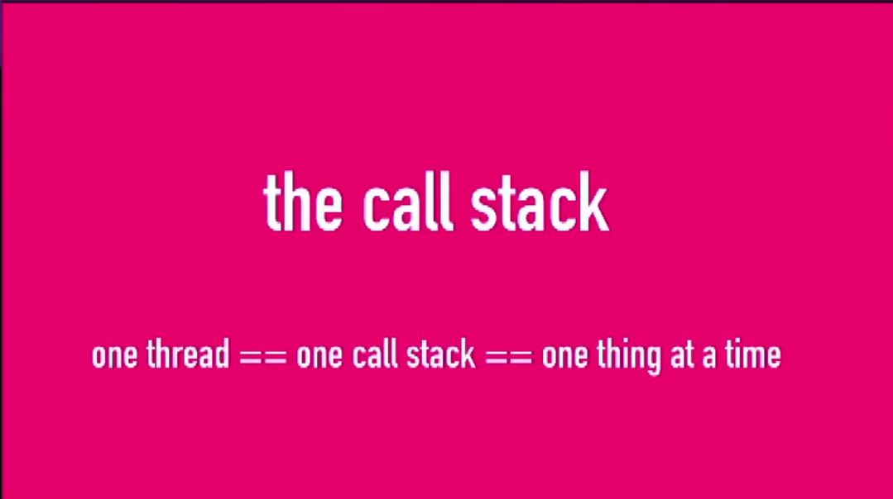

## 浏览器事件循环

##### 宏任务

- I/O
- setTimeout
- setInterval
- setImmediate
- requestAnimationFrame

##### 微任务

当`宏任务`执行完，会在渲染前，将执行期间所产生的所有`微任务`都执行完

- process.nextTick
- MutationObserver
- Promise.then catch finally