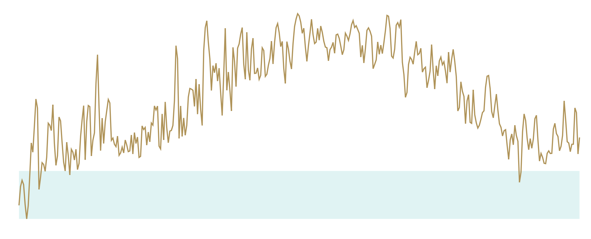

# Drawing the line

<CodeSandboxEmbed
  src="//codesandbox.io/s/8folh?fontsize=14&hidenavigation=1&theme=dark&autoresize=1&module=/chart.js"
  style={{width: '100%', height: '35em'}}
/>

The timeline itself will be a single **path** SVG element. **path** elements take a **d** attribute (short for data) that tells them what shape to make. If you've ever played a learn-to-program game for kids, creating a **d** string is similar.

{width=50%}


The **d** attribute will take a few commands that can be capitalized (if giving an absolute value) or lowercased (if giving a relative value):

- **M** will move to a point (followed by x and y values)
- **L** will draw a line to a point (followed by x and y values)
- **Z** will draw a line back to the first point
- ...

For example, let's draw this path:

```javascript
bounds.append("path").attr("d", "M 0 0 L 100 0 L 100 100 L 0 50 Z")
```

We can see a new shape at the top of our chart.

{width=30%}


More **d** commands exist, but thankfully we don't need to learn them. d3's module [**d3-shape**](https://github.com/d3/d3-shape) has a `d3.line()` method that will create a generator that converts data points into a **d** string.

{lang=javascript,crop-query=context(.lineGenerator, 0, -2)}
<<[code/01-making-your-first-chart/completed/chart.js](./protected/code/01-making-your-first-chart/completed/chart.js)

{pagebreak}

Our generator needs two pieces of information:

1. how to find an x axis value, and
2. how to find a y axis value.

We set these values with the `x` and `y` method, respectively, which each take one parameter: a function to convert a data point into an x or y value.

We want to use our accessor functions, but remember: our accessor functions return the **unscaled value**.

**We'll transform our data point with both the accessor function and the scale to get the scaled value in pixel space.**

{lang=javascript,crop-query=.lineGenerator}
<<[code/01-making-your-first-chart/completed/chart.js](./protected/code/01-making-your-first-chart/completed/chart.js)

Now we're ready to add the `path` element to our bounds.

```javascript
const line = bounds.append("path")
```

Let's feed our dataset to our line generator to create the **d** attribute and tell the line what shape to be.

```javascript
const line = bounds.append("path")
    .attr("d", lineGenerator(dataset))
```

Success! We have a chart with a line showing our max temperature for the whole year.

Something looks wrong, though:


Remember that SVG elements default to a black fill and no stroke, which is why we see this dark filled-in shape. This isn't what we want! Let's add some styles to get an orange line with no fill.

{lang=javascript,crop-query=choose(.line, 1)}
<<[code/01-making-your-first-chart/completed/chart.js](./protected/code/01-making-your-first-chart/completed/chart.js)



We're almost there, but something is missing. Let's finish up by drawing our axes.

### Final code for this lesson

<CodeSandboxEmbed
  src="//codesandbox.io/s/qzx8q?fontsize=14&hidenavigation=1&theme=dark&autoresize=1&module=/chart.js"
  style={{width: '100%', height: '35em'}}
/>