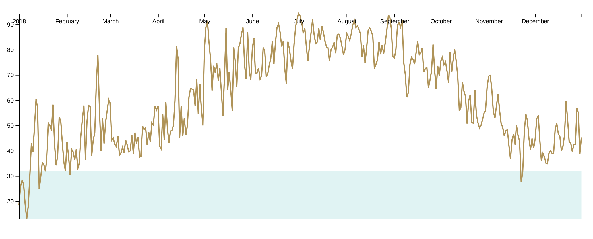

# Drawing the axes

<CodeSandboxEmbed
  src="//codesandbox.io/s/bo2kw?fontsize=14&hidenavigation=1&theme=dark&autoresize=1&module=/chart.js"
  style={{width: '100%', height: '35em'}}
/>

Let's start with the y axis. d3's [**d3-axis**](https://github.com/d3/d3-axis) module has axis generator methods which will **draw an axis** _for the given scale_.

Unlike the methods we've used before, d3 axis generators will append multiple elements to the page.

{pagebreak}

There is one method for each orientation, which will specify the placement of labels and tick marks:

- `axisTop`
- `axisRight`
- `axisBottom`
- `axisLeft`

Following common convention, we want the labels of our y axis to be to the left of the axis line, so we'll use `d3.axisLeft()` and pass it our y scale.

{lang=javascript,crop-query=.yAxisGenerator}
<<[code/01-making-your-first-chart/completed/chart.js](./protected/code/01-making-your-first-chart/completed/chart.js)

When we call our axis generator, it will create a lot of elements — let's create a `g` element to hold all of those elements and keep our DOM organized. Then we'll pass that new element to our `yAxisGenerator` function to tell it where to draw our axis.

```javascript
const yAxis = bounds.append("g")

yAxisGenerator(yAxis)
```

This method works but it will break up our chained methods. To fix this, d3 selections have a `.call()` method that will execute the provided function with the selection as the first parameter.

We can use `.call()` to:

1. prevent saving our selection as a variable, and
2. preserve the selection for additional chaining.

Note that this code does exactly the same thing as the snippet above - we are passing the **function** `yAxisGenerator` to `.call()`, which then runs the function for us.

{lang=javascript,crop-query=.yAxis}
<<[code/01-making-your-first-chart/completed/chart.js](./protected/code/01-making-your-first-chart/completed/chart.js)

And voila, we have our first axis!


The small notches perpendicular to the axis are called _tick marks_. d3 has made behind-the-scenes decisions about how many tick marks to make and how far apart to draw them. We'll learn more about how to customize this later.


Let's create the x axis in the same way, this time using `d3.axisBottom()`.

{lang=javascript,crop-query=.xAxisGenerator}
<<[code/01-making-your-first-chart/completed/chart.js](./protected/code/01-making-your-first-chart/completed/chart.js)

Alright! Now let's create another `<g>` element and draw our axis.

```javascript
const xAxis = bounds.append("g")
    .call(xAxisGenerator)
```

A>We _could_ `.call()` our x axis directly on our **bounds**:
A>
A>`const xAxis = bounds.call(xAxisGenerator)`
A>
A>This would create our axis directly under our **bounds** (in the DOM).
A>
A>However, it's a good idea to create a `<g>` element to contain our axis elements for three main reasons:
A>
A>1. to keep our DOM organized, for debugging or exporting
A>2. if we want to remove or update our axis, we'll want an easy way to target all of the elements
A>3. modifying our whole axis at once, for example when we want to move it around.

The axis looks right, but it's in the wrong place:



Why didn't `.axisBottom()` draw the axis in the right place? d3's axis generator functions know where to place the tick marks and tick labels relative to the axis line, but they have no idea where to place the axis itself.

To move the x axis to the bottom, we can shift the x axis group, similar to how we shifted our chart bounds using a CSS transform.

{lang=javascript,crop-query=.xAxis}
<<[code/01-making-your-first-chart/completed/chart.js](./protected/code/01-making-your-first-chart/completed/chart.js)

And just like that we're done making our first chart!


Next, let's dive into making a slightly more complex chart and talk more about how d3 works for a deeper understanding of the concepts we just learned.

### Final code for this lesson

<CodeSandboxEmbed
  src="//codesandbox.io/s/g0j9u?fontsize=14&hidenavigation=1&theme=dark&autoresize=1&module=/chart.js"
  style={{width: '100%', height: '35em'}}
/>