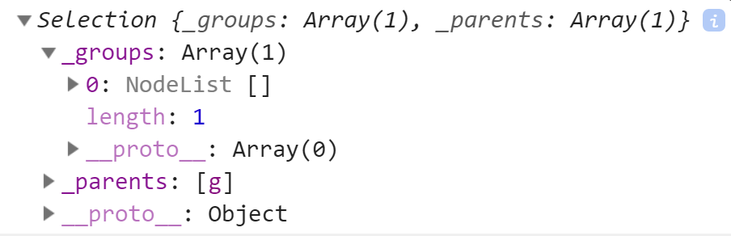

# Draw data

<CodeSandboxEmbed
  src="//codesandbox.io/s/w4j4c?fontsize=14&hidenavigation=1&theme=dark&autoresize=1&module=/chart.js"
  style={{width: '100%', height: '35em'}}
/>

Here comes the fun part! Drawing our scatter plot dots will be different from how we drew our timeline. Remember that we had one line that covered all of the data points? For our scatter plot, we want **one element per data point**.

We'll want to use the [`<circle>`](https://developer.mozilla.org/en-US/docs/Web/SVG/Element/circle) SVG element, which thankfully doesn't need a **d** attribute string. Instead, we'll give it **cx** and **cy** attributes, which set its x and y coordinates, respectively. These position the center of the circle, and the **r** attribute sets the circle's radius (half of its width or height).

Let's draw a circle in the center of our chart to test it out.

```javascript
bounds.append("circle")
  .attr("cx", dimensions.boundedWidth / 2)
  .attr("cy", dimensions.boundedHeight / 2)
  .attr("r", 5)
```


A>Starting to get SVG elements mixed up? No worries! We have an **SVG elements cheat sheet** PDF to help remember what elements exist and what attributes they want. Don't worry if you don't recognize any of the elements — we'll cover them all by the end of the course.


Great! Now let's add one of those for each day.

A straightforward way of drawing the dots would be to map over each element in the dataset and append a circle to our bounds.

```javascript
data.forEach(d => {
  bounds
    .append("circle")
    .attr("cx", xScale(xAccessor(d)))
    .attr("cy", yScale(yAccessor(d)))
    .attr("r", 5)
})
```

Look at that! Now we're starting to get a better sense of our data.

{width=50%}


While this method of drawing the dots works for now, there are a few issues we should address.

- We're adding a level of nesting, which makes our code harder to follow.
- If we run this function twice, we'll end up drawing two sets of dots. When we start updating our charts, we will want to draw and update our data with the same code to prevent repeating ourselves.

To address these issues and keep our code clean, let's handle the dots without using a loop.

### Data joins

Scratch that last block of code. D3 has functions that will help us address the above problems.

We'll start off by grabbing all `<circle>` elements in a **d3 selection object**. Instead of using d3.selection's `.select()` method, which returns one matching element, we'll use its `.selectAll()` method, which returns an array of matching elements.

```javascript
const dots = bounds.selectAll("circle")
```

This will seem strange at first — we don't have any dots yet, why would we select something that doesn't exist? Don't worry! You'll soon become comfortable with this pattern.

**We're creating a d3 selection that is aware of what elements already exist**. If we had already drawn part of our dataset, this selection will be aware of what dots were already drawn, and which need to be added.

To tell the selection what our data look like, we'll pass our dataset to the selection's `.data()` method.

```javascript
const dots = bounds.selectAll("circle")
    .data(data)
```

When we call `.data()` on our selection, **we're joining our selected elements with our array of data points**. The returned selection will have a list of **existing elements**, **new elements** that need to be added, and **old elements** that need to be removed.

We'll see these changes to our selection object in three ways:

- our selection object is updated to contain any overlap between existing DOM elements and data points
- an **\_enter** key is added that lists any data points that don't already have an element rendered
- an **\_exit** key is added that lists any data points that are already rendered but aren't in the provided dataset

{width=70%}


Let's get an idea of what that updated selection object looks like by logging it to the console.

```javascript
let dots = bounds.selectAll("circle")
console.log(dots)
dots = dots.data(data)
console.log(dots)
```

Remember, the currently selected DOM elements are located under the `_groups` key. Before we join our dataset to our selection, the selection just contains an empty array. That makes sense! There are no circles in **bounds** yet.



However, the next selection object looks different. We have two new keys: `_enter` and `_exit`, and our `_groups` array has an array with 365 elements — the number of data points in our dataset.


Let's take a closer look at the `_enter` key. If we expand the array and look at one of the values, we can see an object with a `__data__` property.


A>For the curious, the `namespaceURI` key tells the browser that the element is a SVG element and needs to be created in the "http://www.w3.org/2000/svg" namespace (SVG), instead of the default "http://www.w3.org/1999/xhtml" namespace (XHTML).

If we expand the `__data__` value, we will see one our data points.

Great! We can see that each value in `_enter` corresponds to a value in our dataset. This is what we would expect, since all of the data points need to be added to the DOM.

The `_exit` value is an empty array — if we were removing existing elements, we would see those listed out here.

In order to act on the **new** elements, we can create a d3 selection object containing just those elements with the `enter` method. There is a matching method (`exit`) for **old** elements that we'll need when we go over transitions in **Chapter 4**.


Let's get a better look at that new selection object:

```javascript
const dots = bounds.selectAll("circle")
    .data(data)
  .enter()
console.log(dots)
```

This looks just like any d3 selection object we've manipulated before. Let's append one `<circle>` for each data point. We can use the same `.append()` method we've been using for single-node selection objects and d3 will create one element for each data point.

```javascript
const dots = bounds.selectAll("circle")
    .data(dataset)
  .enter().append("circle")
```

When we load our webpage, we will still have a blank page. However, we will be able to see lots of new empty `<circle>` elements in our **bounds** in the **Elements** panel.

Let's set the position and size of these circles.

```javascript
const dots = bounds.selectAll("circle")
    .data(data)
  .enter().append("circle")
    .attr("cx", d => xScale(xAccessor(d)))
    .attr("cy", d => yScale(yAccessor(d)))
    .attr("r", 5)
```

We can write the same code we would write for a single-node selection object. Any attribute values that are functions will be passed each data point individually. This helps keep our code concise and consistent.

Let's make these dots a lighter color to help them stand out.

```javascript
.attr("fill", "cornflowerblue")
```

### Data join exercise

Here's a quick example to help visualize the data join concept. We're going to split the dataset in two and draw both parts separately. Temporarily comment out your finished dots code so we have a clear slate to work with. We'll put it back when we're done with this exercise.

Let's add a function called `drawDots()` that mimics our dot drawing code. This function will select all existing circles, join them with a provided dataset, and draw any new circles with a provided color.

```javascript
function drawDots(data, color) {
  const dots = bounds.selectAll("circle").data(dataset)

  dots
    .enter().append("circle")
    .attr("cx", d => xScale(xAccessor(d)))
    .attr("cy", d => yScale(yAccessor(d)))
    .attr("r", 5)
    .attr("fill", color)
}
```

Let's call this function with part of our dataset. The color doesn't matter much — let's go with a dark grey.

```javascript
drawDots(data.slice(0, 200), "darkgrey")
```

We should see some of our dots drawn on the page.

{width=50%}


After one second, let's call the function again with our whole dataset, this time with a blue color. We're adding a timeout to help distinguish between the two sets of dots.

```javascript
setTimeout(() => {
  drawDots(data, "cornflowerblue")
}, 1000)
```

When you refresh your webpage, you should see a set of grey dots, then a set of blue dots one second later.

{width=50%}


Each time we run `drawDots()`, we're setting the color of only **new** circles. This explains why the grey dots stay grey. If we wanted to set the color of all circles, we could re-select all circles and set their fill on the new selection:

```javascript
function drawDots(data, color) {
  const dots = bounds.selectAll("circle").data(data)

  dots.enter().append("circle")
  bounds.selectAll("circle")
      .attr("cx", d => xScale(xAccessor(d)))
      .attr("cy", d => yScale(yAccessor(d)))
      .attr("r", 5)
      .attr("fill", color)
}
```

In order to keep the chain going, d3 selection objects have a `merge()` method that will combine the current selection with another selection. In this case, we could combine the new `enter` selection with the original `dots` selection, which will return the full list of dots. When we set attributes on the new merged selection, we'll be updating all of the dots.

```javascript
function drawDots(data, color) {
  const dots = bounds.selectAll("circle").data(data)

  dots
    .enter().append("circle")
    .merge(dots)
      .attr("cx", d => xScale(xAccessor(d)))
      .attr("cy", d => yScale(yAccessor(d)))
      .attr("r", 5)
      .attr("fill", color)
}
```

### `.join()`

Since [d3-selection version 1.4.0](https://github.com/d3/d3-selection/releases/tag/v1.4.0), there is a new [`.join()`](https://github.com/d3/d3-selection/#selection_join) method that helps to cut down on this code. `.join()` is a shortcut for running `.enter()`, `.append()`, `.merge()`, and some other methods we haven't covered yet. This allows us to write the following code instead:

```javascript
function drawDots(data, color) {
  const dots = bounds.selectAll("circle").data(data)

  dots.join("circle")
    .attr("cx", d => xScale(xAccessor(d)))
    .attr("cy", d => yScale(yAccessor(d)))
    .attr("r", 5)
    .attr("fill", color)
}
```

While `.join()` is a great addition to d3, it's still beneficial to understand the `.enter()`, `.append()`, and `.merge()` methods. Most existing d3 code will use these methods, and it's important to understand the basics before getting fancy.

Don't worry if this pattern still feels new — we'll reinforce and build on what we've learned when we talk about transitions. For now, let's delete this example code, uncomment our finished dots code, and move on with our scatter plot!

### Final code for this lesson

<CodeSandboxEmbed
  src="//codesandbox.io/s/7nmmq?fontsize=14&hidenavigation=1&theme=dark&autoresize=1&module=/chart.js"
  style={{width: '100%', height: '35em'}}
/>