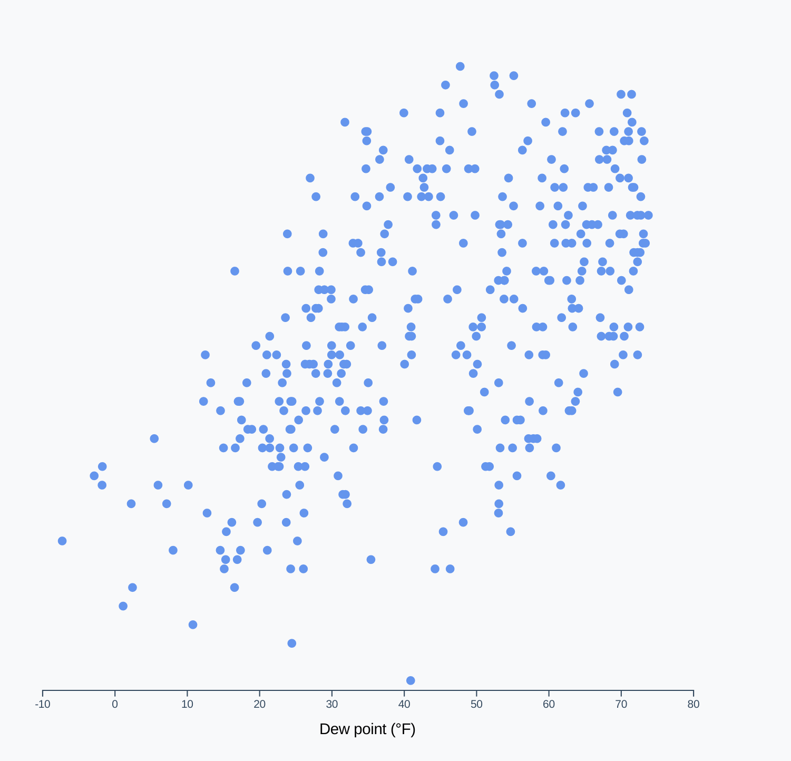

# Draw peripherals

<CodeSandboxEmbed
  src="//codesandbox.io/s/ygu8j?fontsize=14&hidenavigation=1&theme=dark&autoresize=1&module=/chart.js"
  style={{width: '100%', height: '35em'}}
/>

Let's finish up our chart by drawing our axes, starting with the x axis.

We want our x axis to be:

- a line across the bottom
- with spaced "tick" marks that have...
- labels for values per tick
- a label for the axis overall

To do this, we'll create our axis generator using `d3.axisBottom()`, then pass it:

- our x scale so it knows what ticks to make (from the domain) and
- what size to be (from the range).

{lang=javascript,crop-query=.xAxisGenerator}
<<[code/02-making-a-scatterplot/completed/chart.js](./protected/code/02-making-a-scatterplot/completed/chart.js)

Next, we'll use our `xAxisGenerator()` and call it on a new **g** element. Remember, we need to translate the x axis to move it to the bottom of the chart bounds.

{lang=javascript,crop-query=.xAxis}
<<[code/02-making-a-scatterplot/completed/chart.js](./protected/code/02-making-a-scatterplot/completed/chart.js)

When we render our webpage, we should see our scatter plot with an x axis. As a bonus, we can see how using `.nice()` on our scale ensures that our axis ends in round values.

{width=50%}


Let's expand on our knowledge and create labels for our axes. Drawing text in an SVG is fairly straightforward - we need a `<text>` element, which can be positioned with an `x` and a `y` attribute. We'll want to position it horizontally centered and slightly above the bottom of the chart.

`<text>` elements will display their children as text — we can set that with our selection's `.html()` method.

{lang=javascript,crop-query=.xAxisLabel}
<<[code/02-making-a-scatterplot/completed/chart.js](./protected/code/02-making-a-scatterplot/completed/chart.js)

A>We need to explicitly set the text fill to black because it inherits a fill value of none that d3 sets on the axis `<g>` element.

Great! Now we can see a label underneath our x axis.

{width=50%}


Almost there! Let's do the same thing with the y axis. First, we need an axis generator.

D3 axes can be customized in many ways. An easy way to cut down on visual clutter is to tell our axis to aim for a certain number with the `ticks` method. Let's aim for 4 ticks, which should give the viewer enough information.

{lang=javascript,crop-query=.yAxisGenerator}
<<[code/02-making-a-scatterplot/completed/chart.js](./protected/code/02-making-a-scatterplot/completed/chart.js)

A>Note that the resulting axis won't necessarily have exactly 4 ticks. D3 will take the number as a suggestion and aim for that many ticks, but also trying to use friendly intervals. Check out some of the internal logic [in the **d3-array** code](https://github.com/d3/d3-array/blob/master/src/ticks.js#L43) — see how it's attempting to use intervals of `10`, then `5`, then `2`?
A>
A>There are many ways to configure the ticks for a d3 axis — find them all in [the docs](https://github.com/d3/d3-axis#axis_ticks). For example, you can specify their exact values by passing an array of values to `.tickValues()`.

Let's use our generator to draw our y axis.

{lang=javascript,crop-query=.yAxis}
<<[code/02-making-a-scatterplot/completed/chart.js](./protected/code/02-making-a-scatterplot/completed/chart.js)

To finish up, let's draw the y axis label in the middle of the y axis, just inside the left side of the chart wrapper. d3 selection objects also have a `.text()` method that operates similarly to `.html()`. Let's try using that here.

{lang=javascript,crop-query=context(.yAxisLabel, 0, -2)}
<<[code/02-making-a-scatterplot/completed/chart.js](./protected/code/02-making-a-scatterplot/completed/chart.js)

We'll need to rotate this label to fit next to the y axis. To rotate it around its center, we can set its CSS property `text-anchor` to `middle`.

```javascript
.style("transform", "rotate(-90deg)")
.style("text-anchor", "middle")
```

And just like that, we've drawn our scatter plot!

{width=50%}


# Initialize interactions


The next step in our chart-drawing checklist is setting up interactions and event listeners. We'll go over this in detail in **Module 5**.

### Final code for this lesson

<CodeSandboxEmbed
  src="//codesandbox.io/s/t2t2f?fontsize=14&hidenavigation=1&theme=dark&autoresize=1&module=/chart.js"
  style={{width: '100%', height: '35em'}}
/>