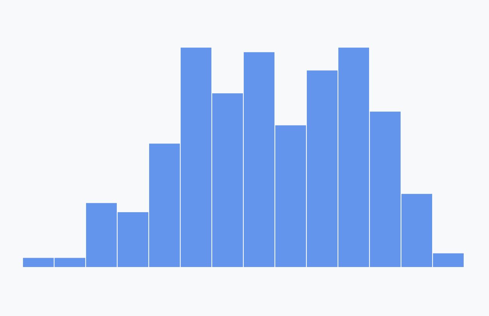

# Draw data

<CodeSandboxEmbed
  src="//codesandbox.io/s/4nh6c?fontsize=14&hidenavigation=1&theme=dark&autoresize=1&module=/chart.js"
  style={{width: '100%', height: '35em'}}
/>

Here comes the fun part! Our plan is to create one bar for each bin, with a label on top of each bar.

We'll need one bar for each item in our `bins` array — this is a sign that we'll want to use the **data bind** concept we learned in **Module 2**.

Let's first create a `<g>` element to contain our bins. This will help keep our code organized and isolate our bars in the DOM.

{lang=javascript,crop-query=.binsGroup}
<<[code/03-making-a-bar-chart/completed/draw-bars.js](./protected/code/03-making-a-bar-chart/completed/draw-bars.js)

Because we have more than one element, we'll bind each data point to a `<g>` SVG element. This will let us group each bin's **bar** and **label**.

To start, we'll select all existing `<g>` elements within our `binsGroup` (_there aren't any yet, but we're creating a selection object that points to the right place_). Then we'll use `.data()` to bind our `bins` to the selection.

{lang=javascript,crop-query=context(.binGroups, 0, -1)}
<<[code/03-making-a-bar-chart/completed/draw-bars.js](./protected/code/03-making-a-bar-chart/completed/draw-bars.js)

Next, we'll create our `<g>` elements, using `.join()` to target all of our bins.

{lang=javascript,crop-query=.binGroups}
<<[code/03-making-a-bar-chart/completed/draw-bars.js](./protected/code/03-making-a-bar-chart/completed/draw-bars.js)

The above code will create one new `<g>` element for each bin. We're going to place our bars within this group.

Next up we'll draw our bars, but first we should calculate any constants that we'll need. Like a warrior going into battle, we want to prepare our weapons before things heat up.

In this case, the only constant that we can set ahead of time is **the padding between bars**. Giving them some space helps distinguish individual bars, but we don't want them too far apart - that will make them hard to compare and take away from the overall shape of the distribution.

T> **Chart design tip:** putting a space between bars helps distinguish individual bars

{lang=javascript,crop-query=.barPadding}
<<[code/03-making-a-bar-chart/completed/draw-bars.js](./protected/code/03-making-a-bar-chart/completed/draw-bars.js)

Now we are armed warriors and are ready to charge into battle! Each bar is a rectangle, so we'll append a `<rect>` to each of our `<g>` elements.

{lang=javascript,crop-query=context(.barRects, 0, -8)}
<<[code/03-making-a-bar-chart/completed/draw-bars.js](./protected/code/03-making-a-bar-chart/completed/draw-bars.js)

Remember, `<rect>`s need four attributes: **x**, **y**, **width**, and **height**.

Let's start with the **x** value, which will corresponds to the *left* side of the bar. The bar will start at the lower bound of the bin, which we can find at the **x0** key.

But **x0** is a humidity level, not a pixel. So let's use `xScale()` to convert it to pixel space.

Lastly, we need to offset it by the `barPadding` we set earlier.

{lang=javascript,crop-query=context(.barRects, -1, -7)}
<<[code/03-making-a-bar-chart/completed/draw-bars.js](./protected/code/03-making-a-bar-chart/completed/draw-bars.js)

A>We could create accessor functions for the **x0** and **x1** properties of each bin if we were concerned about the structure of our bins changing. In this case, it would be overkill since:
A>
A>1. we didn't specify the structure of each bin, `d3.bin()` did
A>2. we're not going to change the way we access either of these values since they're built in to `d3.bin()`
A>3. the way we access these properties is very straightforward. If the values were more nested or required computation, we could definitely benefit from accessor functions.

Next, we'll specify the `<rect>`'s **y** attribute which corresponds to the top of the bar. We'll use our `yAccessor()` to grab the frequency and use our scale to convert it into pixel space.

{lang=javascript,crop-query=context(.barRects, -2, -6)}
<<[code/03-making-a-bar-chart/completed/draw-bars.js](./protected/code/03-making-a-bar-chart/completed/draw-bars.js)

To find the width of a bar, we need to **subtract the x0 position of the left side of the bar from the x1 position of the right side of the bar**.

We'll need to subtract the bar padding from the total width to account for spaces between bars. Sometimes we'll get a bar with a `width` of `0`, and subtracting the `barPadding` will bring us to `-1`. To prevent passing our `<rect>`s a negative `width`, we'll wrap our value with `d3.max([0, width])`.

{lang=javascript,crop-query=context(.barRects, -3, -2)}
<<[code/03-making-a-bar-chart/completed/draw-bars.js](./protected/code/03-making-a-bar-chart/completed/draw-bars.js)

Lastly, we'll calculate the bar's height by subtracting the **y** value from the bottom of the y axis. Since our y axis starts from 0, we can use our `boundedHeight`.

{lang=javascript,crop-query=context(.barRects, -7, -1)}
<<[code/03-making-a-bar-chart/completed/draw-bars.js](./protected/code/03-making-a-bar-chart/completed/draw-bars.js)

Let's put that all together and change the bar **fill** to blue.

{lang=javascript,crop-query=.barRects}
<<[code/03-making-a-bar-chart/completed/draw-bars.js](./protected/code/03-making-a-bar-chart/completed/draw-bars.js)

Alright! Now we're starting to see the beginnings of our histogram!

{width=75%}

### Final code for this lesson

<CodeSandboxEmbed
  src="//codesandbox.io/s/s04x9?fontsize=14&hidenavigation=1&theme=dark&autoresize=1&module=/chart.js"
  style={{width: '100%', height: '35em'}}
/>