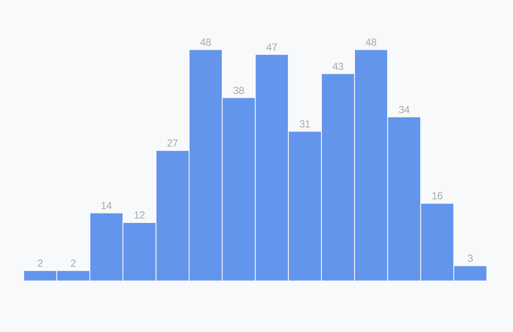

# Adding Labels

<CodeSandboxEmbed
  src="//codesandbox.io/s/7e7j7?fontsize=14&hidenavigation=1&theme=dark&autoresize=1&module=/chart.js"
  style={{width: '100%', height: '35em'}}
/>

Let's add labels to show the count for each of these bars.

We can keep our chart clean by only adding labels to bins with any relevant days — having `0`s in empty spaces is unhelpful visual clutter. We can identify which bins have no data by their lack of a bar, no need to call it out with a label.

d3 selections have a `.filter()` method that acts the same way the native Array method does. `.filter()` accepts one parameter: a function that accepts one data point and returns a value. Any items in our dataset who return a **falsey** value will be removed.

A>By "**falsey**", we're referring to any value that evaluates to `false`. Maybe surprisingly, this includes values other than `false`, such as `0`, `null`, `undefined`, `""`, and `NaN`. Keep in mind that empty arrays `[]` and object `{}` evaluate to **truthy**. If you're curious, [read more here](https://developer.mozilla.org/en-US/docs/Glossary/Falsy).

We can use `yAccessor()` as shorthand for `d => yAccessor(d) != 0` because `0` is **falsey**.

{lang=javascript,crop-query=context(.barText, 0, -8)}
<<[code/03-making-a-bar-chart/completed/draw-bars.js](./protected/code/03-making-a-bar-chart/completed/draw-bars.js)

Since these labels are just text, we'll want to use the SVG `<text>` element we've been using for our axis labels.

{lang=javascript,crop-query=context(.barText, 0, -7)}
<<[code/03-making-a-bar-chart/completed/draw-bars.js](./protected/code/03-making-a-bar-chart/completed/draw-bars.js)

Remember, `<text>` elements are positioned with **x** and **y** attributes. The label will be centered horizontally above the bar — we can find the center of the bar by adding half of the bar's width (_the right side minus the left side_) to the left side of the bar.

{lang=javascript,crop-query=context(.barText, 0, -6)}
<<[code/03-making-a-bar-chart/completed/draw-bars.js](./protected/code/03-making-a-bar-chart/completed/draw-bars.js)

Our `<text>`'s y position will be similar to the `<rect>`'s y position, but let's shift it up by 5 pixels to add a little gap.

{lang=javascript,crop-query=context(.barText, 0, -5)}
<<[code/03-making-a-bar-chart/completed/draw-bars.js](./protected/code/03-making-a-bar-chart/completed/draw-bars.js)

Next, we'll display the count of days in the bin using our `yAccessor()` function. _Note: again, we can use `yAccessor()` as shorthand for `d => yAccessor(d)`._

{lang=javascript,crop-query=context(.barText, 0, -4)}
<<[code/03-making-a-bar-chart/completed/draw-bars.js](./protected/code/03-making-a-bar-chart/completed/draw-bars.js)

We can use the CSS `text-anchor` property to horizontally align our text — this is a much simpler solution than compensating for text width when we set the **x** attribute.

{lang=javascript,crop-query=context(.barText, 0, -3)}
<<[code/03-making-a-bar-chart/completed/draw-bars.js](./protected/code/03-making-a-bar-chart/completed/draw-bars.js)

After adding a few styles to decrease the visual importance of our labels...

{lang=javascript,crop-query=.barText}
<<[code/03-making-a-bar-chart/completed/draw-bars.js](./protected/code/03-making-a-bar-chart/completed/draw-bars.js)

...we should see the count of days for each of our bars!

{width=75%}

### Final code for this lesson

<CodeSandboxEmbed
  src="//codesandbox.io/s/eorco?fontsize=14&hidenavigation=1&theme=dark&autoresize=1&module=/chart.js"
  style={{width: '100%', height: '35em'}}
/>