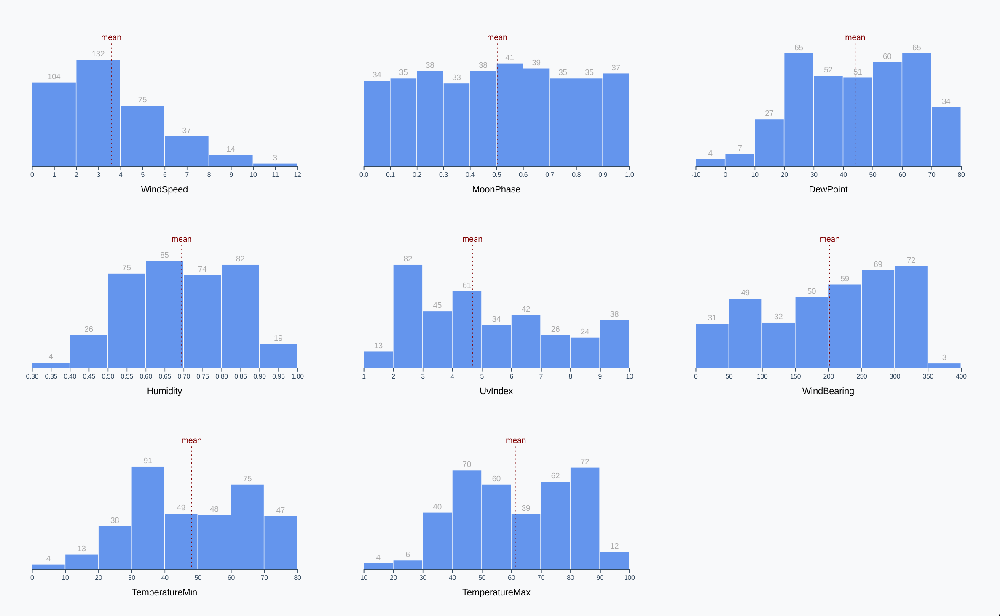

# Extra credit

<CodeSandboxEmbed
  src="//codesandbox.io/s/dhtgr?fontsize=14&hidenavigation=1&theme=dark&autoresize=1&module=/chart.js"
  style={{width: '100%', height: '35em'}}
/>

Let's generalize our histogram drawing function and create a chart for each weather metric we have access to! This will make sure that we understand what every line of code is doing.

Generalizing our code will also help us to start thinking about handling dynamic data — a core concept when building a dashboard. Drawing a graph with a specific dataset can be difficult, but you get to rely on values being the same every time your code runs. When handling data from an API, your charting functions need to be more robust and able to handle very different datasets.



Here's the good news: we won't need to rewrite the majority of our code! The main difference is that we'll wrap most of the chart drawing into a new function called `drawHistogram()`.

Which steps do we need to repeat for every chart? Let's look at our checklist again.

1. **Access data**
2. **Create dimensions**
3. **Draw canvas**
4. **Create scales**
5. **Draw data**
6. **Draw peripherals**
7. **Set up interactions**

All of the histograms will use the same dataset, so we can skip step **1**. And every chart will be the same size, so we don't need to repeat step **2** either. However, we want each chart to have its own **svg** element, so we'll need to wrap everything after step **2** .

A>In the next section, we'll cover ways to make our chart more accessible. We'll be working on the current version of our histogram - make a copy of your current finished histogram in order to come back to it later.

Let's do that — we'll create a new function called `drawHistogram()` that contains all of our code, starting at the point we create our svg. Note that the finished code for this step is in the `/code/03-making-a-bar-chart/completed-multiple/draw-bars.js` file if you're unsure about any of these steps.

```javascript
const drawHistogram = () => {
    const wrapper = d3.select("#wrapper")
    // ...  the rest of our chart code
```

What parameters does our function need? The only difference between these charts is the metric we're plotting, so let's add that as an argument.

```javascript
const drawHistogram = metric => {
    // ...
```

But wait, we need to use the metric to update our `metricAccessor()`. Let's grab our accessor functions from our **Access data** step and throw them at the top of our new function. We'll also need our `metricAccessor()` to return the provided metric, instead of hard-coding `d.humidity`.

```javascript
const drawHistogram = metric => {
    const metricAccessor = d => d[metric]
    const yAccessor = d => d.length

    const wrapper = d3.select("#wrapper")
    // ...
```

Great, let's give it a go! At the bottom of our `drawBars()` function, let's run through some of the available metrics (see code example for a list) and pass each of them to our new generalized function.

```javascript
const metrics = [
    "windSpeed",
    "moonPhase",
    "dewPoint",
    "humidity",
    "uvIndex",
    "windBearing",
    "temperatureMin",
    "temperatureMax",
]

metrics.forEach(drawHistogram)
```

Alright! Let's see what happens when we refresh our webpage.


We see multiple histograms, but something is off. Not all of these charts are showing **Humidity**! Let's find the line where we set our x axis label and update that to show our metric instead. Here it is:

```javascript
const xAxisLabel = xAxis.append("text")
   //  ...
    .text("Humidity")
```

We'll set the text to our metric instead, and we can also add a CSS `text-transform` value to help format our metric names. For a production dashboard, we might want to look up a proper label in a metric-to-label map, but this will work in a pinch.

```javascript
const xAxisLabel = xAxis.append("text")
    // ...
    .text(metric)
    .style("text-transform", "capitalize")
```

When we refresh our webpage, we should see our finished histograms.


Wonderful!

Take a second and observe the variety of shapes of these histograms. What are some insights we can discover when looking at our data in this format?

- the **moon phase** distribution is flat - this makes sense because it's cyclical, consistently going through the same steps all year.
- our **wind speed** is usually around 3 mph, with a long tail to the right that represents a few very windy days. Some days have no wind at all, with an average wind speed of 0.
- our **max temperatures** seem almost bimodal, with the mean falling in between two humps. Looks like New York City spends more days with relatively extreme temperatures (30°F - 50°F or 70°F - 90°F) than with more temperate weather (60°F).

### Final code for this lesson

<CodeSandboxEmbed
  src="//codesandbox.io/s/9h1yx?fontsize=14&hidenavigation=1&theme=dark&autoresize=1&module=/chart.js"
  style={{width: '100%', height: '35em'}}
/>