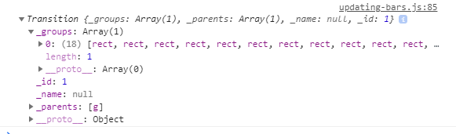
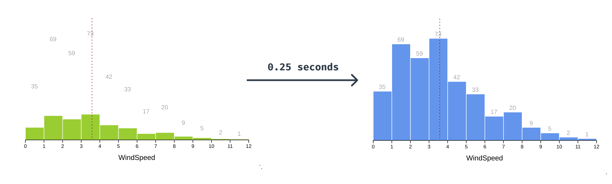
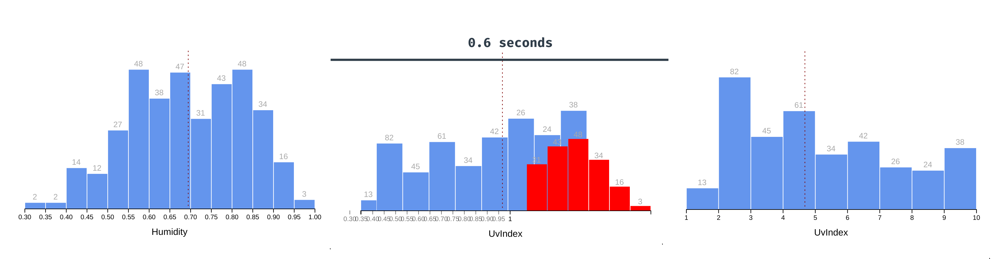

# d3.transition

CSS transitions have our back for simple property changes, but for more complex animations we'll need to use `d3.transition()` from the [**d3-transition**](https://github.com/d3/d3-transition) module. When would we want to use `d3.transition()` instead of CSS transitions?

- When we want to ensure that multiple animations line up
- When we want to do something when the animation ends (for example starting another animation)
- When the property we want to animate isn't a CSS property (remember when we tried to animate our bars' heights but had to use `transform` instead? `d3.translate` can animate non-CSS property changes.)
- When we want to synchronize adding and removing elements with animations
- When we might interrupt halfway through a transition
- When we want a custom animation (for example, we could write a custom interpolator for changing text that adds new letters one-by-one)

Let's get our hands dirty by re-implementing the CSS transitions for our histogram.

<CodeSandboxEmbed
  src="//codesandbox.io/s/05s5k?fontsize=14&hidenavigation=1&theme=dark&autoresize=1&module=/chart.js"
  style={{width: '100%', height: '35em'}}
/>

Let's again start by animating any changes to our bars. Instead of adding a `transition` property to our `styles.css` file, we'll start in the `chart.js` file where we set our `barRects` attributes.

As a reminder, when we run:

```javascript
const barRects = binGroups.select("rect")
```

we're creating a d3 selection object that contains all `<rect>` elements. Let's log that to the console as a refresher of what a selection object looks like.

```javascript
const barRects = binGroups.select("rect")
        .attr("x", d => xScale(d.x0) + barPadding)
        .attr("y", d => yScale(yAccessor(d)))
        .attr("height", d => dimensions.boundedHeight
            - yScale(yAccessor(d))
        )
        .attr("width", d => d3.max([
          0,
          xScale(d.x1) - xScale(d.x0) - barPadding
        ]))

console.log(barRects)
```


We can use the `.transition()` method on our d3 selection object to transform our selection object into a d3 transition object.

```javascript
const barRects = binGroups.select("rect")
    .transition()
        .attr("x", d => xScale(d.x0) + barPadding)
        .attr("y", d => yScale(yAccessor(d)))
        .attr("height", d => dimensions.boundedHeight
          - yScale(yAccessor(d))
        )
        .attr("width", d => d3.max([
          0,
          xScale(d.x1) - xScale(d.x0) - barPadding
        ]))

console.log(barRects)
```



d3 transition objects look a lot like selection objects, with a `_groups` list of relevant DOM elements and a `_parents` list of ancestor elements. They have two additional keys: `_id` and `_name`, but that's not all that has changed.

{pagebreak}

Let's expand the `__proto__` of our transition object.

A>`__proto__` is a native property of JavaScript objects that exposes methods and values that this specific object has inherited. If you're unfamiliar with JavaScript Prototypal Inheritance and want to read up, the [MDN docs](https://developer.mozilla.org/en-US/docs/Web/JavaScript/Inheritance_and_the_prototype_chain) are a good place to start.

A>In this case, we can see that the `__proto__` property contains d3-specific methods, and the nested `__proto__` object contains native object methods, such as `toString()`.


We can see that some methods are inherited from d3 selection objects (eg. `.call()` and `.each()`), but most are overwritten by new transition methods. When we click the **Change metric** button now, we can see that our bar changes are animated. This makes sense — any `.attr()` updates chained after a `.transition()` call will use transition's `.attr()` method, which attempts to interpolate between old and new values.

Something looks strange though - our new bars are flying in from the top left corner.


A>Note that d3 transitions animate over 0.25 seconds — we'll learn how to change that in a minute!

Knowing that `<rect>`s are drawn in the top left corner by default, this makes sense. But how do we prevent this?

Remember how we can isolate new data points with `.enter()`? Let's find the line where we're adding new `<rect>`s and set their initial values. We want them to start in the right horizontal location, but be 0 pixels tall so we can animate them "growing" from the x axis.

Let's also have them be green to start to make it clear which bars we're targeting. We'll need to set the fill using an inline style using `.style()` instead of setting the attribute in order to override the CSS styles in `styles.css`.

```javascript
newBinGroups.append("rect")
        .attr("height", 0)
        .attr("x", d => xScale(d.x0) + barPadding)
        .attr("y", dimensions.boundedHeight)
        .attr("width", d => d3.max([
          0,
          xScale(d.x1) - xScale(d.x0) - barPadding
        ]))
        .style("fill", "yellowgreen")
```

A>Why are we using `.style()` instead of `.attr()` to set the fill? We need the `fill` value to be an inline style instead of an SVG attribute in order to override the CSS styles in `styles.css`. The way CSS specificity works means that inline styles override class selector styles, which override SVG attribute styles.

Once our bars are animated in, they won't be new anymore. Let's transition their fill to blue. Luckily, chaining d3 transitions is really simple — to add a new transition that starts after the first one ends, add another `.transition()` call.

```javascript
const barRects = binGroups.select("rect")
    .transition()
        .attr("x", d => xScale(d.x0) + barPadding)
        .attr("y", d => yScale(yAccessor(d)))
        .attr("height", d => dimensions.boundedHeight
          - yScale(yAccessor(d))
        )
        .attr("width", d => d3.max([
          0,
          xScale(d.x1) - xScale(d.x0) - barPadding
        ]))
    .transition()
        .style("fill", "cornflowerblue")
```



Let's slow things down a bit so we can bask in these fun animations. d3 transitions default to 0.25 seconds, but we can specify how long an animation takes by chaining `.duration()` with a number of milliseconds.

```javascript
const barRects = binGroups.select("rect")
    .transition().duration(600)
        .attr("x", d => xScale(d.x0) + barPadding)
        // ...
```


Smooth! Now that our bars are nicely animated, it's jarring when our text moves to its new position instantly. Let's add another transition to make our text transition with our bars.

```javascript
const barText = binGroups.select("text")
    .transition().duration(600)
        .attr("x", d => xScale(d.x0)
          + (xScale(d.x1) - xScale(d.x0)) / 2
        )
        .attr("y", d => yScale(yAccessor(d)) - 5)
        .text(d => yAccessor(d) || "")
```

We'll also need to set our labels' initial position (higher up in our code) to prevent them from flying in from the left.

```javascript
newBinGroups.append("text")
        .attr("x", d => xScale(d.x0)
          + (xScale(d.x1) - xScale(d.x0)) / 2
        )
        .attr("y", dimensions.boundedHeight)
```

Here's a fun tip: we can specify a timing function (similar to CSS's transition-timing-function) to give our animations some life. They can look super fancy, but we only need to chain `.ease()` with a d3 easing function. Check out the full list at [the d3-ease repo](https://github.com/d3/d3-ease).

```javascript
const barRects = binGroups.select("rect")
    .transition().duration(600).ease(d3.easeBounceOut)
        .attr("x", d => xScale(d.x0) + barPadding)
        // ...
```

That's looking groovy, but our animation is out of sync with our labels again. We could ease our other transition, but there's an easier (no pun intended) way to sync multiple transitions.

By calling `d3.transition()`, we can make a transition on the root document that can be used in multiple places. Let's create a root transition — we'll need to place this definition above our existing transitions, for example after we define `barPadding`. Let's also log it to the console to take a closer look.

```javascript
const barPadding = 1

const updateTransition = d3.transition()
    .duration(600)
    .ease(d3.easeBackIn)

console.log(updateTransition)
```

If we expand the `_groups` array, we can see that this transition is indeed targeting our root `<html>` element.


A>You'll notice errors in the dev tools console that say `Error: <rect> attribute height: A negative value is not valid.`. This happens with the `d3.easeBackIn` easing we're using, which causes the bars to bounce below the x axis when they animate.

Let's update our bar transition to use `updateTransition` instead of creating a new transition. We can do this by passing the existing transition in our `.transition()` call.

```javascript
const barRects = binGroups.select("rect")
    .transition(updateTransition)
        .attr("x", d => xScale(d.x0) + barPadding)
        // ...
```

Let's use `updateTransition` for our text, too.

```javascript
const barText = binGroups.select("text")
    .transition(updateTransition)
        .attr("x", d => xScale(d.x0)
          + (xScale(d.x1) - xScale(d.x0)) / 2
        )
        // ...
```

We can use this transition as many times as we want — let's also animate our mean line when it updates.

```javascript
const meanLine = bounds.selectAll(".mean")
    .transition(updateTransition)
        .attr("x1", xScale(mean))
        // ...
```

And our x axis:

```javascript
const xAxis = bounds.select(".x-axis")
    .transition(updateTransition)
    .call(xAxisGenerator)
```

Remember that we couldn't animate our x axis with CSS transition? Our transition objects are built to handle axis updates — we can see our tick marks move to fit the new **domain** before the new tick marks are drawn.


But what about animating our bars when they leave? Good question - exit animations are often difficult to implement because they involve delaying element removal. Thankfully, d3 transition makes this pretty simple.

Let's start by creating a transition right before we create `updateTransition`. Let's also take out the easing we added to `updateTransition` since it's a little distracting.

```javascript
const exitTransition = d3.transition().duration(600)
const updateTransition = d3.transition().duration(600)
```

We can target only the bars that are exiting using our `.exit()` method. Let's turn them red before they animate to make it clear which bars are leaving. Then we can use our `exitTransition` and animate the `y` and `height` values so the bars shrink into the x axis.

A>Don't look at the browser just yet, we'll need to finish our exit transition first.

```javascript
const oldBinGroups = binGroups.exit()
oldBinGroups.selectAll("rect")
        .style("fill", "red")
    .transition(exitTransition)
        .attr("y", dimensions.boundedHeight)
        .attr("height", 0)
```

And we'll remember to also transition our text this time:

```javascript
oldBinGroups.selectAll("text")
  .transition(exitTransition)
      .attr("y", dimensions.boundedHeight)
```

Last, we need to actually remove our bars from the DOM. We'll use a new transition here — not because we can animate removing the elements, but to delay their removal until the transition is over.

```javascript
oldBinGroups
    .transition(exitTransition)
        .remove()
```

Now we can look at the browser, and we can see our bars animating in and out!



There is one issue, though: our bars are moving to their new positions while the bars are still exiting and we end up with intermediate states like this one:


To fix this, we'll delay the update transition until the exit transition is finished. Instead of creating a our `updateTransition` as a root transition, we can chain it on our existing `exitTransition`.

```javascript
const exitTransition = d3.transition().duration(600)
const updateTransition = exitTransition.transition().duration(600)
```

A>We're chaining transitions here to run them one after the other — d3 transitions also have a `.delay()` method if you need to delay a transition for a certain amount of time. Check out [the docs](https://github.com/d3/d3-transition#transition_delay) for more information.

Wonderful! Now that we've gone through the three different ways we can animate changes, let's recap when each method is appropriate.

**SVG `<animate>`** is never really appropriate.

**CSS `transition`** is useful for animating CSS properties. A good rule of thumb is to use these mainly for stylistic polish — that way we can keep simpler transitions in our stylesheets, with the main goal of making our visualizations feel smoother.

**`d3.transition()`** is what we want to use for more complex animations: whenever we need to chain or synchronize with another transition or with DOM changes.

### Final code for this lesson

<CodeSandboxEmbed
  src="//codesandbox.io/s/060hn?fontsize=14&hidenavigation=1&theme=dark&autoresize=1&module=/chart.js"
  style={{width: '100%', height: '35em'}}
/>