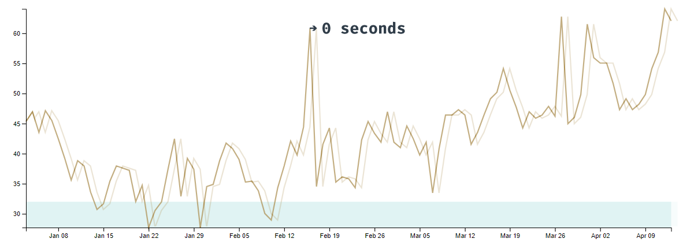

# Lines


After animating bars, animating line transitions should be easy, right? Let's find out!

<CodeSandboxEmbed
  src="//codesandbox.io/s/826uy?fontsize=14&hidenavigation=1&theme=dark&autoresize=1&module=/chart.js"
  style={{width: '100%', height: '35em'}}
/>

Does this example look familiar? This is our timeline drawing code from **Module 1** with some small updates.


One of the main changes is an `addNewDay()` function at the bottom of the script. This exact code isn't important — what is good to know is that `addNewDay()` shifts our dataset one day in the future. To simulate a live timeline, `addNewDay()` runs every 1.5 seconds.

A>If you read through the `addNewDay()` code and were confused by the `...dataset.slice(1),` syntax, the `...` is using ES6 spread syntax to expand the dataset (minus the first point) in place. Read more about it in [the MDN docs](https://developer.mozilla.org/en-US/docs/Web/JavaScript/Reference/Operators/Spread_syntax).

We can see our timeline updating when we load our webpage, but it looks jerky. We know how to smooth the axis transitions, let's make them nice and slow.

```javascript
const xAxis = bounds.select(".x-axis")
    .transition().duration(1000)
    .call(xAxisGenerator)
```

Great! Now let's transition the line.

```javascript
const line = bounds.select(".line")
    .transition().duration(1000)
        .attr("d", lineGenerator(dataset))
```

What's going on here? Why is our line wriggling around instead of adding a new point at the end?


Remember when we talked about how path **d** attributes are a string of draw-to values, like a learn-coding turtle? d3 is transitioning each point to **the next point at the same index**. Our transition's `.attr()` function has no idea that we've just shifted our points down one index. It's guessing how to transition to the new **d** value, animating each point to the next day's y value.

Pretend you're the `.attr()` function - how would you transition between these two **d** values?

```html
<path d="M 0 50 L 1 60 L 2 70 L 3 80 Z" />
<path d="M 0 60 L 1 70 L 2 80 L 3 90 Z" />
```

It would make the most sense to transition each point individually, interpolating from `0 50` to `0 60` instead of moving each point to the left.

Great, we understand _why_ our line is wriggling, but how do we shift it to the left instead?

Let's start by figuring out **how far we need to shift our line** to the left. Before we update our line, let's grab the last two points in our dataset and find the difference between their x values.

```javascript
const lastTwoPoints = dataset.slice(-2)
const pixelsBetweenLastPoints = xScale(xAccessor(lastTwoPoints[1]))
  - xScale(xAccessor(lastTwoPoints[0]))
```

Now when we update our line, we can instantly shift it to the right to match the old line.

```javascript
const line = bounds.select(".line")
        .attr("d", lineGenerator(dataset))
        .style("transform", `translateX(${pixelsBetweenLastPoints}px)`)
```



This shift should be invisible because **we're shifting our x scale to the left by the same amount at the same time**.


Then we can animate un-shifting the line to the left, to its normal position on the x axis.

```javascript
const line = bounds.select(".line")
        .attr("d", lineGenerator(dataset))
        .style("transform", `translateX(${pixelsBetweenLastPoints}px)`)
    .transition().duration(1000)
        .style("transform", `none`)
```


Okay great! We can see the line updating before it animates to the left, but we don't want to see the new point until it's within our bounds. **The easiest way to hide out-of-bounds data is to add a `<clipPath>`**.

A `<clipPath>` is an SVG element that:

- is sized by its children. If a `<clipPath>` contains a **circle**, it will only paint content within that circle's bounds.
- can be referenced by another SVG element, using the `<clipPath>`'s `id`.

Before we test it out, we need to learn one important SVG convention: using `<defs>`. The SVG `<defs>` element is used to store any re-usable definitions that are used later in the `<svg>`. By placing any `<clipPath>`s or gradients in our `<defs>` element, we'll make our code more accessible. We'll also know where to look when we're debugging, similar to defining constants in one place before we use them.

Now that we know this convention, let's create our `<defs>` element and add our `<clipPath>` inside. We'll want to put this definition right after we define our **bounds**. Let's also give it an `id` that we can reference later.

```javascript
const bounds = wrapper.append("g")
    .style("transform", `translate(${
      dimensions.margin.left
    }px, ${
      dimensions.margin.top
    }px)`)

bounds.append("defs")
  .append("clipPath")
    .attr("id", "bounds-clip-path")
```

If we inspect our `<clipPath>` in the Elements panel, we can see that it's not rendering at all.


Remember, the `<clipPath>` element's shape depends on its children, and it has no children yet. Let's add a `<rect>` that covers our bounds.

```javascript
bounds.append("defs")
  .append("clipPath")
    .attr("id", "bounds-clip-path")
  .append("rect")
    .attr("width", dimensions.boundedWidth)
    .attr("height", dimensions.boundedHeight)
```

To use our `<clipPath>` we'll create a group with the attribute `clip-path` pointing to our `<clipPath>`'s `id`. The order in which we draw SVG elements determines their "z-index". Keeping that in mind, let's add our new group _after_ we draw the **freezing** `<rect>`.

```javascript
bounds.append("rect")
    .attr("class", "freezing")
const clip = bounds.append("g")
    .attr("clip-path", "url(#bounds-clip-path)")
```

Now we can update our `path` to sit inside of our new group, instead of the `bounds`.

```javascript
clip.append("path")
    .attr("class", "line")
```

Voila! We can see that our line's new point isn't fully visible until it has finished un-shifting.


A>We can see that the first point of our dataset is being removed before our line un-shifts. I bet you could think of a few ways around this — feel free to implement one or two!
A>We could save the old dataset and preserve that extra point until our line is unshifted, or we could slice off the first data point when we define our x scale. In a production graph, the solution would depend on how our data is updating and what's appropriate to show.

Now that we have the tools needed to make our chart transitions lively, we'll learn how to let our users interact with our charts!

### Final code for this lesson

<CodeSandboxEmbed
  src="//codesandbox.io/s/cuweu?fontsize=14&hidenavigation=1&theme=dark&autoresize=1&module=/chart.js"
  style={{width: '100%', height: '35em'}}
/>