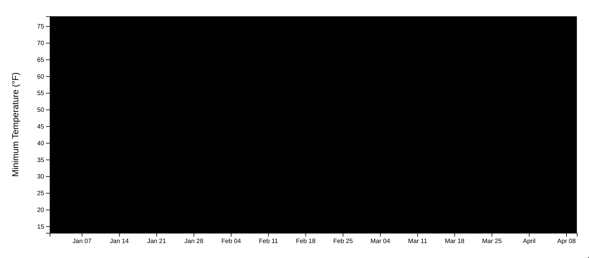

# Line chart

Let's go through one last example for adding tooltips. So far, we've added tooltips to individual elements (bars, circles, and paths). Adding a tooltip to a timeline is a bit different.

In this section, we're aiming to add a tooltip to our line chart like this:


Instead of catching hover events for individual elements, we want to display a tooltip whenever a user is hovering **anywhere on the chart**. Therefore, we'll want an element that spans our entire **bounds**.

<CodeSandboxEmbed
  src="//codesandbox.io/s/g44be?fontsize=14&hidenavigation=1&theme=dark&autoresize=1&module=/chart.js"
  style={{width: '100%', height: '35em'}}
/>

To start coding up our **Set up interactions** step, let's create a `<rect>` that covers our **bounds** and add our mouse event listeners to it. This time we'll want to listen for `mousemove` events instead of `mouseenter` events because we'll want to update the tooltip's position when a reader moves their mouse around the chart.

A>Note that we don't need to define our `<rect>`'s `x` or `y` attributes because they both default to `0`.

```javascript
const listeningRect = bounds.append("rect")
    .attr("class", "listening-rect")
    .attr("width", dimensions.boundedWidth)
    .attr("height", dimensions.boundedHeight)
    .on("mousemove", onMouseMove)
    .on("mouseleave", onMouseLeave)
```

Perfect! We can see that our `listeningRect`, defaulted to a black fill, covers our entire bounds.



Let's add a rule to `styles.css` so we can see our chart again.

```css
.listening-rect {
    fill: transparent;
}
```

Great! Now we can set up our `tooltip` variable and `onMouseMove` and `onMouseLeave()` functions (back in our `line.js` file).

```javascript
const tooltip = d3.select("#tooltip")
function onMouseMove(event) {
}

function onMouseLeave() {
}
```

Let's start fleshing out `onMouseMove` — how will we know the location on our line that we are hovering over? The passed parameters we used previously (`datum`, `index`, and `nodes`) won't be helpful here, and `this` will just point us at the listener rect element.

When an event listener is invoked, the **d3-selection** library sets a global `d3.event`. `d3.event` will refer to the currently triggered event and will be reset when the event listener is done. During the event listener handler, we also get access to a `d3.mouse()` function which will return the `x`, `y` coordinates of the mouse event, relative to a specified container.

Let's see what that would look like in action and pass our listener container to `d3.mouse()`.

```javascript
function onMouseMove(event) {
    const mousePosition = d3.pointer(event)
    console.log(mousePosition)
```

Now we can see our mouse position as an `[x,y]` array when we move our mouse around the chart.

{width=50%}


Test it out — what do the numbers look like when you hover over the top left of the chart? What about the bottom right?

{pagebreak}

Great, but in order to show the tooltip next to an actual data point, we need to know which point we're closest to. First, we'll need to figure out what date we're hovering over — how do we convert an x position into a date? So far, we've only used our scales to convert from the data space (in this case, JavaScript date objects) to the pixel space.

Thankfully, d3 scales make this very simple! We can use the same `xScale()` we've used previously, which has an `.invert()` method. `.invert()` will convert our units backwards, from the `range` to the `domain`.

Let's pass the x position of our mouse (`mousePosition[0]`) to the `.invert()` method of our `xScale()`.

```javascript
const mousePosition = d3.mouse(this)
const hoveredDate = xScale.invert(mousePosition[0])
```

Okay great, now know what date we're hovering over — let's figure out how to find the closest data point.

### d3.leastIndex()

If you ever need to know where a variable will fit in a sorted list, [`d3.leastIndex()`](https://github.com/d3/d3-array#leastIndex) can help you out. `d3.leastIndex()` requires two parameters:

1. an array (in this case, our dataset), and
2. an optional comparator function.

The comparator function will take two adjacent items in the passed array and return a numerical value. `d3.leastIndex()` will take those returned values and return the _index_ of the _smallest value_.

Let's look at a few examples to get that description to _click_:

`d3.leastIndex([100, 0, 10], (a,b) => a - b)` would create an array of values that looks like `[100, -10]`.

{width=80%}


This expression would then return `1` because the second item in the array of values is the smallest (remember, the second item is referred to as `1` when we're looking at zero-indexed indices).

`d3.leastIndex([100, 0, 10], (a,b) => b - a)` would create the array `[-100, 10]`

{width=80%}


This expression would then return `0`, because the first item of the array of values is the smallest.

Let's try it out — we'll first create a function to find the distance between the hovered point and a datapoint. We don't care if the point is before or after the hovered date, so we'll use `Math.abs()` to convert that distance to an absolute distance.

```javascript
const getDistanceFromHoveredDate = d => Math.abs(
  xAccessor(d) - hoveredDate
)
```

Then we can use that function to compare the two data points in our `d3.leastIndex()` comparator function. This will create an array of distances from the hovered point, and we'll get the index of the closest data point to our hovered date.

```javascript
const closestIndex = d3.leastIndex(dataset, (a, b) => (
  getDistanceFromHoveredDate(a) - getDistanceFromHoveredDate(b)
))
```

Next, we need to grab the data point at that index.

```javascript
const closestDataPoint = dataset[closestIndex]
```

Let's `console.table(closestDataPoint)` to make sure we're grabbing the right value.


When we move our mouse to the left of our chart, we should see dates close to the beginning of our dataset, which increase as we move right.

Perfect! Now let's grab the closest `x` and `y` values using our accessor functions — these will come in handy when we're updating our tooltip.

```javascript
const closestXValue = xAccessor(closestDataPoint)
const closestYValue = yAccessor(closestDataPoint)
```

We can use our `closestXValue` to set the date in our tooltip. Let's also format it nicely using `d3.timeFormat()` with the same specifier string we used for our scatter plot.

```javascript
const formatDate = d3.timeFormat("%B %A %-d, %Y")
tooltip.select("#date")
    .text(formatDate(closestXValue))
```

Next up, we can set the temperature value in our tooltip — this time our formatter string will also add a `°F` suffix to clarify.

```javascript
const formatTemperature = d => `${d3.format(".1f")(d)}°F`
tooltip.select("#temperature")
    .text(formatTemperature(closestYValue))
```

Lastly, we'll want to grab the `x` and `y` position of our closest point, shift our tooltip, and hide/show our tooltip appropriately. This should look like what we've done in the past two sections.

```javascript
  const x = xScale(closestXValue)
      + dimensions.margin.left
  const y = yScale(closestYValue)
      + dimensions.margin.top

  tooltip.style("transform", `translate(`
      + `calc( -50% + ${x}px),`
      + `calc(-100% + ${y}px)`
      + `)`)

  tooltip.style("opacity", 1)
}

function onMouseLeave() {
  tooltip.style("opacity", 0)
}
```

Wonderful! When we refresh our webpage, we can see a tooltip that will match the horizontal position of our cursor, while sitting just above our line.


#### Extra credit

You may notice an issue that we had before with our scatter plot — it's not immediately clear what point we're hovering over. Let's solve this by positioning a `<circle>` over the spot we're hovering — this should make the interaction clearer and the dataset more tangible.

First, we need to create our circle element — let's draw it right after we create our `tooltip` variable.

```javascript
const tooltip = d3.select("#tooltip")
const tooltipCircle = bounds.append("circle")
    .attr("r", 4)
```

In our `styles.css` file, let's add some styles and hide it with an `opacity` of `0` to start.

```css
.tooltip-circle {
    stroke: #af9358;
    fill: white;
    stroke-width: 2;
    opacity: 0;
    pointer-events: none;
}
```

Now, right after we position our tooltip in `onMouseEnter()`, we can also position our `tooltipCircle` and give it an `opacity` of `1`.

```javascript
tooltipCircle
    .attr("cx", xScale(closestXValue))
    .attr("cy", yScale(closestYValue))
    .style("opacity", 1)
}
```

Lastly, we'll hide it in `onMouseLeave()` after we hide our tooltip.

```javascript
function onMouseLeave() {
  tooltip.style("opacity", 0)
  tooltipCircle.style("opacity", 0)
}
```

Voila! Now we should see a circle under our tooltip, right over the "hovered" point.


Give it a spin and feel out the difference. Putting yourself in the user's shoes, you can see how highlighting the hovered data point makes the data feel more tangible.

### Final code for this lesson

<CodeSandboxEmbed
  src="//codesandbox.io/s/erd5b?fontsize=14&hidenavigation=1&theme=dark&autoresize=1&module=/chart.js"
  style={{width: '100%', height: '35em'}}
/>