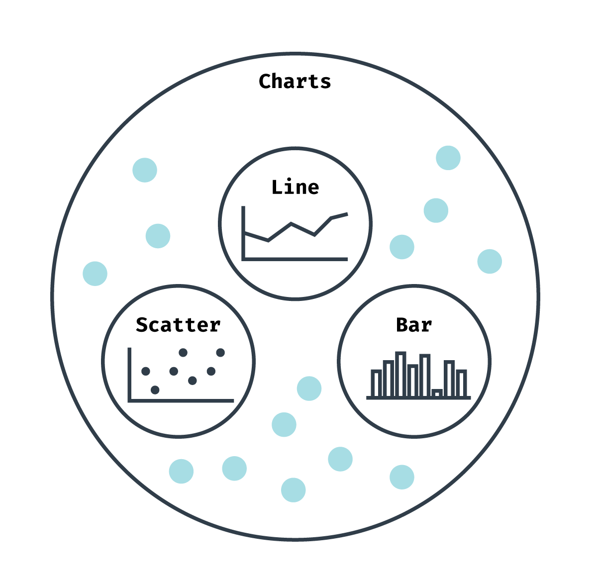

# Data Visualization Basics

Now that we're comfortable with _how_ to create a chart, we should zoom out a bit and talk about _what_ chart to create. So far, we've created a line, scatter, and bar chart, but there are many more basic types to choose from, as well as charts that don't fall into a simple category.

{width=50%}

The format of our chart is the largest factor in what information our users take away — even given the same dataset! Let's look at the charts we've made with our weather data.

In **Module 1**, we charted a timeline of maximum temperatures. Looking at this chart, we could see how the temperature changed over time - how consistent was the weather day to day or season to season?

In **Module 2**, we created a scatter plot with two metrics. Looking at this chart, we could see at how humidity and dew point are related, answering questions such as: does a high humidity also meant a high dew point?

{width=50%}

In **Module 3**, we created a histogram of humidity values. Looking at this chart, we could see how much variety there was in a single metric — do most days stay around the same humidity level, or are they all very different?

{width=70%}

Even with these three examples and a limited dataset, we can see how the type of chart will enable the user to answer very different questions. There are also many types of charts — thus, answering the question **What type of chart is best?** is both important and overwhelmingly open-ended. Don't worry, though — this module will equip you with the tools to make that decision, and quickly!

Let's start at the beginning — with our data.
