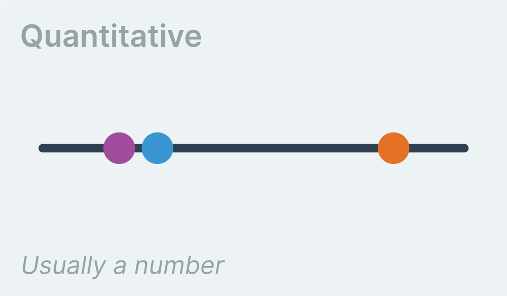

# Types of data

Given a dataset, the first task is to determine the structure of the available metrics. Let's look at the first item of our weather dataset.

{width=50%}

There are many different values here, but two basic types: **strings** and **numbers**. These two types can roughly be split (respectively) into two basic types of data: **qualitative** and **quantitative**.

**Qualitative** data (our strings) does not have a numerical value, but it can be put into categories. For example, `precipType` can either have a value of "rain" or "snow".

{width=70%}

**Quantitative** data (our numbers) is numerical and can be measured objectively. For example, `temperatureMax` has values ranging from 10°F to 100°F.

{width=70%}

Both of these types of data can be broken down even further.

### Qualitative Data

**Binary** data can be placed into only two categories.

{width=70%}

For example, if our weather data had an **did rain** metric that was either **true** or **false**, that metric would be binary.

**Nominal** data can be placed multiple categories that don't have a natural order.

{width=70%}

For example, our weather data has the metric **icon** with values such as `clear-day` and `wind` — these values can't be ordered.

**Ordinal** data can be placed in multiple categories with a natural order.

{width=70%}

For example, if our weather data instead represented **wind speed** values with `not windy`, `somewhat windy`, and `very windy`, that metric would be ordinal.

### Quantitative Data

**Discrete** data has numerical values that can't be interpolated between, such as a metric that can only be represented by an integer (whole number).

{width=70%}

A classic example is **number of kids** — a family can have 1 or 2 kids, but not 1.5 kids. With weather data, a good example would be number of tornados that happened.

**Continuous** data has numerical values that can be interpolated between. Usually a metric will fall under this category — for example, **max temperature** can be 50°F or 51°F or 50.5°F.

{width=70%}

This categorization is just one way to group types of data. There are other ways, but this categorization is common and a handy place to start. When you are looking at a new dataset, familiarize yourself by categorizing each metric.
