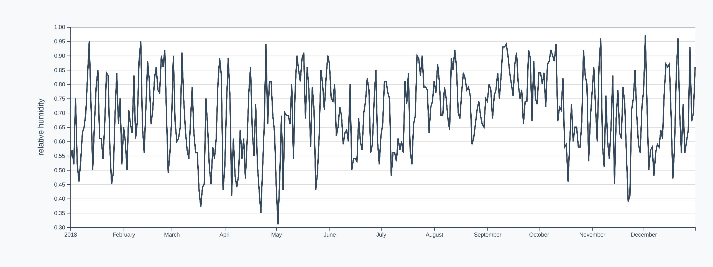
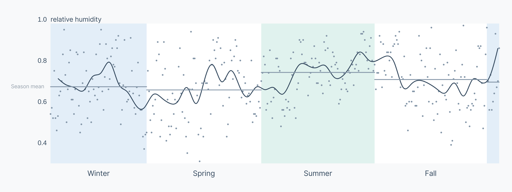

# Example redesign

Let's redesign a simple chart to see these tips in practice. The goal of this chart is to **examine how humidity changes, depending on the time of year**.

<CodeSandboxEmbed
  src="//codesandbox.io/s/b2fq6?fontsize=14&hidenavigation=1&theme=dark&autoresize=1&module=/chart.js&view=preview"
  style={{width: '100%', height: '35em'}}
/>

For practice, take a minute and write down the ways you would improve on this chart, with our goal in mind.

**Goal: examine how humidity changes, depending on the time of year**

Ready to dive in? There is no "correct" way to improve on this chart, but we'll do our best to make it easier to digest quickly.

The first problem we'll tackle is the noisiness of the data. While the daily dips and spikes may help answer other questions, they only distract from our goal of investigating seasonal trends. Let's downsample the data to one point per week and smooth our line using `d3.curveBasis()`.

A>If you're following along, we have a `downsampleData()` function at the bottom of the file that we can pass our `dataset`, `xAccessor`, and `yAccessor` and receive a downsampled dataset with weekly values.

{pagebreak}

A>`d3.line()` has a method `.curve()` that can be passed a interpolation function. The default interpolation is linear: the line connects points directly. For a smoother line, check out the different interpolation options built in to d3 in the [d3-shape documentation](https://github.com/d3/d3-shape#curves). Here, we're adding the code `.curve(d3.cuveBasis)` to diminish the importance of specific data points and give the reader an idea of the overall line shape.

Let's add the original points back in, in the form of small circles. We don't want to lose the granularity of the original data, even when we're getting the basic _trend_ with the downsampled line.

To prevent from drawing attention away from our trend line, we'll make these dots a lighter grey.

There's a lot going on right now! Let's simplify a bit and take out the grid marks and chart background. We'll also specify a smaller number of ticks (`.ticks(3)`) for our y axis — the extra ticks aren't giving any useful information since readers can easily extrapolate between values.

<!-- Much cleaner! However, without our grid lines, values that are far apart are a bit hard to compare. Instead, let's add an area element that splits in the center of the chart. This will make it clear when the humidity is higher or lower than usual. It will also act as a grid line, giving us a frame of reference all the way across the chart.

 -->

Revisiting our goal, we realize that we want to focus on trends based on the time of year. We're showing the months on our x axis, but we can do some work for the reader and highlight the different seasons. Let's block out each season with a `<rect>` underneath our main data elements.

While the legend is helpful, there are a few issues with it.

1. Both Spring and Fall are `white` because they are transitional seasons. This makes it unclear which is which on the chart.

2. As we discussed earlier in the chapter, legends make the reader look back and forth between the chart and the legend.

To fix these issues, let's label the seasons directly on the chart instead of having an x axis.

Let's focus on the y axis. Rotated y axis labels are great — they're often the only way to fit the label to the side of our chart. However, the label is divorced from the values, and rotating text makes it harder to read.

Instead, let's signify the units of our y axis by incorporating it into a phrase with our top y tick value. Human-readable labels can do some of the digesting work a reader has to do, hinting at how to interpret a number.

While we've made it easier to compare trends across seasons, it's not easy to conclude how the seasons compare in general. We _could_ downsample our data and only display one point per season, but then we'd lose any insights from seasonal trends.

Instead, let's add seasonal means as lines, which should enhance the chart but not take away from the main picture.

<CodeSandboxEmbed
  src="//codesandbox.io/s/oyz8g?fontsize=14&hidenavigation=1&theme=dark&autoresize=1&module=/chart.js&view=preview"
  style={{width: '100%', height: '35em'}}
/>

Nice! Now we can easily see that the humidity is low in the Winter, but not as low as in the Spring. Let's look at two charts side-by-side.

While both charts display the same data and can both be helpful, the final version is much more effective for our goal: to **examine how humidity changes, depending on the time of year**.
