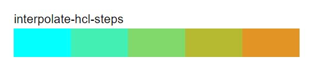

### Custom color scales

Sometimes the built-in color scales don't cut it. Maybe you have specific colors that you want to work in, or you are going for a particular tone with your chart. No worries! We can make our own scales easily using [**d3-interpolate**](https://github.com/d3/d3-interpolate).

<CodeSandboxEmbed
  src="//codesandbox.io/s/i7t0j?fontsize=14&hidenavigation=1&theme=dark&autoresize=1&module=/draw-scales.js"
  style={{width: '100%', height: '35em'}}
/>

Let's say that we wanted to represent temperature values with a color, ranging from "cyan" to "red". There are several methods that we could use to interpolate between those two colors, including `d3.interpolateRgb()` and `d3.interpolateHsl()`.

Let's make our own scale, running from "cyan" to "tomato" — all we need to do is pass our starting and ending color as separate parameters to `d3.interpolateHcl()`.

A>We'll talk about the difference between the different color spaces (**rgb**, **hsl**, **hcl**) in the next section.

```javascript
d3.interpolateRgb("cyan", "tomato")
```

That will give us this scale:


Our code has been started off with a few different custom scales.


If we open up the `draw-scales.js` file, we can test our own custom scales at the bottom. In the `index.html` file, we are importing other JavaScript files that list the built-in scale types and define a `drawColorRange()` function that creates an `<svg>` element with a `linear-gradient`.

We also have a utility function, `addCustomScale()`, that accepts two parameters:

1. the scale's name (which needs to be a string without spaces, since we're using it to create and reference an `id`), and
2. a color scale (a function that returns a color when passed a value between `0` and `1`)

We've already created a few custom scales — check out the first three which have the same range but use different color spaces for interpolation.

We can also create new discrete color schemes. The last two custom scales are using a function called `interpolateWithSteps()` defined on line **33**. `interpolateWithSteps(n)` returns a new array of **n** elements interpolating between `0` and `1`. For example, `interpolateWithSteps(3)` returns `[0, 0.5, 1]`.

We can use this function to make a new color scheme by stepping through a color scale and returning equally spaced through the range. For example:

```
interpolateWithSteps(6).map(
    d3.interpolateHcl("cyan", "tomato")
)
```

will create the following color scheme.


We can look at the color scheme by passing a unique id and our scale to `addCustomScale()`.

```javascript
addCustomScale(
  "interpolate-hcl-steps",
  interpolateWithSteps(6).map(
      d3.interpolateHcl("cyan", "tomato")
  )
)
```



If we wanted to create discrete color schemes with many colors, we could use one of **d3-scale-chromatic**'s cyclical color scales.


We can use our `interpolateWithSteps()` function to split this continuous color scale into a color scheme.

```javascript
interpolateWithSteps(10).map(
  d3.interpolateRainbow
)
```


Play around and make a few color scales or color schemes to get the hang of it.


