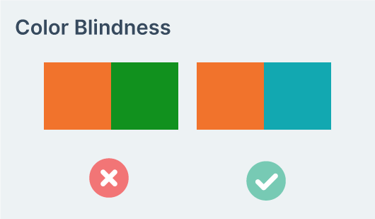
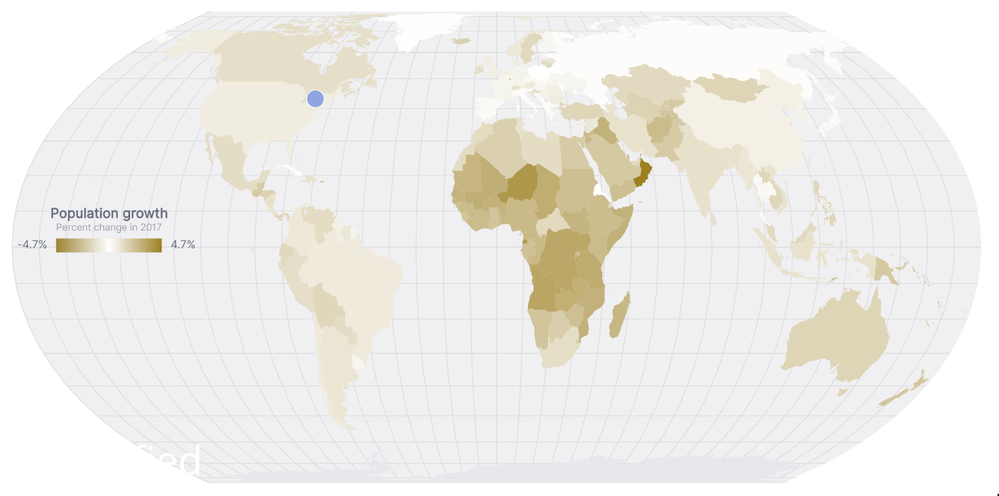
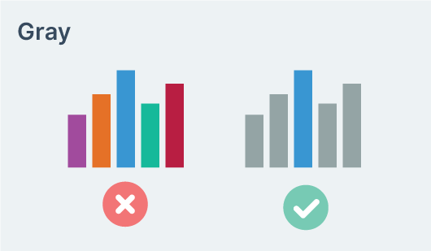

### Color tips

Here are a few tips to keep in mind when choosing individual colors or a color scale.

#### Contrast

{width=70%}

Make sure that your colors have enough contrast with their surroundings in all cases. If you're using Chrome, there is a great tool to check that your colors have enough contrast right in your dev tools. Learn how to use it in the Appendix.

#### Color blindness

{width=70%}

 Don't assume that your users can see your charts as clearly as you can. Almost 8 percent of males of North American descent have red-green color blindness. To make sure most people can encode the information from your color scale, stay away from scales where users have to distinguish between red and green.

 Here's a simulation of what the above picture looks for people with red-green color blindness.

{width=70%}

It's impossible to see which countries have negative growth and which have positive growth if we use the red/green colors on the left for our color scale on the map we created in **Chapter 6**.

There are other forms of color blindness (yellow-blue and total), but they are less common (under 1% of the population). When creating a chart with a color scale, it helps to have a second way to extract the information, such as adding tooltips or in-place labels.

There are sites where you can simulate different types of color blindness to test your data visualizations, such as [Color Flip](https://www.canvasflip.com/color-blind.php).

#### Comparing colors

{width=70%}

Smaller areas of color need are harder to compare. When using colors as an indicator, make sure the colored elements are large enough.

Additionally, far-apart areas of color are harder to compare. Make sure the colors you use have enough contrast that users can easily tell the difference.

#### Semantics

{width=70%}

Choose semantically meaningful colors when possible. For example, blue for lower and red for higher temperatures.

#### Gray

{width=70%}

Gray can be the most important color. When you want to highlight part of a chart, keeping other elements gray helps viewers focus on that element.
