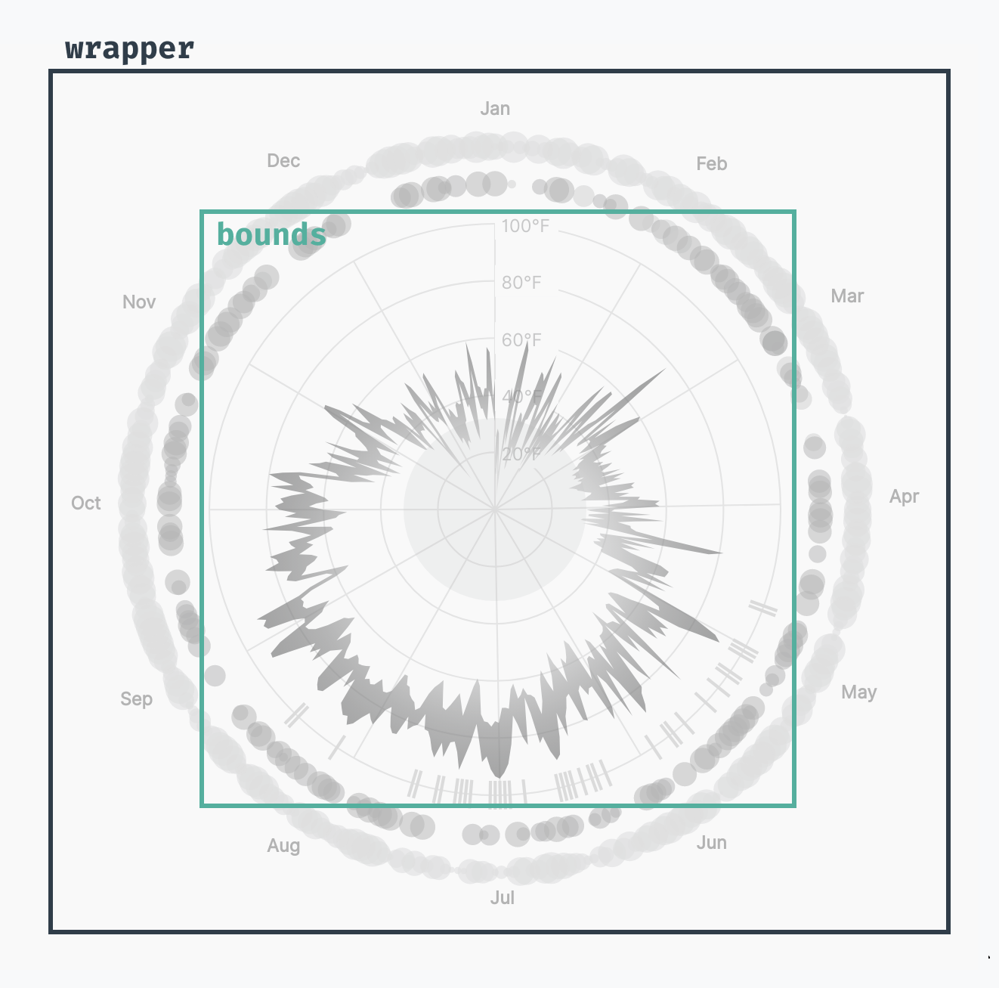
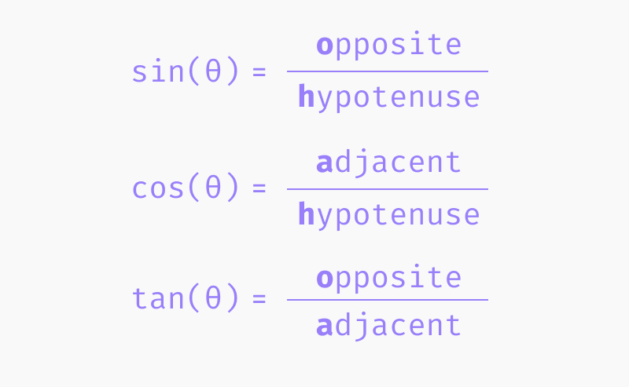
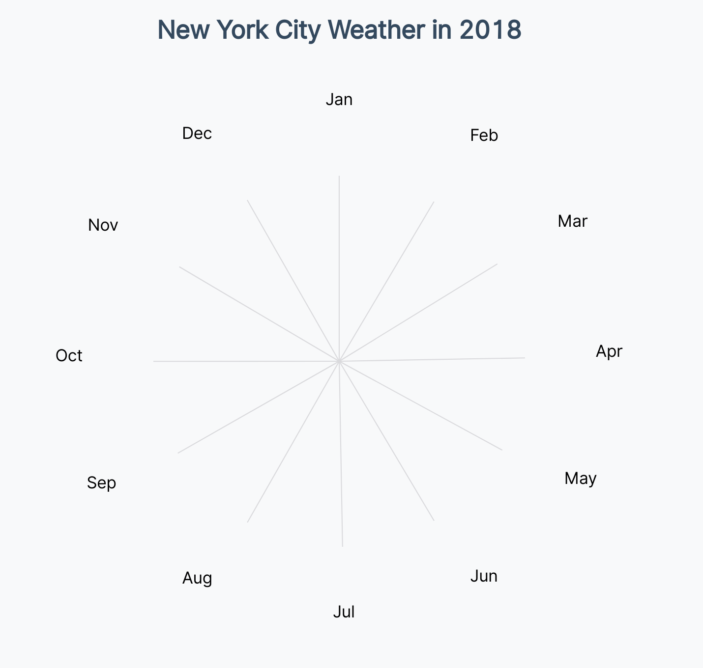
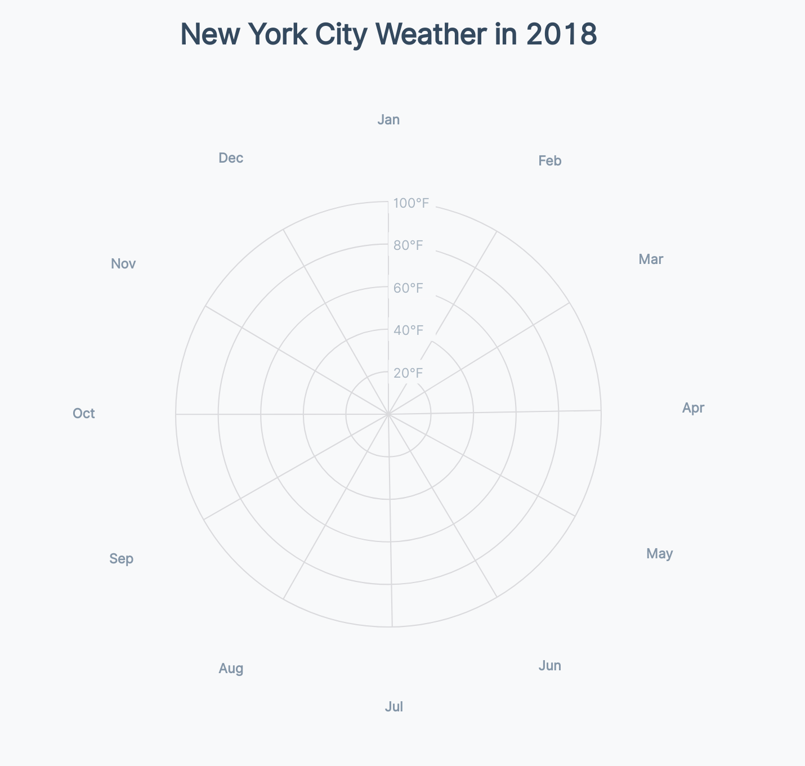

# Adding gridlines

To get our feet wet with this angular math, we'll draw our peripherals _before_ we draw our data elements.

<CodeSandboxEmbed
  src="//codesandbox.io/s/6tzd9?fontsize=14&hidenavigation=1&theme=dark&autoresize=1&module=/chart.js"
  style={{width: '100%', height: '35em'}}
/>

Let's switch those steps in our code.

```javascript
  // 6. Draw peripherals


  // 5. Draw data

```

If your first thought was "but the checklist!", here's a reminder that our chart drawing checklist is here as a friendly guide, and we can switch the order of steps if we need to.

Drawing the grid lines (peripheral) first is helpful in cases like this where we want our data elements to layer _on top_. If we wanted to keep our steps in order, we could also create a `<g>` element _first_ to add our grid lines to _after_.

Creating a group to hold our grid elements is also a good idea to keep our elements organized -- let's do that now.

{lang=javascript,crop-query=.peripherals}
<<[code/11-radar-weather-chart/completed/chart.js](./protected/code/11-radar-weather-chart/completed/chart.js)

### Draw month grid lines

Next, let's create one "spoke" for each month in our dataset. First, we'll need to create an array of each month. We already know what our first and last dates are -- they are the `.domain()` of our `angleScale`. But how can we create a list of each month between those two dates?

The [**d3-time**](https://github.com/d3/d3-time#intervals) module has various _intervals_, which represent various units of time. For example, `d3.timeMinute()` represents every minute and `d3.timeWeek()` represents every week.

Each of these intervals has a few methods -- we can see those methods in the documentation, and also if we double-click into the source code in our dev tools console.

{width=70%}


For example, we could use the `.floor()` method to get the first "time" in the current month:

```javascript
d3.timeMonth.floor(new Date())
```


d3 time intervals also have a `.range()` method that will return a list of datetime objects, spaced by the specified interval, between two dates, passed as parameters.

Let's try it out by creating our list of months!

```javascript
const months = d3.timeMonth.range(...angleScale.domain())
console.log(months)
```

Great! Now we have an array of datetime objects corresponding to the beginning of each month in our dataset.


**d3-time** gives us shortcut aliases that can make our code even more concise -- we can use [`d3.timeMonth()`](https://github.com/d3/d3-time#timeMonths) instead of `d3.timeMonth.range()`.

{lang=javascript,crop-query=.months}
<<[code/11-radar-weather-chart/completed/chart.js](./protected/code/11-radar-weather-chart/completed/chart.js)

Let's use our array of months and draw one `<line>` per month.

```javascript
const gridLines = months.forEach(month => {
  return peripherals.append("line")
})
```

We'll need to find the angle for each month -- let's use our `angleScale` to convert the date into an angle.

```javascript
const gridLines = months.forEach(month => {
  const angle = angleScale(month)

  return peripherals.append("line")
})
```

Each _spoke_ will start in the middle of our chart -- we could start those lines at `[dimensions.boundedRadius, dimensions.boundedRadius]`, but most of our element will need to be shifted in respect to the center of our chart.

Remember how we use our **bounds** to shift our chart according to our `top` and `left` margins?

{width=75%}


To make our math simpler, let's instead shift our **bounds** to _start_ in the center of our chart.

{width=75%}


This will help us when we decide where to place our data and peripheral elements -- we'll only need to know where they lie _in respect to the center of our circle_.

{lang=javascript,crop-query=.bounds}
<<[code/11-radar-weather-chart/completed/chart.js](./protected/code/11-radar-weather-chart/completed/chart.js)

We'll need to convert from _angle_ to `[x, y]` coordinate many times in this chart. Let's create a function that makes that conversion for us. Our function will take two parameters:

1. the **angle**
2. the **offset**

and return the `[x,y]` coordinates of a point rotated `angle` radians around the center, and `offset` time our circle's radius (`dimensions.boundedRadius`). This will give us the ability to draw elements at different **radii** (for example, to draw our precipitation bubbles slightly outside of our temperature chart, we'll offset them by `1.14` times our normal radius length).

```javascript
const getCoordinatesForAngle = (angle, offset=1) => []
```

To convert an angle into a coordinate, we'll dig into our knowledge of [trigonometry](https://www.mathsisfun.com/algebra/trigonometry.html). Let's look at the right-angle triangle (a triangle with a 90-degree angle) created by connecting our _origin point_ (`[0,0]`) and our _destination point_ (`[x,y]`).


The numbers we already know are **theta (θ)** and the **hypotenuse** (`dimensions.boundedRadius * offset`). We can use these numbers to calculate the lengths of the `adjacent` and `opposite` sides of our triangle, which will correspond to the `x` and `y` position of our _destination point_.

Because our triangle has a _right angle_, we can multiply the `sine` and `cosine` of our `angle` by the length of our **hypotenuse** to calculate our `x` and `y` values (remember the [**soh cah toa** mnenomic](http://mathworld.wolfram.com/SOHCAHTOA.html)?).



Let's implement this in our `getCoordinatesForAngle()` function.

```javascript
const getCoordinatesForAngle = (angle, offset=1) => [
  Math.cos(angle) * dimensions.boundedRadius * offset,
  Math.sin(angle) * dimensions.boundedRadius * offset,
]
```

This looks great! But we have to make one more tweak to our `getCoordinatesForAngle()` function -- an angle of `0` would draw a line horizontally to the right of the _origin point_. But our radar chart starts in the center, above our _origin point_. Let's rotate our angles by 1/4 turn to return the correct points.


A>Remember that there are 2π radians in one full circle, so 1/4 turn would be 2π / 4, or π / 2.

{lang=javascript,crop-query=.getCoordinatesForAngle}
<<[code/11-radar-weather-chart/completed/chart.js](./protected/code/11-radar-weather-chart/completed/chart.js)

Whew! That was a a lot of math. Now let's use it to draw our grid lines.

If we move back down in our `chart.js` file, let's grab the `x` and `y` coordinates of the end of our _spokes_ and set our `<line>`s' `x2` and `y2` attributes.

A>We don't need to set the `x1` or `y1` attributes of our line because they both default to `0`.

```javascript
months.forEach(month => {
 const angle = angleScale(month)
 const [x, y] = getCoordinatesForAngle(angle)

 peripherals.append("line")
   .attr("x2", x)
   .attr("y2", y)
   .attr("class", "grid-line")
})
```

Hmm, we can't see anything yet. Let's give our lines a `stroke` color in our `styles.css` file.

```css
.grid-line {
    stroke: #dadadd;
}
```

Finally! We have 12 spokes to show where each of the months in our chart start.

{width=75%}


A>Your spokes might be rotated a bit, depending on when your dataset starts.

### Draw month labels

Our viewers won't know which month each spoke is depicting -- let's label each of our spokes. While we're looping over our months, let's also get the `[x, y]` coordinates of a point **1.38** times our chart's radius _away_ from the center of our chart. This will give us room to draw the rest of our chart within our month labels.

```javascript
months.forEach(month => {
 const angle = angleScale(month)
 const [x, y] = getCoordinatesForAngle(angle)

 peripherals.append("line")
   .attr("x2", x)
   .attr("y2", y)
   .attr("class", "grid-line")

 const [labelX, labelY] = getCoordinatesForAngle(angle, 1.38)
 peripherals.append("text")
   .attr("x", labelX)
   .attr("y", labelY)
   .attr("class", "tick-label")
   .text(d3.timeFormat("%b")(month))
})
```

We can see our month labels now, but there's one issue: the labels on the left are closer to our spokes than the labels on the right.

{width=75%}


This is because our `<text>` elements are anchored by their _left side_. Let's dynamically set their `text-anchor` property, depending on the label's `x` position. We'll align labels on the left by the `end` of the text, and labels near the center by their `middle`.

A>Note that `text-anchor` is essentially the `text-align` CSS property for SVG elements.

```javascript
.text(d3.timeFormat("%b")(month))
.style("text-anchor",
  Math.abs(labelX) < 5 ? "middle" :
  labelX > 0           ? "start"  :
                         "end"
)
```

{width=75%}


Our labels also aren't centered vertically with our spokes. Let's center them, using `dominant-baseline`, and update their styling to decrease their visual weight. We want our labels to orient our users, but not to distract from our data.

```css
.tick-label {
    dominant-baseline: middle;
    fill: #8395a7;
    font-size: 0.7em;
    font-weight: 900;
    letter-spacing: 0.005em;
}
```

Looking much better!

{width=75%}


### Adding temperature grid lines

Our final chart has circular grid marks that mark different temperatures. Before we add this, we need a temperature scale that converts a **temperature** to a **radius**. Higher temperatures are drawn further from the center of our chart.

Let's add a `radiusScale` at the end of our **Create scales** section. We'll want to use `nice()` to give us friendlier minimum and maximum values, since the exact start and end doesn't matter. Note that we didn't use `.nice()` to round the edges of our `angleScale`, since we want it to start and end exactly with its **range**.

{lang=javascript,crop-query=.radiusScale}
<<[code/11-radar-weather-chart/completed/chart.js](./protected/code/11-radar-weather-chart/completed/chart.js)

A>We're using the ES6 _spread_ operator (`...`) to _spread_ our arrays of min and max temperatures so we get one flat array with both arrays concatenated. If you're unfamiliar with this syntax, feel free to [read more here](https://developer.mozilla.org/en-US/docs/Web/JavaScript/Reference/Operators/Spread_syntax).

We'll be converting a single data point into an `x` or `y` value many times -- let's create two utility functions to help us to do just that. It seems simple enough now, but it's nice to have this logic in one place and not cluttering our `.attr()` functions.

{lang=javascript,crop-query=.getXFromDataPoint-.getYFromDataPoint}
<<[code/11-radar-weather-chart/completed/chart.js](./protected/code/11-radar-weather-chart/completed/chart.js)

Let's put this scale to use! At the end of our **Draw peripherals** step, let's add a few circle grid lines that correspond to temperatures within our `radiusScale`.

{lang=javascript,crop-query=.temperatureTicks-.gridCircles}
<<[code/11-radar-weather-chart/completed/chart.js](./protected/code/11-radar-weather-chart/completed/chart.js)

Since `<circle>` elements default to a black fill, we won't be able to see much yet.

{width=75%}


Let's add some styles to remove the fill from any `.grid-line` elements and add a faint `stroke`.

```css
.grid-line {
    fill: none;
    stroke: #dadadd;
}
```

Wonderful! Now we can see our concentric circles on our chart.

{width=75%}


Similar to our month lines, we'll need labels to tell our viewers what temperature each of these circles represents.

{lang=javascript,crop-query=.tickLabels}
<<[code/11-radar-weather-chart/completed/chart.js](./protected/code/11-radar-weather-chart/completed/chart.js)

A>Notice that we're returning early if `d` is falsey -- we don't want to make a label for a temperature of `0`.

We'll need to vertically center and dim our labels -- let's update our

`.tick-label-temperature` elements in our `styles.css` file.

```css
.tick-label-temperature {
    fill: #8395a7;
    opacity: 0.7;
    font-size: 0.7em;
    dominant-baseline: middle;
}
```

These labels are very helpful, but they're a little hard to read on top of our grid lines.

{width=75%}


Let's add a `<rect>` _behind_ our labels that's the same color as the background of our page. We'll need to add this code before we draw our `tickLabels` and after our `gridCircles`, since SVG stacks elements in the order we draw them.

{lang=javascript,crop-query=.tickLabelBackgrounds}
<<[code/11-radar-weather-chart/completed/chart.js](./protected/code/11-radar-weather-chart/completed/chart.js)

That's much easier to read!

{width=75%}


Great! We're all set with our grid marks and ready to draw some data!

### Final code for this lesson

<CodeSandboxEmbed
  src="//codesandbox.io/s/nmzrp?fontsize=14&hidenavigation=1&theme=dark&autoresize=1&module=/chart.js"
  style={{width: '100%', height: '35em'}}
/>