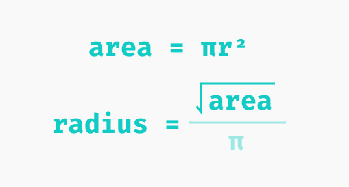
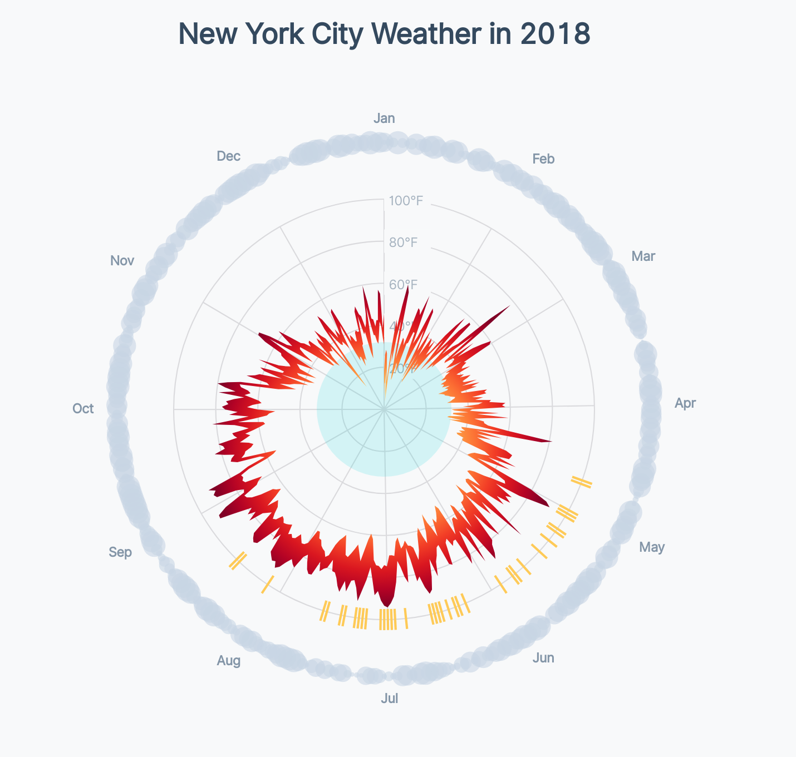

# Adding the cloud cover bubbles

<CodeSandboxEmbed
  src="//codesandbox.io/s/wz0ln?fontsize=14&hidenavigation=1&theme=dark&autoresize=1&module=/chart.js"
  style={{width: '100%', height: '35em'}}
/>

Next, let's add the gray circles around our chart that show how much cloud cover each day has. As a reminder, this is what our final chart will look like:

{width=75%}


The _radius_ of each of our circles will depend on the amount of cloud cover.

A>As an example of how we can use different **dimensions** to visualize a metric (like we learned in **Module 6**), we could have encoded the amount of cloud cover as the color of each circle, instead of the size. In this case, size works better because we're already using a color scale for our temperature _and_ our precipitation type. To prevent from distracting the eye with too many colors, we'll vary our cloud cover circles by _size_ instead.

One caveat with visualizing a _linear scale_ with a circle's size is that circles' _areas_ and _radii_ scale at different rates. Let's take a circle with a radius of 100px as an example. If we multiply its radius by 2, we'll get a circle with a radius of 200. However, the circle grows in every direction, making this larger circle cover _four times_ as much space.


Instead, we'll want a circle with a radius of 141 pixels to create a circle that is twice as _large_ as our original circle.


Since we, as humans, judge a circle by the _amount of space it takes up_, instead of _how wide it is_, we need a way to size our circles by their area instead of their radii. But `<circle>` elements are sized with their `r` attribute, so we need a way to scale our radii so that our areas scale linearly.

The _area_ of a circle is the _radius_ multiplied by π, then squared. If we flip this equation around, we'll find that the _radius_ of a circle is the square root of a circle's _area_, divided by π.

{width=75%}


Since π is a constant, we can represent the relationship simply by using a square root scale. How convenient!

**Whenever we're scaling a circle's radius, we'll want to use [`d3.scaleSqrt()`](https://github.com/d3/d3-scale#scaleSqrt) instead of [`d3.scaleLinear()`](https://github.com/d3/d3-scale#scaleLinear) to keep the circles' areas scaling proportionally.**

Let's create our cloud cover radius scale, making our circles' radii range from `1` to `10` pixels.

A>We'll write this code at the end of our **Create scales** step.

{lang=javascript,crop-query=.cloudRadiusScale}
<<[code/11-radar-weather-chart/completed/chart.js](./protected/code/11-radar-weather-chart/completed/chart.js)

At the end of our **Draw data** step, let's create a new `<g>` to contain our cloud circles, then declare their offset from the center of our chart.

{lang=javascript,crop-query=.cloudGroup-.cloudOffset}
<<[code/11-radar-weather-chart/completed/chart.js](./protected/code/11-radar-weather-chart/completed/chart.js)

Now we can draw one circle per day, setting each circle's radius with our new `cloudRadiusScale`.

{lang=javascript,crop-query=.cloudDots}
<<[code/11-radar-weather-chart/completed/chart.js](./protected/code/11-radar-weather-chart/completed/chart.js)

Great! Now we can see a ring of "clouds" around the outside of our chart.

{width=75%}


Let's set their `fill` color in our `styles.css` file, dimming them so they are a more natural "cloud" color, and so they don't visually dominate our chart.

```css
.cloud-dot {
    fill: #c8d6e5;
}
```
{width=75%}


Let's also make our cloud circles somewhat translucent, so that larger circles don't completely cover their smaller neighbors.

```css
.cloud-dot {
    fill: #c8d6e5;
    opacity: 0.6;
}
```

{width=75%}


### Final code for this lesson

<CodeSandboxEmbed
  src="//codesandbox.io/s/crwiv?fontsize=14&hidenavigation=1&theme=dark&autoresize=1&module=/chart.js"
  style={{width: '100%', height: '35em'}}
/>