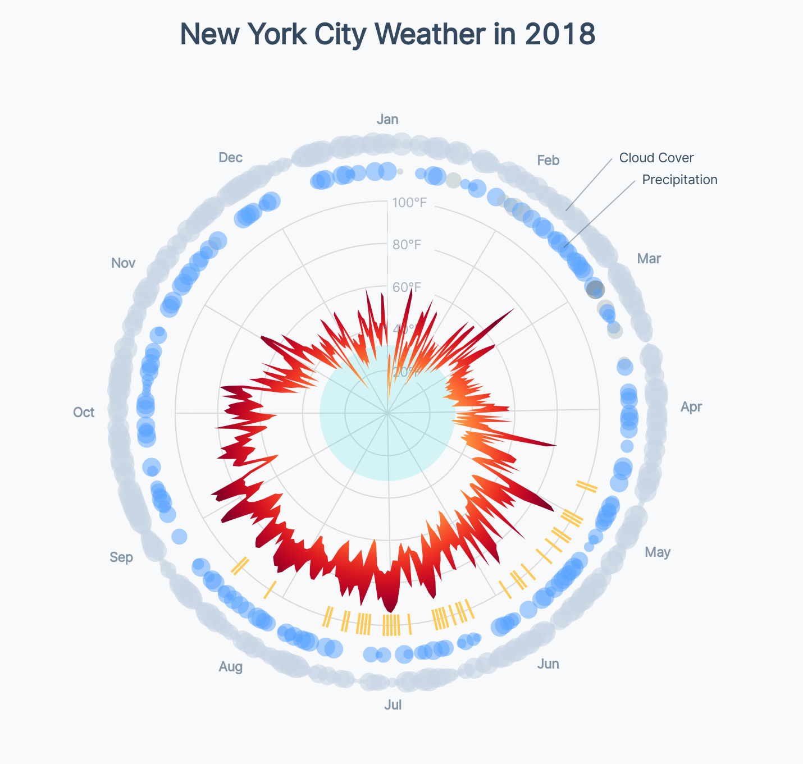
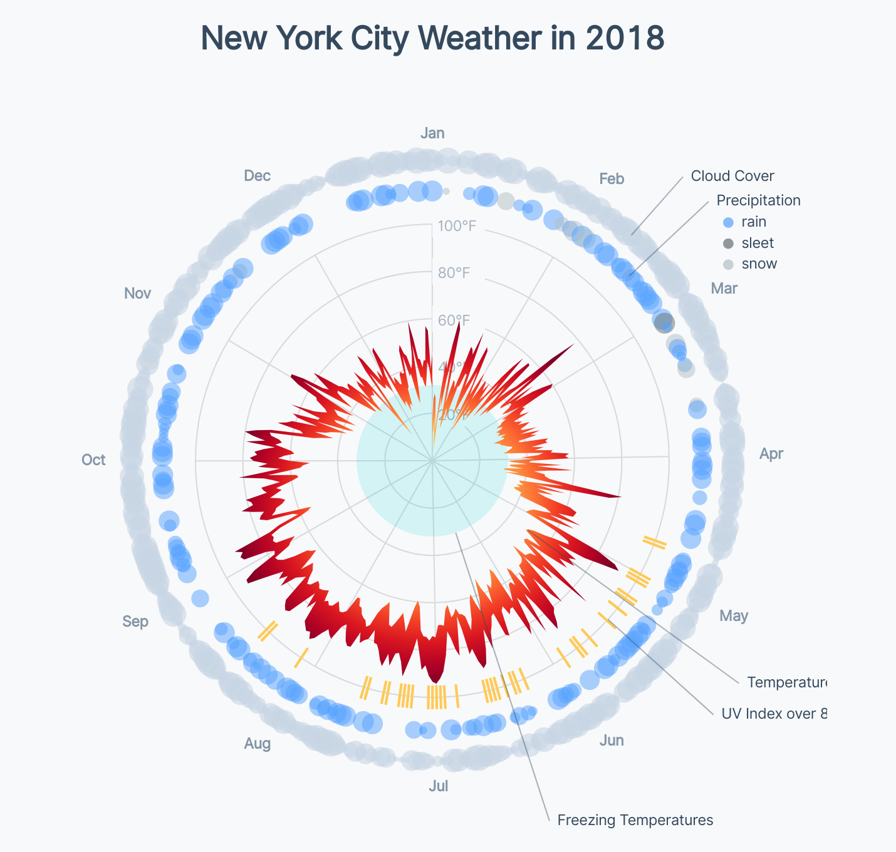

# Adding annotations

<CodeSandboxEmbed
  src="//codesandbox.io/s/xbbml?fontsize=14&hidenavigation=1&theme=dark&autoresize=1&module=/chart.js"
  style={{width: '100%', height: '35em'}}
/>

Let's take a step back and look at our charts through a new viewer's eyes.

{width=75%}


There's a lot going on and not much explanation. A new viewer might wonder: what does this blue dot represent? What are these yellow slashes? The goal of data visualization is communication - and being clear is important for effective communication.

Let's add some annotations to help orient a new viewer. We have a lot of things that need explanation, so let's start by creating a function that will draw an annotation, give three parameters:

1. the **angle** around our circle
2. the **offset** from the center of our circle to start our line at
3. the **text** that we want to display

We'll also create a `<g>` element to contain all of our annotations.

```javascript
const annotationGroup = bounds.append("g")

const drawAnnotation = (angle, offset, text) => {
}
```

Within our `drawAnnotation()` function, we want to draw a `<line>` that extends from our `offset` to a set distance from the center of our chart. Let's draw our lines out to 1.6 times our circle's radius, just outside of our cloud bubbles. We'll also want a `<text>` element to display the text of our annotation, which we'll draw at the outer end of our `<line>`.

{lang=javascript,crop-query=.drawAnnotation}
<<[code/11-radar-weather-chart/completed/chart.js](./protected/code/11-radar-weather-chart/completed/chart.js)

We'll want our `<line>` to have a light stroke and our `<text>` to be vertically centered with the end of our `<line>`. Let's add those styles to our `styles.css` file.

```css
.annotation-line {
    stroke: #34495e;
    opacity: 0.4;
}

.annotation-text {
    fill: #34495e;
    font-size: 0.7em;
    dominant-baseline: middle;
}
```

Going back to our `chart.js` file, let's draw our first two annotations. To keep the top of our chart as clean as possible, let's create an annotation for the outer two data elements: cloud and precipitation bubbles.

We'll want to draw these annotations in the _top right_ of our chart, to prevent from stealing the show too early. If our annotations were in the top left, viewers might read them first (since English text usually runs from left-to-right, top-to-bottom). We'll set the `angle` of these two annotations around π / 4, which is one-eight of a turn around our chart.

And for our annotations' `offset`, we can use the offsets we defined when we drew each set of bubbles.

```javascript
drawAnnotation(Math.PI * 0.23, cloudOffset, "Cloud Cover")
drawAnnotation(Math.PI * 0.26, precipitationOffset, "Precipitation")
```

Wonderful! Our annotations fit in between two of our month labels, preventing any overlap.

{width=75%}


We'll draw the rest of our annotations in the _bottom right_ of our chart, making sure to tell our viewers what the exact UV index threshold is.

```javascript
drawAnnotation(Math.PI * 0.734, UvOffset + 0.05, `UV Index over ${
  uvIndexThreshold
}`)
drawAnnotation(Math.PI * 0.7, 0.5, "Temperature")
drawAnnotation(
 Math.PI * 0.9,
 radiusScale(32) / dimensions.boundedRadius,
 "Freezing Temperatures"
)
```

A>Note that we had to convert our freezing point into a value _relative to our bounded radius_, since our `drawAnnotation()` function takes an `offset` instead of a `radius` value.

Hmm, our longer annotation labels are cut off.

{width=75%}


We _could_ increase the size of our right margin, but that would un-center our chart within our **wrapper**. Not a big deal, but let's look at an alternative: prevent overflowing svg elements from being clipped.

In our `styles.css` file, let's change the `overflow` property of our `svg` from the default of `hidden`.

```css
svg {
    overflow: visible;
}
```

Easy peasy! Now we can see the end of our annotations. Be careful, though, when using this workaround in complicated pages -- you don't want your chart to run into other elements on your page!

{width=75%}


This looks great, but feel free to play around with the `angle` of your annotations. Maybe you would group all of your annotation labels in the _top right_. Keep in mind that irregular shapes waste more space in many page layouts.

If we again view our chart with a new viewer's eyes, each part is way more clear! We are missing one thing, though: the precipitation type colors are still un-labeled.

Let's loop over each of our precipitation types, creating one `<circle>` to show the color and one `<text>` element to label the color.

```javascript
precipitationTypes.forEach((precipitationType, index) => {
 const labelCoordinates = getCoordinatesForAngle(Math.PI * 0.26, 1.6)
 annotationGroup.append("circle")
     .attr("cx", labelCoordinates[0] + 15)
     .attr("cy", labelCoordinates[1] + (16 * (index + 1)))
     .attr("r", 4)
     .style("opacity", 0.7)
     .attr("fill", precipitationTypeColorScale(precipitationType))
 annotationGroup.append("text")
     .attr("class", "annotation-text")
     .attr("x", labelCoordinates[0] + 25)
     .attr("y", labelCoordinates[1] + (16 * (index + 1)))
     .text(precipitationType)
})
```

Great! Now a new viewer is quickly oriented and can figure out what each data element represents.

{width=75%}


### Final code for this lesson

<CodeSandboxEmbed
  src="//codesandbox.io/s/j7nse?fontsize=14&hidenavigation=1&theme=dark&autoresize=1&module=/chart.js"
  style={{width: '100%', height: '35em'}}
/>