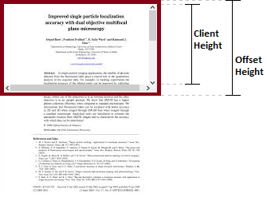

# css workflow
- [x] spacing
- [x] sizing
- [x] alignment
- [x] color

## resize
```js

document.documentElement.style.fontSize = document.documentElement.clientWidth / 375 * 100 + 'px'
window.addEventListener('resize',() => {
  document.documentElement.style.fontSize = document.documentElement.clientWidth / 375 * 100 + 'px'
})

```
## white-space bahaviour

css white space property

|            | line breaks char | extra while space | Text wrapping |
| :--------- | :--------------- | :-------------- | :------------ |
| `normal`   | Collapse         | Collapse        | Wrap          |
| `pre`      | Preserve         | Preserve        | No wrap       |
| `nowrap`   | Collapse         | Collapse        | No wrap       |
| `pre-wrap` | Preserve         | Preserve        | Wrap          |
| `pre-line` | Preserve         | Collapse        | Wrap          |


## all about height



- offsetHeight 
`VISIBLE content & padding & scrollbar `

- clientHeight:
`VISIBLE content & padding` only

- scollHeihgt
`ENTIRE content & padding (visible or not)`

- Element.getBoundingClientRect()


## spacing

```css 
  item:not(:last-child) {
    margin-right: .06rem;
  }
```