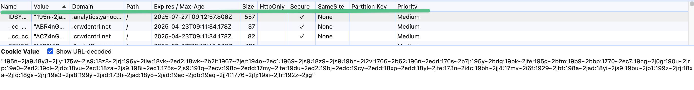

## localstorage 和 sessionstorage 的使用常见分别是什么
vuex,redux,zustand,mobx等状态管理工具，将数据存在内存中
本地存储：localstorage，sessionstorage，不会在服务器设置
sessionstorage 列表页

## cookie和session的使用场景分别是什么,解决的问题
服务端设置
仅放在服务端维护，不暴露给客户端,下发用户唯一标识到客户端

## jwt

## status code

405 Method Not Allowed

404 Not Found

## What Data Is Collected

- Authentication and security
- site service and feature

- site security cookie
IP address/ OS version&type / Device Type / brower type / name of ISP

- analytics cookies
The pages which you have accessed.
The length of your session.
The date and time of your visit to the website.
The number of times you access our website within any month.
The website which referred you to our website.
The domain name you requested.

- [x] perfromance cookie


- [x] Advertising/targeting cookies
  限制您看到广告的次数，让您不会反复看到同一条广告
  购买过其商品或使用过其应用的用户投放广告
  '_fbp'看到广告后购物的频率
  "oo" 在第三方网站上的动态向您展示广告

- [x] Preferences cookies
Save and honor your preferences (such as your theme, language or the region you are in or choose) and provide more enhanced, personal features.




```js
ctx.res.setHeader("Set-Cookie", [
  // ‘AEC’ cookies ensure that requests within a browsing session are made by the user, and not by other sites. These cookies prevent malicious sites from acting on behalf of a user without that user’s knowledge
  "AEC=AVYB7crR8cCxeGkhRIfu; domain=.google.com",
  // cloudflar bot management
  "__cf_bm; expires=1h"，
  // perf cookie: Google Cloud Load Balancer
  "GCLB=",
    // “datr” 是您浏览器的唯一识别符, 可帮助我们识别您以前登录过且可信赖的浏览器
    "datr=9NNLZJsF5TCTxhpfl-wlPB8o; max-age=3"，
    // 统计广告的展示次数和看到广告后购物的频率
    "_fbp=9NNLZJsF5TCTxhpfl-wlPB8o; httpOnly"
    // 屏幕和窗口的比率和尺寸
    "dpr"
])
```

### cookie读写中间件（实用方法）
```js
const crypto = require('crypto')

const sign = (val, secret) => {
  return crypto.createHmac('sha256', secret).update(val).digest('base64url')
  // '/' -> '_'; = -> ''
}

app.use((ctx,next) => {
  ctx.res.setCookies = (key, value, option) => {
    const opt = option || {}
    let val = encodeURIComponent(value)
    // 防止客户端篡改的签名
    if(opt.signed) {
      val = sign(val, 'xiyuan')
    }
    const pairs = [key + "=" + val]


    if(opt.domain) {
      pairs.push('Domain=' + opt.domain )
    }
    if (opt.path) {
      paris.push("Path=" + opt.path)
    }
    if (opt.MaxAge) {//以s为单位
      paris.push("Max-Age="+ opt.MaxAge)
    }

    return pairs.join("; ")
  }
})


ctx.res.setHeader("Set-Cookie", )
```
