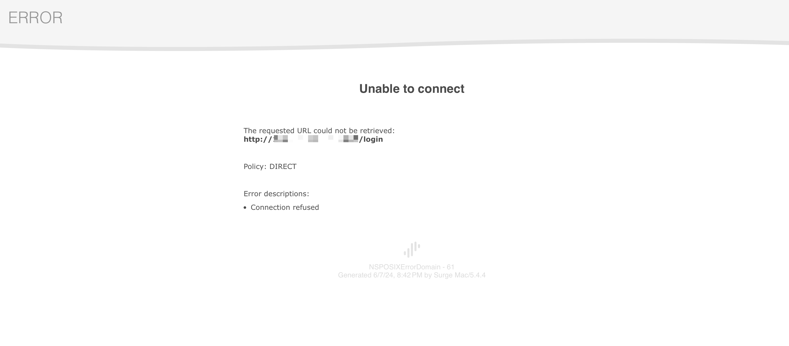
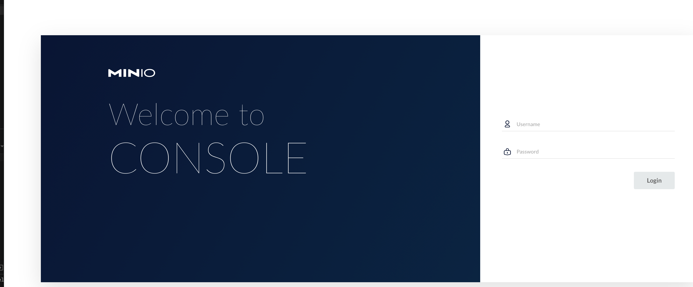

- [x] [Error response from daemon: open /var/lib/docker/tmp/docker-import-537484462/repo/.cpt_hardlink_dir_a920e4ddc233afddc9fb53d26c392319/json: no such file or directory #19566](https://github.com/moby/moby/issues/19566)

> helinwang commented on Jul 21, 2017 •
> I got similar error:
>
> open /var/lib/docker/tmp/docker-import-347673752/bin/json: no such file or directory
> It's because I ran docker load, trying to import the output of docker export.
> The correct way is to run docker import for the output of docker export. (docker load is for the output of docker save).
> Better error message from docker would be more helpful.

> ran md5 checksums on the images before and after I moved them across systems

```bash title="云主机 /root/"
md5sum phoenix.tar.gz
6f7ea1a750fbbe4e81b3431250275553  phoenix.tar.gz
```

>

```bash title="本地 /project-clone/shenzhou/images"
brew install md5sha1sum
md5sum phoenix.tar.gz
6f7ea1a750fbbe4e81b3431250275553  phoenix.tar.gz
```

- [x] ssh 登录云服务器频繁断开链接
      `vim /etc/ssh/sshd_config`

```bash
[root@VM-20-10-centos ~]# cat /etc/ssh/sshd_config | grep  Client
#ClientAliveInterval 0
#ClientAliveCountMax 3
[root@VM-20-10-centos ~]# vim /etc/ssh/sshd_config
[root@VM-20-10-centos ~]# systemctl restart sshd #重启sshd服务
[root@VM-20-10-centos ~]# cat /etc/ssh/sshd_config | grep  Client
ClientAliveInterval 30 #客户端每隔多少秒向服务发送一个心跳数据
ClientAliveCountMax 86400 #客户端多少秒没有相应，服务器自动断掉连接
```

- [x] [How to retrieve the forgotten master password #858](https://github.com/kingToolbox/WindTerm/issues/858)

> kingToolbox commented on Jun 29, 2022
>
> Unfortunately, there is no way to retrieve the master password. 😞 You can reset the master password to an empty string through the steps below:
>
> Open the file .wind/profiles/default.v10/user.config and delete the lines containing application.fingerprint and application.masterPassword.
> Open the file .wind/profiles/default.v10/terminal/user.sessions and delete the lines containing session.autoLogin.
> Note that all automatic login information will be lost.

- [x] IDEA2023 创建 spring 工程无法选择 jdk8 与 11 的解决办法

> 我们只需要改变我们的 spring 项目构建网站即可，点击创建 spring 项目窗口上方的服务器 URL 后的齿轮按钮，将网站更改即可，可以使用阿里云的构建网站https://start.aliyun.com/

```bash
[root@VM-20-10-centos ~]# docker run -it -d --name redis -p 6379:6379 \
> -v /root/redis/conf:/usr/local/etc/redis \
> -e TZ=Asia/Shanghai \
> redis:6.0.10 \
> redis-server /usr/local/etc/redis/redis.conf
ea7897d35aa55d06ceddda2dd8b96b4dc7a2f05a4c1ab8accba6488bb5fc3395
```

- [x] 修改已经创建的 docker 容器配置

```bash
[root@VM-20-10-centos ~]# cd /var/lib/docker/containers/
[root@VM-20-10-centos containers]# ls -la
total 16
drwx------  4 root root 4096 Jun  7 19:53 .
drwx--x--x 11 root root 4096 Jun  7 19:25 ..
drwx------  5 root root 4096 Jun  7 19:53 ae47c9eb876cd81d8fd55d118fe379474a000949a2c21e41acc883d3cda95f20
drwx------  5 root root 4096 Jun  7 19:36 c0a8bb6d2769fb153d2199ef7c59ee3bfd6ab9077679ae086009c1aecee38a1c
[root@VM-20-10-centos containers]# docker ps -a
CONTAINER ID        IMAGE                                        COMMAND                  CREATED             STATUS                      PORTS                                                                                                                                                    NAMES
ae47c9eb876c        redis:6.0.10                                 "docker-entrypoint..."   13 minutes ago      Exited (1) 13 minutes ago                                                                                                                                                            redis
c0a8bb6d2769        boostport/hbase-phoenix-all-in-one:2.0-5.0   "/start-hbase-phoe..."   31 minutes ago      Up 31 minutes               0.0.0.0:2181->2181/tcp, 0.0.0.0:8765->8765/tcp, 0.0.0.0:15165->15165/tcp, 0.0.0.0:16000->16000/tcp, 0.0.0.0:16010->16010/tcp, 0.0.0.0:16020->16020/tcp   phoenix
[root@VM-20-10-centos containers]# cd ae47c9eb876c/
-bash: cd: ae47c9eb876c/: No such file or directory
[root@VM-20-10-centos containers]# cd ae47c9eb876cd81d8fd55d118fe379474a000949a2c21e41acc883d3cda95f20
[root@VM-20-10-centos ae47c9eb876cd81d8fd55d118fe379474a000949a2c21e41acc883d3cda95f20]# ls -la
total 44
drwx------ 5 root root 4096 Jun  7 19:53 .
drwx------ 4 root root 4096 Jun  7 19:53 ..
drwx------ 2 root root 4096 Jun  7 19:53 checkpoints
-rw-r--r-- 1 root root 3165 Jun  7 19:53 config.v2.json
-rw-r--r-- 1 root root 1206 Jun  7 19:53 hostconfig.json
-rw-r--r-- 1 root root   13 Jun  7 19:53 hostname
-rw-r--r-- 1 root root  174 Jun  7 19:53 hosts
-rw-r--r-- 1 root root   89 Jun  7 19:53 resolv.conf
-rw-r--r-- 1 root root   71 Jun  7 19:53 resolv.conf.hash
drwxr-xr-x 3 root root 4096 Jun  7 19:53 secrets
drwx------ 2 root root 4096 Jun  7 19:53 shm
[root@VM-20-10-centos ae47c9eb876cd81d8fd55d118fe379474a000949a2c21e41acc883d3cda95f20]# vim hostconfig.json
[root@VM-20-10-centos ae47c9eb876cd81d8fd55d118fe379474a000949a2c21e41acc883d3cda95f20]# vim config.v2.json
[root@VM-20-10-centos ae47c9eb876cd81d8fd55d118fe379474a000949a2c21e41acc883d3cda95f20]#
```

```bash
 docker logs minio
 12:21:23.20
 12:21:23.21 Welcome to the Bitnami minio container
 12:21:23.21 Subscribe to project updates by watching https://github.com/bitnami/bitnami-docker-minio
 12:21:23.21 Submit issues and feature requests at https://github.com/bitnami/bitnami-docker-minio/issues
 12:21:23.21
 12:21:23.21 INFO  ==> ** Starting MinIO setup **
 12:21:23.22 INFO  ==> ** MinIO setup finished! **

minio 12:21:23.24 INFO  ==> ** Starting MinIO **
ERROR Unable to validate credentials inherited from the shell environment: Invalid credentials
      > Please provide correct credentials
      HINT:
        Access key length should be at least 3, and secret key length at least 8 characters

```

- [x] minio MINIO_ROOT_PASSWORD 长度未达到要求

想进入minio web管理界面时报错



查看日志
`docker logs minio`

```bash
ERROR Unable to validate credentials inherited from the shell environment: Invalid credentials
      > Please provide correct credentials
      HINT:
        Access key length should be at least 3, and secret key length at least 8 characters
```

检视 minio 容器配置
`docker inspect minio | grep -A 5 Env`

```bash
"Env": [
  "TZ-Asia/Shanghai",
  "MINIO_ROOT_USER=root",
  #原密码隐私处理,就是长度不够8位
  "MINIO_ROOT_PASSWORD="*****",
  "MINIO_SKIP_CLIENT=yes",
  "PATH=/opt/bitnami/common/bin:/opt/bitnami/minio-client/bin:/opt/bitnami/minio/bin:/usr/local/sbin:/usr/local/bin:/usr/sbin:/usr/bin:/sbin:/bin",
```

1. 防止修改后容器配置不生效，先停止 docker 服务`systemctl stop docker` 

2. 编辑 congfig.v2.json 修改`MINIO_ROOT_PASSWORD`的Miami,保存退出。

3. 重启docker服务 `systemctl start docker`

4. 查看镜像是否启动 `docker ps`

5. 自己的镜像没有启动时，手动启动即可 `docker start [CONTAINER ID | CONTIANER NAME]`

_详细过程_

`cd /var/lib/docker/containers/`

`docker ps -a`

```bash
CONTAINER ID        IMAGE                                        COMMAND                  CREATED             STATUS                         PORTS               NAMES
c257d676ec59        bitnami/minio:latest                         "/opt/bitnami/scri..."   41 minutes ago      Exited (1) 58 seconds ago                          minio
96ccf67d5239        rabbitmq:3.8.9                               "docker-entrypoint..."   48 minutes ago      Exited (0) 2 minutes ago                           mq
ae47c9eb876c        redis:6.0.10                                 "docker-entrypoint..."   About an hour ago   Exited (1) About an hour ago                       redis
c0a8bb6d2769        boostport/hbase-phoenix-all-in-one:2.0-5.0   "/start-hbase-phoe..."   About an hour ago   Exited (137) 2 minutes ago                         phoenix
```
`ls -la`
```bash
total 24
drwx------  6 root root 4096 Jun  7 20:21 .
drwx--x--x 11 root root 4096 Jun  7 19:25 ..
drwx------  5 root root 4096 Jun  7 21:00 96ccf67d52394654d2e47f88fbeeed1c3dde439a1684f153dc4fb08e1f301764
drwx------  5 root root 4096 Jun  7 21:00 ae47c9eb876cd81d8fd55d118fe379474a000949a2c21e41acc883d3cda95f20
drwx------  5 root root 4096 Jun  7 21:00 c0a8bb6d2769fb153d2199ef7c59ee3bfd6ab9077679ae086009c1aecee38a1c
drwx------  5 root root 4096 Jun  7 21:01 c257d676ec59ae7768bb812fcc9b5337fe52f0c43d7443341b692bf783012b3d
```
`cd c257d676ec59ae7768bb812fcc9b5337fe52f0c43d7443341b692bf783012b3d`
`ls -la`

```bash
total 44
drwx------ 5 root root 4096 Jun  7 21:01 .
drwx------ 6 root root 4096 Jun  7 20:21 ..
drwx------ 2 root root 4096 Jun  7 20:21 checkpoints
-rw-r--r-- 1 root root 3324 Jun  7 21:01 config.v2.json
-rw-r--r-- 1 root root 1248 Jun  7 21:01 hostconfig.json
-rw-r--r-- 1 root root   13 Jun  7 21:01 hostname
-rw-r--r-- 1 root root  174 Jun  7 21:01 hosts
-rw-r--r-- 1 root root   89 Jun  7 21:01 resolv.conf
-rw-r--r-- 1 root root   71 Jun  7 21:01 resolv.conf.hash
drwxr-xr-x 3 root root 4096 Jun  7 21:01 secrets
drwx------ 2 root root 4096 Jun  7 20:21 shm
```
`vim config.v2.json`

终于进入到登录界面
