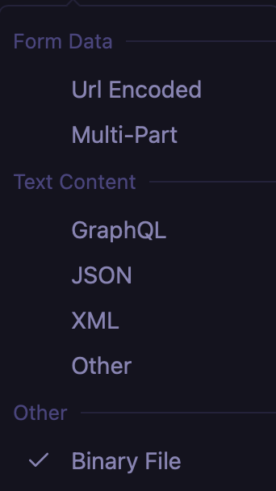

# 前后端数据通信

浏览器:提供web服务的客户端浏览程序,可向web服务发送各种请求,并对从服务器发来的超文本和各种多媒体数据格式进行解析,显示和播放

服务器: 指一个管理资源并未用户提供服务的计算机软件, 通常为文件服务器,数据库服务器,应用程序服务器. 运行以上软件的计算机或计算机系统也被称为服务器


cors  反向代理


http response status code(响应状态码)

400 Bad Request 语法错误

401 Unauthorized 未认证

403 Forbidden 禁止访问

404 Not Found 资源未找到

500 Interal Server Error 服务器故障

503 Service Unavailiable 服务器繁忙


## 局部刷新与异步

瀑布流内容下拉刷新列表,上拉加载更多

地图拖拽加载更多


## GET发送数据


## POST发送数据

__constructing request body type__




`Content-Type: multipart/form-data`

> The content type "application/x-www-form-urlencoded" is inefficient for sending large quantities of binary data or text containing non-ASCII characters.
>
> "multipart/form-data" should be used for submitting forms that contain files, non-ASCII data, and binary data.

`Content-Type: application/x-www-form-urlencoded`

```js

xhr.setRequestHeader('Content-Type', 'application/x-www-form-urlencoded')//Raw text/plain
xhr.send('username=James&password=12345')
```

`raw json`

`Content-Type: application/json`

```js
xhr.setRequestHeader('Content-type', 'application/json')
xhr.send(JSON.stringfy({}))
```

 - HTTP  MDN.png>)

__raw text/plain__

`Content-Type: text/plain`


JSON


## 响应数据类型

xhr.responseText

xhr.responseXML


```js
router.post('/login', (ctx, next)=>{
  const token = require('crypto').randomBytes(64).toString('hex')
  ctx.body = {
 		errcode: 0,
  	errmsg: 'ok',
  	result: {
     	   permissons:['LIST:UPDATE', 'LIST:DELTE'],
    			token 
    }
  }
 
})
```


## 把响应JSON数据渲染到页面

模版字符串支持插值表达式

```js
const boday = document.querySelector('tbody')
xhr.onload = function(){
	const data = JSON.parase(xhr.responseText)
  tbody.innerHtml = data.result.permissions.map(permission => {
    return `
    		<td>${permission}<td>
    `
  })
}

```

模版引擎


## API接口文档

swagger


## 实现上拉刷新,下拉加载更多

错误码

- -1 : 参数个数错误
- -2: 参数类型错误

```js
const fs = require('fs')
router.post('/page', async(ctx, next)=>{
	const args = [
  	{ field: 'page', type: 'number'},
  	{ field: 'count', type: 'number'}
	]
	const requestBody = ctx.request.body // { page: 1, count: 10 }
	args.forEach(arg => {
  	if(!Object.keys(requestBody).includes(arg.field))	{
  		ctx.body = {
  			errcode: -1,
  			errmsg: '参数个数错误'
  		}
  		return; 
  	}else {
  		if(typeof requestBody[arg.field] != arg.type){
  			ctx.body = {
  				errcode: -2,
  				errmsg: '参数类型错误'
  			}
  			return;
  		}
  		
  		let data = fs.readFileSync('./data/sportNewsList.json')
  		data = JSON.parse(data)
      const result = data.splice((requestBody.page - 1) * requestBody.count, requestBody.count)
      ctx.body = {
        errcode: 0,
        errmsg: 'ok',
        result
      }
  	}
	})  
})

```


```vue
<template>
	<div id="loading"></div>
  <div id="loading-down"></div>
  <main id="sport-main">
    <div class="list-wrapper">
      <ul class="sport-list"></ul>
      <div id="loading-up"></div>
    </div>
  </main>
</template>

<style>
#sport-main {
  margin-top: 50px;
  height: calc(100vh - 50px);
}
</style>
<script src="https://unpkg.com/better-scroll@latest/dist/better-scroll.js"></script>
<script>
const sportList = document.querySelector('#sport-list')
const sportMain = document.querySelector('#sport-main')
const loadingDown = document.querySelector('#loading-down')
const loadingUp = document.querySelector('#loading-up')
const loading = document.querySelector('#loading')
const current = 0

initList()
function initList() {
	loading = 'Loading...'
  axios
    .post('/sportList', {
      page: 1,
      count: 10,
    })
    .then((res) => {
      if (res.data.errcode === 0) {
				setTimeout(() => {
					sportList.innerHtml = res.data.result.map((item) => {
						return `
						<li>{item}<li>
					`
					})
					initBetterScroll()
					loading = ''
				}, 1000);
      }
    })
}
function initBetterScroll() {
  let bs = BetterScroll.initBetterScroll(sportMain, {
    // 触发条件
    pullDownRefresh: {
      threshold: 50,
    },
    pullUpLoad: {
      threshod: -10,
    },
  })

  bs.on('pullingDown', () => {
    loadingDown.innerHtml = 'loading...'
    axios
      .post('sportList', {
        page: 0,
        count: 10,
      })
      .then((res) => {
        if (res.data.errcode === 0) {
          setTimeout(() => {
            sportList.innerHtml = res.data.result.map((item) => {
              return `
							<li>{item}</li>
						`
            })
            loadingDown.innerHtml = '刷新成功'
            bs.finishPullDown()
            bs.refresh()
						current = 0
          }, 1000)
        }
      })
  })

	bs.on('pullingUp', ()=>{
		pullingUp.innerHtml = 'Loading...'
		axios.post('/sportList', {
			page: ++current,
			count: 10
		}).then(res=>{
			if(res.data.errcode === 0){
				sportList.innerHtml += res.data.result.map(item=>{
					return `
						<li>{item}</li>
					`
				})
				loadingUp.innerHtml = res.data.result.length > 0 ? '加载更多' : 
				bs.finishPullUp()
				bs.refresh()
			}
		})
	})
}

</script>
```


### 跨域与反向代理

__浏览器同源策略__

<div class="grid cards" markdown>

-  __协议相同__
-  __域名相同__
-  __端口相同__

</div>

| URL                               | 结果                  | 原因     |
| --------------------------------- | --------------------- | -------- |
| http://localhost:3000/sports.html | 成功:material-check:  |          |
| http://localhost:3000/list        | 成功 :material-check: |          |
| https://localhost:3000/list       | 失败 :material-close: | 协议不同 |
| http://127.0.0.1:3000/list        | 失败 :material-close: | 域名不同 |
| http://localhost:8080/list        | 失败 :material-close: | 端口不同 |

```js
ctx.set('Access-Control-Allow-origin', 'http://localhost:3000')
```


```js
cbRegex = /callback=([^&]+)/
cbRegex.test('http://1237.0.0.1:3000?callback=foo')
```

