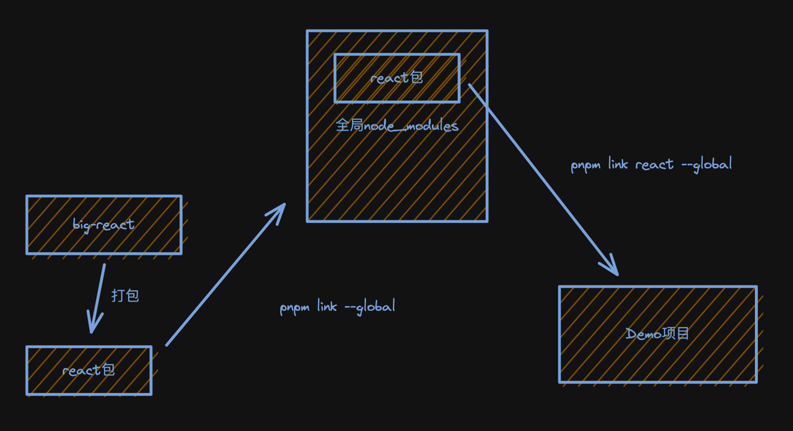

<head>
  <style>
    :root {
      --color-primary: rgb(145,109,213)
    }
    code {
      color: var(--color-primary) !important;
    }
  </style>
</head>

# JSX 转换

[本节课代码地址]()

<span  style="font-size: 18px; display: inline-block; padding-left: 10px; border-left: 5px solid rgb(145, 109, 213);">React 项目架构</span>

<ul style="list-style-type:circle; padding-left: 30px;">
  <li><code>react</code>（宿主环境无关的公用方法）</li>
 <li><code>react-reconciler</code> (协调器的实现，宿主环境无关)</li>
 <li><code>shared</code> (公用辅助方法，宿主环境无关)</li>
</ul>
本节课将实现的JSX转换属于`react`包

<span  style="font-size: 18px; display: inline-block; padding-left: 10px; border-left: 5px solid rgb(145, 109, 213);">JSX 转换是什么</span>

[jsx 转换演练场](https://babeljs.io/repl#?browsers=defaults&build=&builtIns=false&corejs=3.6&spec=false&loose=false&code_lz=DwEwlgbgfAjATAZmAenNIA&debug=false&forceAllTransforms=false&shippedProposals=false&circleciRepo=&evaluate=false&fileSize=false&timeTravel=false&sourceType=module&lineWrap=true&presets=react%2Cstage-2&prettier=false&targets=&version=7.19.5&externalPlugins=&assumptions=%7B%7D)

- 编译时
- 运行时:jsx 或 React.createElemnt 的执行

编译时由 babel 编译实现, 我们来实现运行时, 步骤分为

1. 实现 jsx 方法
2. 实现打包流程
3. 实现调试打包结果的环境

<h3 style="text-align:center;  font-size: 20px;font-weight: bold;"><span style="border-bottom: 2px solid rgb(145, 109,213);">实现jsx方法</span></h3>

包括:

- `jsx`方法 (prod 环境)
- `jsxDev`方法 (dev 环境)
- `React.createElement` 方法

<h3 style="text-align:center;  font-size: 20px;font-weight: bold;"><span style="border-bottom: 2px solid rgb(145, 109,213);">实现打包流程</span></h3>

对应上述 3 个方法,打包对应文件

- react/jsx-dev-runtime.js (dev 环境)
- react/hsx-runtime.js (prod 环境)
- React

<h3 style="text-align:center;  font-size: 20px;font-weight: bold;"><span style="border-bottom: 2px solid rgb(145, 109,213);">调试打包结果</span></h3>

[pnpm link 文档] (https://pnpm.io/zh/cli/link)



模拟实际项目中引用 react

<span  style="font-size: 18px; display: inline-block; padding-left: 10px; border-left: 5px solid rgb(145, 109, 213);">知识补充</span>

<h3 style="text-align:center;  font-size: 20px;font-weight: bold;"><span style="border-bottom: 2px solid rgb(145, 109,213);">@rollup/plugin-commonjs插件的作用</span></h3>

`rollup`原生支持`ESM`格式， 所以对`CJS`格式的包，需要先用插件将他转换为`ESM`格式，

<h3 style="text-align:center;  font-size: 20px;font-weight: bold;"><span style="border-bottom: 2px solid rgb(145, 109,213);">为什么要别分别实现createElement与jsx这2个API</span></h3>

**Pass key separately from props**
key 为什么单独传参
before: pass it as part of props
now: pass it as separate arguments

```t
jsx(type, props, key) {}
```

**Always pass children as props**

**DEV only transforms**

```ts
jsxDEV(type, props, key, isStaticChildren, source, self){}
```
