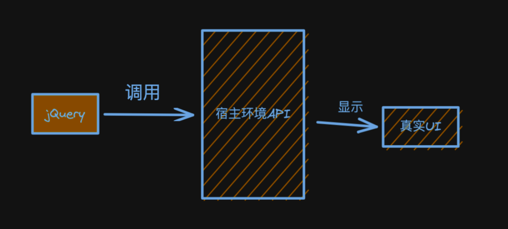
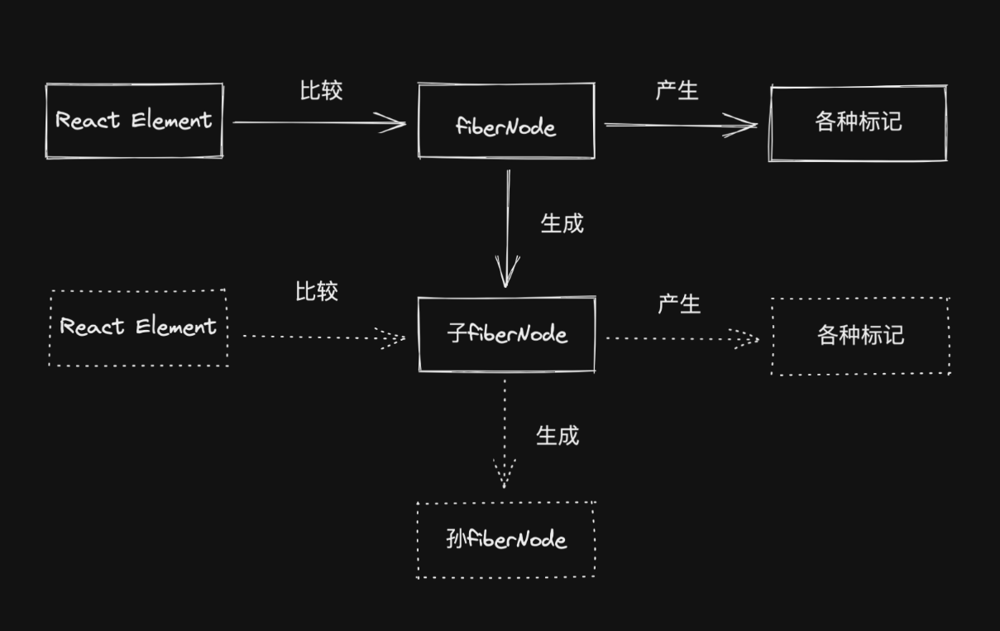

<head>
  
</head>
# 实现reconciler架构

[代码地址]()

`reconciler`是`react`h

<h2  style="font-size: 22px; display: inline-block; padding-left: 10px; border-left: 5px solid rgb(145, 109, 213); font-weight:bold;">reconciler有什么用?</h2>

inversion of control:开发者不再直接调用宿主环境api

过程驱动:

状态驱动

<h3 style="text-align:center;  font-size: 20px;font-weight: bold;">reconciler操作的数据结构是</h3>

当前我们了解的节点类型:

- JSX
- ReactElement
- FiberNode
- DOMElement

`straight forward appoch`是用`ReactElement`,但ReactElement作为数据结构,存在的问题:

- 无法表达节点之间的关系

我们需要的数据结构的特点是:

- 介于`ReactElement`与真实UI节点之间
- 能够表达节点之间的关系
- 方便扩展(不仅能作为数据存储单元, 也能作为工作单元)

`FiberNode`(虚拟DOM在React中的实现)

> 虚拟DOM在Vue中的实现是`vnode`

<h2  style="font-size: 18px; display: inline-block; padding-left: 10px; border-left: 5px solid rgb(145, 109, 213);font-weight:bold">reconciler的工作方式?</h2>

对于同一节点,比较其`ReactElement`与`fiberNode`. 生成子`fiberNode`.并根据比较的结果生成不同的标记(插入、删除、移动...), 对因不同`宿主环境API的执行`

当所有`ReactElement`比较完后，会生成一棵`fiberNode`树， 一共会存在两棵`fiberNode`树：

- current: 与视图中真实UI对应的`fiberNode`树
- workInProgress : 触发更新后，在`reconciler`中计算出的`fiberNode`树 

<h2  style="font-size: 18px; display: inline-block; padding-left: 10px; border-left: 5px solid rgb(145, 109, 213);font-weight:bold">jsx的消费顺序</h2>

以DFS（深度优先遍历） 的顺序遍历`ReactEleement`, 这意味着

- 如果有子节点，遍历子节点
- 如果没有子节点， 遍历兄弟节点 

这是个递归的过程， 存在递、归两个阶段：

- 递：对应beginWork
- 归： 对应completeWork
