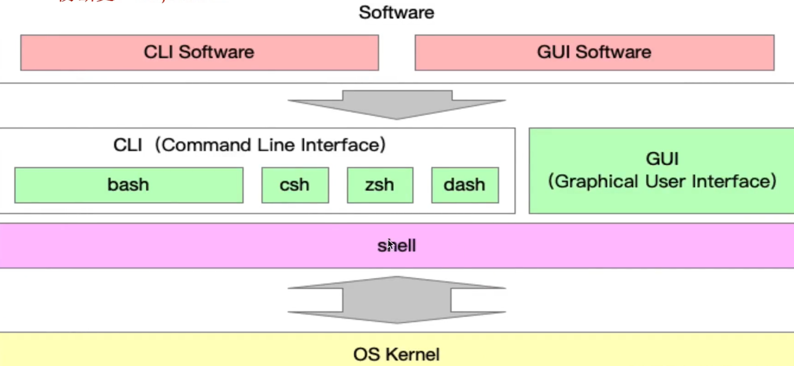

## Cli 101

### shell
> shell provide interface to interact with other programs


to find the path of executable from env variable($PATH)
```sh
which npm
/Users/ayao/.nvm/versions/node/v22.4.1/bin/npm
```
to find the path of built-in command
```sh
ls /usr/bin | grep -w "cd"
cd
```


- [x] bash and zsh as shell implementation

```sh
cat /etc/shells
# List of acceptable shells for chpass(1).
# Ftpd will not allow users to connect who are not using
# one of these shells.

/bin/bash
/bin/csh
/bin/dash
/bin/ksh
/bin/sh
/bin/tcsh
/bin/zsh
```


- [x] cli(text-based user interface)
> clis accpet input command that are entered by keyboard


vendor of cli

- terminal in macos
- powershell in windows

type of CLI commands include the following:

- executable programs
- batch programs
- system commands

cli add-on feature

- Scripting capability
- Command pipes
- System variables
- Command history





### cli client in use


###  脚手架实现原理

vue.js w/ shebang

```js
#!/usr/bin/env node
```

`ln -s /path/to/file_or_directory path/to/symlink`


## cli framework

- yargs
  - gulp-cli
  - rollup-cli(vie底层)
  - create-vue scafold
- commander
  - vue-cli
  - wepack-cli
  - create-react-app
- oclif(脚手架生成)


## vue dev workflow


`node/bin`

### 本地调试

- [x] 全局安装发布上线的脚手架
```sh
npm i -g 4am
```

- [x] 全局卸载上线的脚手架
```sh
npm remove -g 4am
```

- [x] symlink指向本地项目


1. `npm link` in a package folder with no arguments will create a symlink in the global folder {prefix}/lib/node_modules/<package> that links to the package where the npm link command was executed.

2. it will also link any bins in the package to {prefix}/bin/{name}. Note that npm link uses the global prefix (see npm prefix -g for its value).

```sh
➜ npm link
➜ bin ls -l Users/ayao/.nvm/versions/node/v22.4.1/bin/
quarte -> ../lib/node_modules/@quarte/cli/bin/cli.js

➜ tree  /Users/ayao/.nvm/versions/node/v22.4.1/lib/node_modules/ -L 2
├── @quarte
│   └── cli -> ../../../../../../../project-clone/cli/4am/packages/cli

```


`npm i 4am` 在全局`node/lib/node_modules/<pgk_name>`找到库包(scoped package)

```sh
➜  cli cd 4am
➜  4am npm link
➜  4am ls -la /Users/ayao/.nvm/versions/node/v22.4.1/lib/node_modules/
4am -> ~/project-clone/cli/4am
➜  4am
debug setup
```

- [x] 分包

- [x] 包的发布上线
```sh
npm login
npm publish
```


- [x] 命令注册

```sh
vue create
vue invoke
```

### 参数解析
```sh
vue command [options] <params>
```
- 可选参数
- 必选参数
- option fullname: `--version`, `--help`
- option shorthand: `-V`, `-h`
- option w/ params: `--path ~/projects/project-generator`


- [x] normalizeCommandLineOptions or Command-line argument parsing

```js
const argv = process.argv.slice(process.argv.indexOf("init") + 1)


const versions = []

const main = () => {
  if(argv.length) return help()

  while(argv.lenght) {
    // --version=1.0.0
    let option = argv.shift()
    const idxOfEqualSign = option.indexOf("=")
    if(idxOfEqualSign > -1) {
      const val = option.slice(idxOfEqualSign + 1)
      option = option.slice(0,idxOfEqualSign)
      argv.unshift(val)
    }
  }

  switch(option) {
    case '-v': case '--version':
      versions.push(argv.shift())
      break
  }
}

const help = () => console.log(
  `
  A JavaScript implementation of the https://semver.org/ specification

  Usage: semver [options] <version> [<version> [...]]

  Options:
  -r --range <range>
          Print versions that match the specified range
  `
)

main()
```


### colored output


## 为什么要使用node.js开发脚手架?
- [x] node.js ecosystem

built-in libs: fs, path, os, child_process
3rd-patry libs: commander, yargs, fs-extra, rxjs

- [x] 包管理系统,可以快速完善cli发布更新


- [x] chainable

```ts
class Ora {
  stop():this;
  start(text?):this;
  succeed(text): this;
}

```


### 命令行交互

run to completion
pause and resume


## node.js最先进的脚手架设计理念和开发方法


## 自主搭建前端脚手架,覆盖前端研发全流程
项目创建->项目下载->项目测试->项目提交->项目发布

项目创建自动化

项目模版配置

项目渲染动态化


包下载


代码规范检查工具


代码自动化测试工具

## 明星级脚手架源码解读


### create-vue


```js

function toValidProjectName(projectName) {
  return projectName.
    .toLowerCase()
    .trim()
    .replace(/^[\._]/,"")
    .replace(/\s+/g, "-")
    .replace([^a-z0-9-], "-")
}

```


## 前端脚手架面试题


## 通过debug的方式阅读cli框架源码


## 脚手架框架封装


### 脚手架通用框架开发流程

- 初始化
- 命令注册和执行
- 自动化测试

### 初始化

通过lerna创建package

```md
packages
- cli # 脚手架入口
- command #命令注册和参数解析
- init # 项目初始化
- utils # 通过工具类
```

### 命令注册和执行

- commander框架
- 封装通用command类
- 基于command派生出initCommand
- 命令的注册和执行
- cjs和esm混合开发的问题

### 自动化测试

- jest
= 测试过程中的兼容性问题


### 项目项目创建脚手架（project generator)

#### 核心依赖库：

__交互__
- commander: 命令注册和参数解析，用于处理输入命令
- inquirer: 通用的命令行用户界面集合，用于和用户进行交互


__样式和动画__
- [chalk](https://www.npmjs.com/package/chalk) colored output
- [ora](https://www.npmjs.com/package/ora) terminal spinner, loading indicator
- [log-symbols](https://www.npmjs.com/package/log-symbols):Colored symbols

__模版__
- download-git-repo 拉取存放在git仓库中的项目模版
- handlebars.js  模板引擎，将用户提交的信息动态填充到文件中
- 从npm register拉取项目模版


### 配置项目模版


- [x] node版本检测
```json
{
  "engines": {
    "node": "^12.0.0 || >= 14.0.0"
  }
}
```

```js
function checkVersion(processVersion, requiredVersion) {
  if(!semver.satisfies(processVersion,requiredVersion, {incluePrelease: true})){

  }
  process.exit(1)
}

```


```js title="env.js"
//{"os": "darwin", "arch": "arm64"}
//{"os": "darwin", "arch": "x86_64"}

// os
exports.isWindows = process.platform === 'win32'
exports.isMacintosh = process.platform === 'darwin'
exports.isLinux = process.platform === 'linux'
```


[^1]: [@npm Docs > npm CLI > #Using npm,# configuring npm, CLI Commands ](https://docs.npmjs.com/cli/v10/using-npm/scope#installing-scoped-packages)
