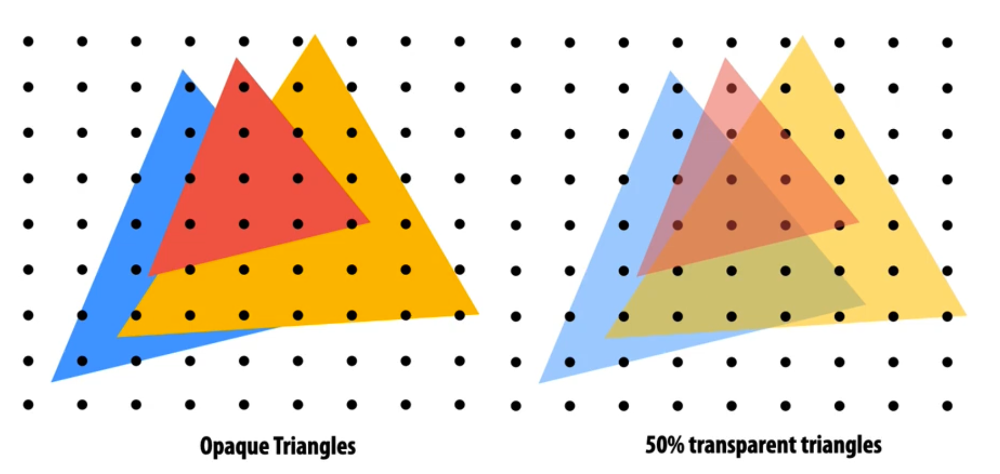
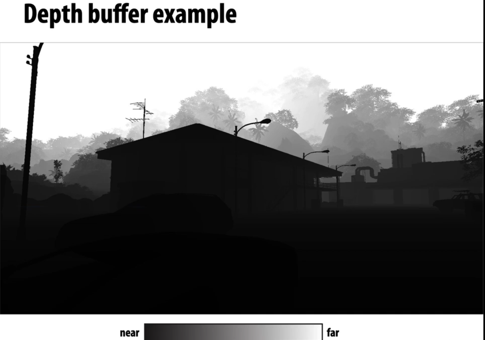

## what we know how to do so far


## occlusion(遮罩)

> which trangle is visible at each covered sample  point







## oclusion using the depth buffer

```md
draw_sample(x, y, d, c) { // new depth d & color c at (x,y)
  if( passDepthTest(d, zbuffer[x][y])) {
  	// 	trinagle is the closeest obejct seen so far at this sample point.
  	// update depth the and color buffers
  	zbuffer[x][y] = d; // update to close depth
  	color[x][y] =c;  // update the color store in that point
  }
  // otherwise, we've seen closer sample point already
  // don;t update the color or depth
}
```


## Depth + Intersection

> draw trangile from front to back


