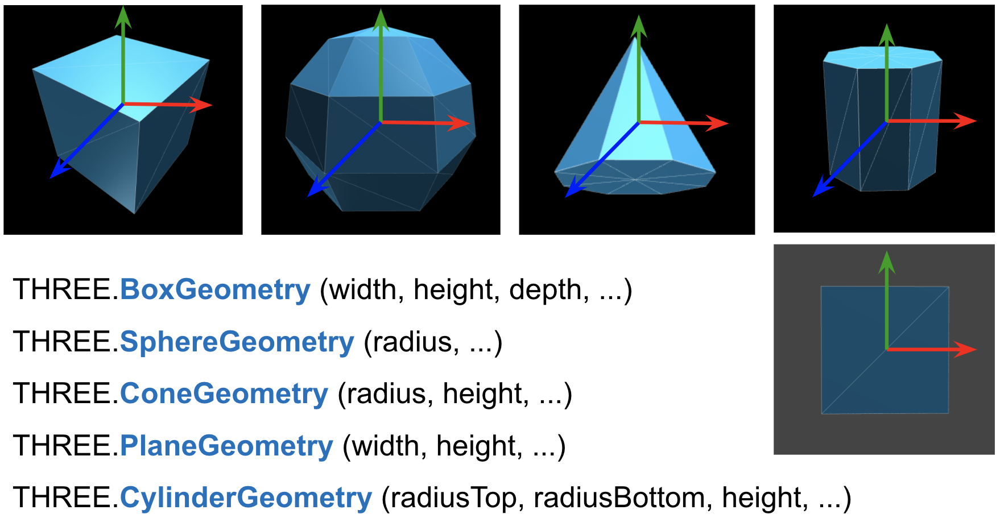

## Scene Bounding Box

```js
var scene_bounding_box = { minx: -50, maxx: +100,
                           miny: 0, maxy: 50,
                           minz: -25, maxz: 100 };
```


##  Instance Transform 

built-in objects ( polygonal approximations)



We place objects with

- position (translation) along major axes (x,y,z):
  - `*obj*.position.set(a,b,c)`
  - `*obj*.position.x = d`
- rotation around major axes (angles are specified in radians)
  - `*obj*.rotation.set(alpha,beta,gamma)`
  - `*obj*.rotation.y = theta`
- scale along major axes:
  - `*obj*.scale.set(i,j,k)`
  - `*obj*.scale.z = m`