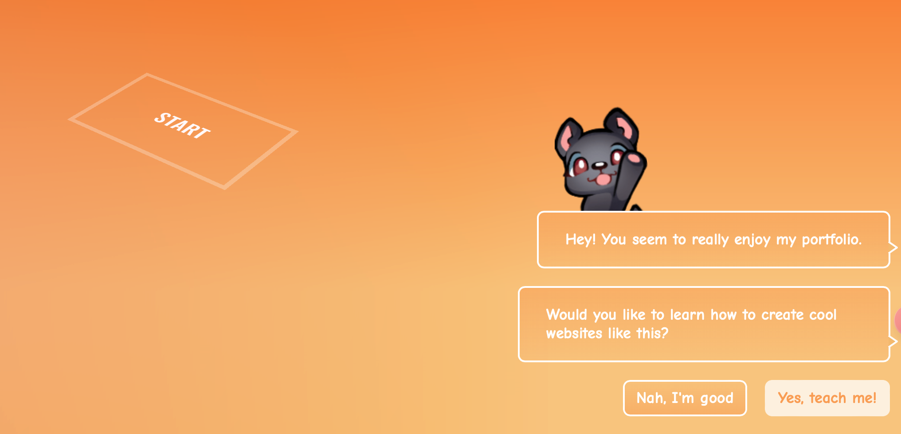

<h2  style="font-size: 22px; display: inline-block; padding-left: 10px; border-left: 5px solid rgb(145, 109, 213); font-weight:bold;">preview of what you can achieve with Three.js</h2>

- [https://bruno-simon.com](https://bruno-simon.com/?ref=shop.codedolt.com)

- [https://richardmattka.com](https://richardmattka.com/?ref=shop.codedolt.com)

- [https://www.oculus.com/medal-of-honor/](https://www.oculus.com/medal-of-honor/?ref=shop.codedolt.com)

- [http://letsplay.ouigo.com](http://letsplay.ouigo.com/?ref=shop.codedolt.com)

- [https://zen.ly](https://zen.ly/?ref=shop.codedolt.com)

- https://www.midwam.com/en/experiences

- oppenheimermovie.com

- https://chartogne-taillet.com/en

- https://www.bugatti.com ( a car dealership that wants users to be able to interact with a 3D model of a car on offer )

<h2  style="font-size: 22px; display: inline-block; padding-left: 10px; border-left: 5px solid rgb(145, 109, 213); font-weight:bold;">author and contributors of Three.js</h2>

Ricardo Cabello, aka Mr.doob ([Website](https://mrdoob.com/?ref=shop.codedolt.com), [Twitter](https://twitter.com/mrdoob?ref=shop.codedolt.com)), is the developer who created Three.js. He is still working on it, but now he's helped by a large community. You can check the list of contributors sadhere:[https://github.com/mrdoob/three.js/graphs/contributors](https://github.com/mrdoob/three.js/graphs/contributors?ref=shop.codedolt.com)

animation presenting a sequence of still images in quick enought succession, the viewer interperets them as a continuous moving 

frame rate aka `frame per second` the number of images consecutively display each second

<h2  style="font-size: 22px; display: inline-block; padding-left: 10px; border-left: 5px solid rgb(145, 109, 213); font-weight:bold;">3d geometry</h2>

> in 3d space, three parameters are required to find exact location of a point

geomestry composed of vertices(顶点) 和 faces(面)

vertices: vertices are points where the edges meet

`edges` egdes are lines where two faces meet

__UV__

- spherical(球面) maps 
- Cylindrical(柱面) maps
- planar(平面) maps

## assets libs

- poly haven
- HDRiHaven

meshes(网格) and particles(粒子)

npm uses `package.json` to track which versions of each dependency you've installed

each dependecy you install is located in `<proejct_root>/node_modules`

`npx` as `node package runner`

When executables are installed via NPM packages, NPM links to them:

1. *local* installs have "links" created at `./node_modules/.bin/` directory.
2. *global* installs have "links" created from the global `bin/` directory (e.g. `/usr/local/bin`) on Linux or at `%AppData%/npm` on Windows.

`npx` will check whether `<command>` exists in `$PATH`, or in the local project binaries`./node_modules/.bin/`

execute a executables which wasn't previously installed:

## From dat.GUI to lil-gui

creatvie project need to tweak parameter 

`lil-gui` as a drop in replacement for `dat.GUI`

compatiable interface without adjustment for the code, plus missing feature

### CC0 License

> # Asset License
>
> All assets ([HDRIs](https://polyhaven.com/hdris), [textures](https://polyhaven.com/textures) and [3D models](https://polyhaven.com/models)) on this site are the original work of Poly Haven staff, or artists who willingly and directly donate/sell their work to Poly Haven.
>
> Our assets are all licensed as [CC0](https://creativecommons.org/publicdomain/zero/1.0/), which is effectively [Public Domain](https://en.wikipedia.org/wiki/Public_domain) even in jurisdictions that do not support the Public Domain.
>
> Here's an excerpt from the [CC0 FAQ page](https://wiki.creativecommons.org/wiki/CC0_FAQ) to clarify:
>
> Once the creator or a subsequent owner of a work applies CC0 to a work, the work is no longer his or hers in any meaningful sense under copyright law. Anyone can then use the work in any way and for any purpose, including commercial purposes [...] Think of CC0 as the "no rights reserved" option. CC0 is a useful tool for clarifying that you do not claim copyright in a work anywhere in the world.
>
> In other words:
>
> - **You can use our assets for any purpose**, including commercial work.
> - **You do not need to give credit** or attribution when using them (although it is appreciated).
> - **You can redistribute them**, share them around, include them when sharing your own work, or even in a product you sell.
>
> More info: [CC0 summary](https://creativecommons.org/publicdomain/zero/1.0/), [CC0 wiki](https://wiki.creativecommons.org/wiki/CC0), [CC0 FAQ](https://wiki.creativecommons.org/wiki/CC0_FAQ).
>
> # Why CC0?
>
> We believe the benefits of using this license outweigh the obvious drawbacks for us as a business.
>
> Yes it's possible that unethical users can (and do) resell our work for their own profit, at the cost of unwitting customers who didn't know they were purchasing content they could get here for free.
>
> But what the 3D industry as a whole gains from our work being so freely available is immeasurable
>
> 3D art is also only the tip of the iceberg, we've heard from numerous data scientists, software developers, automotive engineers and AI researchers all using our assets in their work, which simply wouldn't be possible with more restrictive (even open source) licenses.
>
> We don't have anything against Copyright in general, we simply believe we can do more good in the world by providing as much freedom as possible.
>
> If you benefit from our work financially, e.g. by including our assets in a product you sell, or simply make frequent use of them in your own work, please consider [supporting us on Patreon](https://www.patreon.com/polyhaven/overview) with a small monthly donation in order to help us continue to produce more assets and maintain this platform.
>
> # Terms of Service
>
> Although our assets are shared under the CC0 license, and our code is open source, we maintain a standard Terms of Service agreement to prevent any misuse of this website (polyhaven.com).
>
> ## 1. Acceptance of Terms
>
> By using this website, you agree to be bound by these Terms of Service (ToS). If you do not agree with any of these terms, please refrain from using this website.
>
> ## 2. Changes to Terms
>
> We reserve the right to modify these ToS at any time. It is your responsibility to review these terms periodically for any changes. Your continued use of the website after any changes to the ToS constitutes your acceptance of those changes.
>
> ## 3. Use of the Website
>
> 3.1. You agree to use this website for lawful purposes only.
>
> 3.2. You must not engage in any activity that may disrupt or interfere with the proper functioning of the website, including but not limited to:
>
> - Web scraping or data mining without express permission.
> - Distributed denial-of-service (DDoS) attacks.
> - Unauthorized access to website resources or user accounts.
> - Posting malicious code, malware, or any harmful content.
> - Engaging in any form of harassment or abuse towards other users.
>
> ## 4. Intellectual Property
>
> 4.1. All content on this website, excluding the CC0 assets themselves, is protected by intellectual property laws. You may not reproduce, distribute, or otherwise use this content without prior written permission from the website or intellectual property owner.
>
> 4.2. Examples of such content includes but is not limited to:
>
> - [Logos](https://polyhaven.com/logo)
> - User avatar images
> - Asset thumbnails and example renders
> - User renders
> - Text
> - Asset metadata such as tags and categories
>
> ## 5. Public API
>
> The use of the public API hosted at api.polyhaven.com is governed by separate [API Terms](https://github.com/Poly-Haven/Public-API/blob/master/ToS.md). By using the public API, you agree to abide by the API Terms in addition to these Terms of Service.
>
> ## 6. Privacy
>
> Your use of this website is also governed by our [Privacy Policy](https://polyhaven.com/privacy). By using this website, you consent to the collection, use, and disclosure of your information as described in the Privacy Policy.
>
> ## 7. Termination
>
> We reserve the right to terminate or suspend your access to the website at our discretion, without notice, for any breach of these ToS or for any other reason.
>
> ## 8. Disclaimer
>
> The website is provided "as is" without any warranties, express or implied. We do not guarantee that the website will be error-free or uninterrupted. You use the website at your own risk.
>
> ## 9. Limitation of Liability
>
> To the extent permitted by law, we shall not be liable for any direct, indirect, incidental, consequential, or special damages arising from or related to your use of the website.
>
> ## 10. Governing Law
>
> These ToS are governed by and construed in accordance with the laws of South Africa. Any disputes arising from these ToS or your use of the website shall be subject to the exclusive jurisdiction of the courts in South Africa.
>
> ## 11. Contact Information
>
> If you have any questions or concerns about these ToS, please [contact us](https://polyhaven.com/about-contact).

- **You can use our assets for any purpose**, including commercial work.
- **You do not need to give credit** or attribution when using them (although it is appreciated).
- **You can redistribute them**, share them around, include them when sharing your own work, or even in a product you sell.

