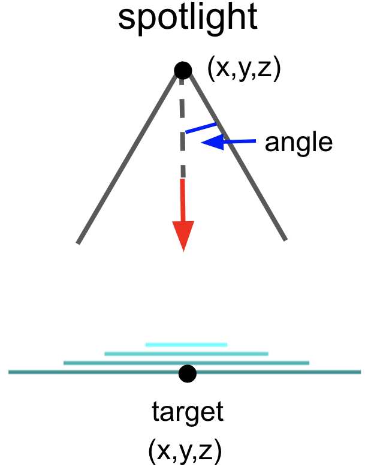

## Lighting Models 


*Global* lighting models take into account interactions of light with objects in the room. For example:
全局照明模型考虑了光与房间中物体的相互作用。例如：

- light will bounce off one object and onto another, lighting it
  光将从一个物体反射到另一个物体上，照亮它
- objects may block light from a source
  物体可能会阻挡光源发出的光
- shadows may be cast
  可能会投射阴影
- reflections may be cast
  可能会投射反射
- diffraction may occur

lobal lighting algorithms fall into two basic categories, ray-tracing and radiosity algorithms:

[Ray-tracing](http://en.wikipedia.org/wiki/Ray_tracing_(graphics)): conceptually, the algorithm traces a ray from the light source onto an object in the scene, where it bounces onto something else, then to something else, ..., until it finally hits the eye. Often the ray of light will split, particularly at clear surfaces, such as glass or water, so you have to trace two light rays from then on. Furthermore, most rays of light won't intersect the eye. For efficiency, then, algorithms may trace the rays backwards, from the eye into the scene, back towards light sources (either lights or lit objects).


 local lighting models: the Lambert Model and the Phong Model.


use the Scene Graph data structure to compute shadows

> We're going to proceed in a bottom-up fashion, first explaining the  building blocks, before we see how they all fit together.


## kinds of lights

The three kinds of light are:
这三种光是：

- ambient 周围的,环境
- diffuse  扩散
- specular  镜面反射


### Diffuse Calculation 

**LV** is the vector from the surface fragment to the light

**NV** is the surface normal (a vector) of the surface fragment

The [dot product](https://www.mathsisfun.com/algebra/vectors-dot-product.html) shows how closely **LV** and **NV** are aligned


##  Light Sources 


## Flat versus Smooth Shading


There are four lights that you can control in Three.js

- Point lights 点光源
- Ambient light  环境光
- Directional lights 定向灯
- Spotlights  聚光灯


All light-source classes are subclasses of the `Light` class, which is a subclass of `Object3D`, which has a `position` property that can be set with `position.set(x,y,z)`

before adding the light source to the scene. **For a directional light**, the combination of the position of the light and the position of a target determine the direction of the light onto surface in the scene

[Spotlights](https://threejs.org/docs/index.html#api/lights/SpotLight) have more parameters, and can also be **directed toward** a trarge location or object in the scene(the default target is the origin of the scene)



```js
const spotLight = new THREE.SpotLight(
  color, // rgb color of the light source, default to white
  intensity,
  distance, //  where light ends, default 0
  angle, //	cutoffAngle, default Math.PI/2
  penumbra, // spotlight cone attenuated,  0-1, default to 0
  decay // amount light decays with distance, default 1
)

spotLight.position.set(x, y, z)
spotLight.target.position.set(xt, yt, zt)
// or
spotLight.lookAt(new THREE.Vector3(xt, yt, zt))
scene.add(spotLight)
scene.add(spotLight.target)
```

## spotlight demo

- [Three.js spotlight demo](https://threejs.org/examples/#webgl_lights_spotlight)

```js
var scene = new THREE.Scene()
var renderer = new THREE.WebGLRenderer()
TW.mainInit(renderer, scene)

var sceneParams = { planeLambert: false,
                    planeColor : 0x30D040,
                    planeSpecular: 0x444444,
                    planeShininess: 20,
                    spotlightX: 9,
                    spotlightY: 0,
                    spotlightZ: 9,
                    spotlightColor: 0xffffff,
                    spotlightIntensity: 1,
                    spotlightDistance: 0,
                    spotlightAngle: Math.PI/5,
                    spotlightPenumbra: 0,
                    spotlightExponent: 10,
                    targetX: 0,
                    targetY: 0,
                    targetZ: 0,
                    lastparam: null
                  };
function removeByName(name) {
  const obj = scene.getObjectByName(name)
  if(obj) scene.remove(obj)
}

function drawScene() {
  // delete old stuff
  removeByName('plane')
  removeByName('target')
  removeByName('spot')
  removeByName('helper')

  // create the plane
  const planeG = new THREE.PlaneGeometry(20, 20)
  if(sceneParams.planeLambert) {
		var planeM = new THREE.MeshLambertMaterial({
      color: sceneParams.planeColor,
      specular: sceneParams.planeSpecular,
      shininess: sceneParams.planeShininess
    }) else {
      var planeM = new THREE.MeshPhongMaterial({
        color: sceneParams.planeColor,
      	specular: sceneParams.planeSpecular,
      	shininess: sceneParams.planeShininess
      })
    }
  }
  const plane = new THREE.Mesh(planeG, planeM)
  plane.name = "plane" // give it a name, so we can remove it next tiem
  scene.add(plane)

  // create the target()
  var target = new THREE.Mesh(
  	new THREE.SphereGeometry(0,5,8,8)
    new THREE.MeshBasicMaterial({color: 0xFFFFFF})
  )
  target.position.set( sceneParams.targetX, sceneParams.targetY, sceneParams.targetZ)
	target.name = "target"
	scene.add(target)

	// create the spotlight
	spotLight = new THREE.SpotLight(
  	sceneParams.spotlightColor,
    sceneParams.spotlightIntensity,
    sceneParams.spotlightAngle,
    sceneParams.spotlightPenumbra,
    sceneParams.spotlightExponent
  )

	spotLight.name = "spot"
	spotLight.position.set(sceneParams.spotlightX, sceneParams.spotlightY, secneParams.spotlightZ)
	spotLight.target = target
	scene.add(spotLight)

	var helper = new THREE.SpotLightHelper(spotLight)
  helper.name = 'helper'
	scene.add(helper)
	helper.update()
	TW.render()
}

var state = TW.cameraSetup(renderer,
                          scene,
                          {minx: -10, maxx:10,
                          miny: -10, maxy:10,
                          minz:-10, maxz:10})

drawScene()

var gui = new dat.GUI();
gui.add(sceneParams,'planeLambert').onChange(drawScene);
gui.addColor(sceneParams,'planeColor').onChange(drawScene);
gui.addColor(sceneParams,'planeSpecular').onChange(drawScene);
gui.add(sceneParams,'planeShininess',0,100).onChange(drawScene);
gui.add(sceneParams,'spotlightX',0,20).onChange(drawScene);
gui.add(sceneParams,'spotlightY',0,20).onChange(drawScene);
gui.add(sceneParams,'spotlightZ',0,20).onChange(drawScene);
gui.add(sceneParams,'targetX',-10,10).onChange(drawScene);
gui.add(sceneParams,'targetY',-10,10).onChange(drawScene);
gui.add(sceneParams,'targetZ',-10,10).onChange(drawScene);
gui.addColor(sceneParams,'spotlightColor').onChange(drawScene);
gui.add(sceneParams,'spotlightIntensity',0,2).onChange(drawScene);
gui.add(sceneParams,'spotlightDistance',0,100).onChange(drawScene);
gui.add(sceneParams,'spotlightAngle',0,Math.PI/2).onChange(drawScene);
gui.add(sceneParams,'spotlightPenumbra',0,1).onChange(drawScene);
gui.add(sceneParams,'spotlightExponent',0,200).onChange(drawScene);
```


