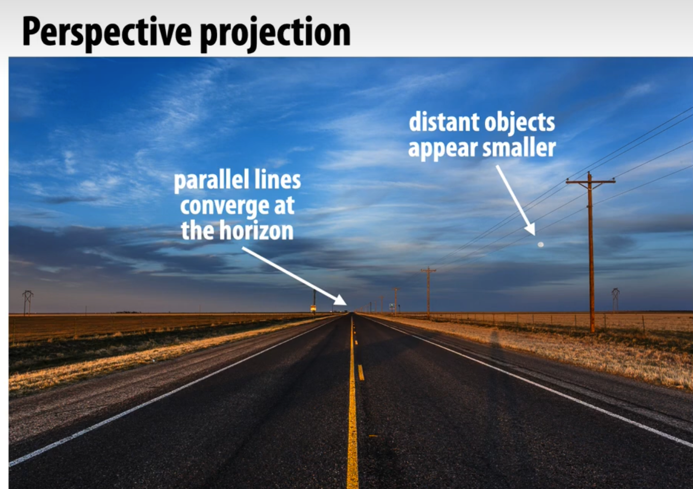
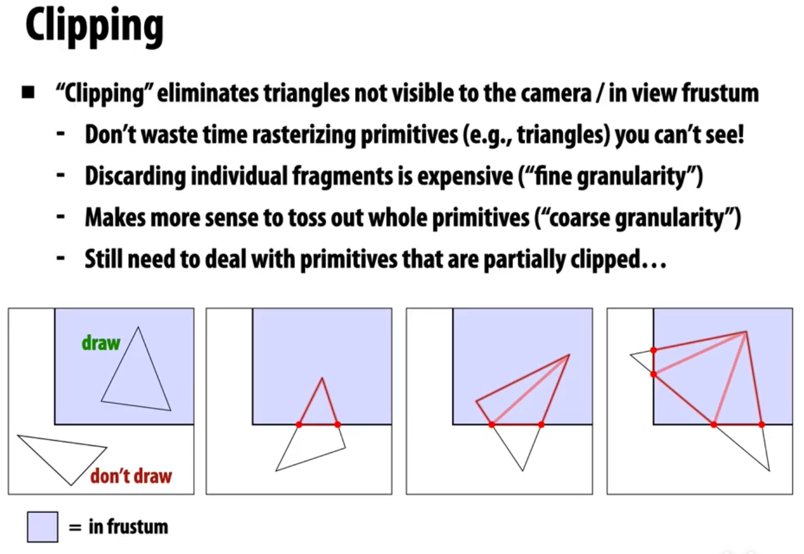
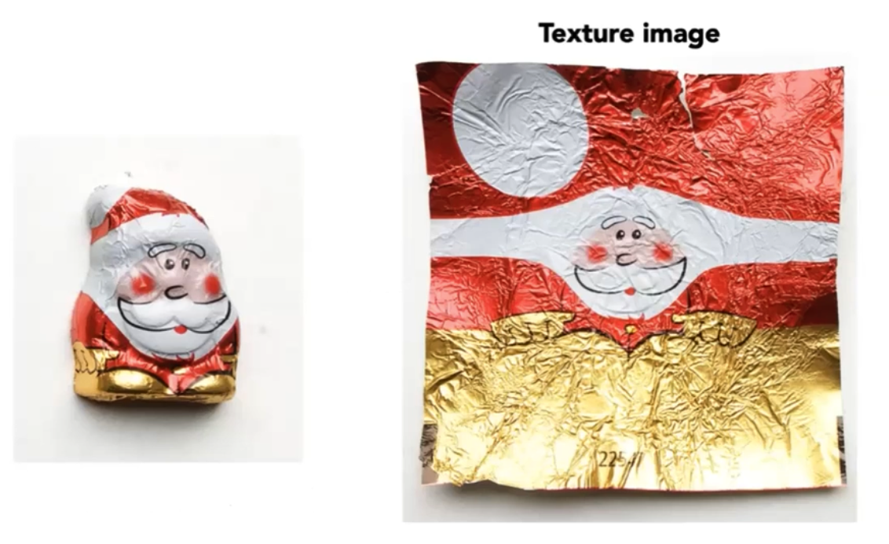
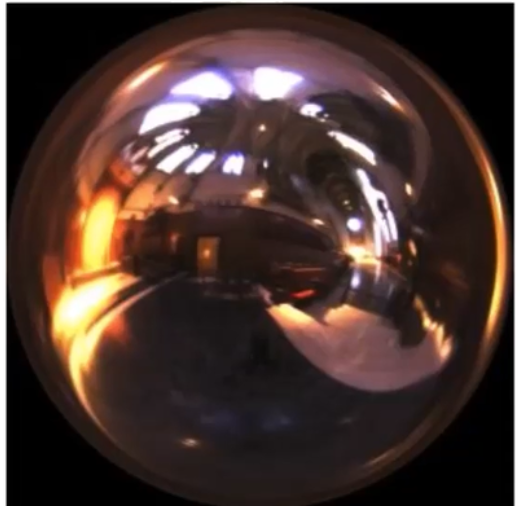
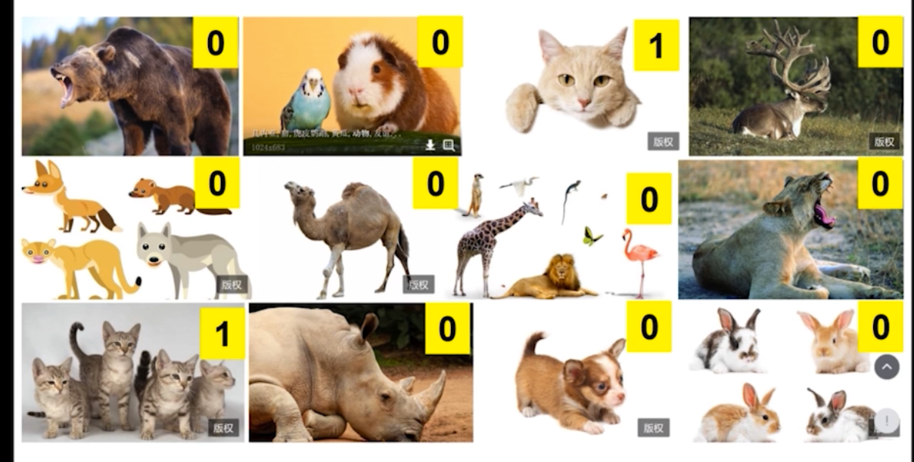

## perspective projection

bi

### clipping

## pinhome camera model

- image point (成像点)
- scene point ()
- image plane(成像平面,such as a camera sensor or the human retina)

perpsective effects

- converging lines + vanishing points
- closer objects appear larger in images
- blur effect
- sampling
- antialiasing(反锯齿)

### viewing frustum

- `clipping` eliminates triangles not visible to the camera

paramtererized by

- fovy
- aspect ratio
- near (depth of near cliping plane)
- far (depth of far cliping plane)

## Texture 

> wrap around the surface of geometry

`texture`: describe  surface material  property

surface material property beyond color

- wet/dry area of the surface
- bump map （凹凸）
- displacement(offset) map 
- light and shadow

trilinear filtering

Each surface point is assigned to texture coordinate(u,v)

> In GPUs, texture = memory + filtering

use for texturing

- enverionment lighting

- cubeMap  
- displacement map (位移)
- 
- ambient occlusion(环境光遮挡) texture map
- store microgeometry
- procedural textures
- solid modeling
- volume rendering

sampling(采样)

- 1:1 mapping

- Texture Magnification

- Texture Minification

## 数据拟合,逼近和插值

> fitting approximating interpolation

nearest neightbour interpolation

分类拟合

Texture Filtering

Texture Magnification

Texture Minification

Mipmap Limitations

Anisotropic sampling

Environment Map

Environmental Lighting

Cube Map

Displacement Mapping

Bump Mapping